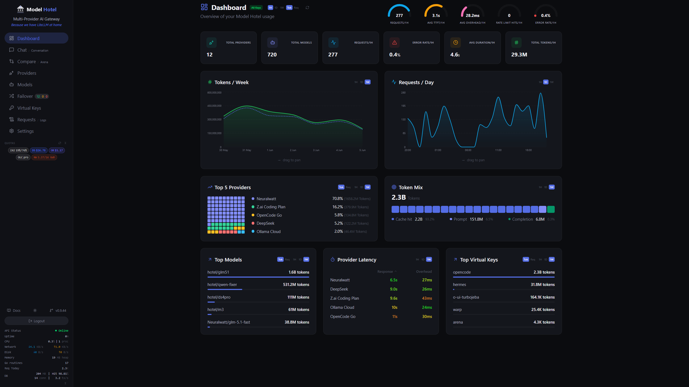

<p align="center">
  
</p>

<p align="center"><strong>Multi-Provider AI Gateway</strong></p>
<p align="center"><em>"Because we have LiteLLM at home"</em></p>
<br><br>

<p align="center">
<a href="/actions/workflows/ci.yml"></a>
<a href="/LICENSE"></a>
<a href="/commits/master"></a>
<a href="go.mod"></a>
<a href="https://github.com/hugalafutro/model-hotel/pkgs/container/model-hotel"></a>
<a href="https://goreportcard.com/badge/github.com/hugalafutro/model-hotel"></a>
<a href="https://codecov.io/github/hugalafutro/model-hotel"></a>
<a href="/stargazers"></a>
  <br>
  
  
  
  
  
</p>

<div align="center">

> **AI-Assisted Project Disclaimer:**<br>Human judgment applied at every stage, particularly around architectural decisions, UX flows, and quality control.<br>

Made in [CodeNomad](https://github.com/NeuralNomadsAI/CodeNomad) with [OpenCode](https://opencode.ai).<br>

<details>
<summary>📊 opencode stats (click to expand)</summary>

```
┌────────────────────────────────────────────────────────┐
│                       OVERVIEW                         │
├────────────────────────────────────────────────────────┤
│Sessions                                          1,861 │
│Messages                                         65,153 │
│Days                                                 34 │
└────────────────────────────────────────────────────────┘

┌────────────────────────────────────────────────────────┐
│                    COST & TOKENS                       │
├────────────────────────────────────────────────────────┤
│Total Cost                                      $112.90 │
│Avg Cost/Day                                      $3.32 │
│Avg Tokens/Session                                 2.6M │
│Median Tokens/Session                            574.5K │
│Input                                           2641.3M │
│Output                                            17.1M │
│Cache Read                                      2252.0M │
│Cache Write                                        4.1M │
└────────────────────────────────────────────────────────┘
```
</details><br>

Meet the [oh-my-opencode-slim](https://github.com/alvinunreal/oh-my-opencode-slim) team:<br><br>   <br>  <br><br> <br>

Powered by <a href="https://github.com/aovestdipaperino/tokensave">tokensave<br>
</a>
</div><br>

A single OpenAI-compatible endpoint that sits in front of all your LLM providers. Models are auto-discovered the moment you add a provider and optionally on schedule; failover groups form automatically around shared model names and retry transparently when a provider goes down; no prompt data is ever stored.
<div align="center">
<br>
</div>

### [ One Endpoint, Many Providers](#-one-endpoint-many-providers)
Add any OpenAI-compatible provider ([Anthropic](https://claude.ai/), [DeepSeek](https://deepseek.com/), [KoboldCPP](https://koboldcpp.com/), [LMStudio](https://lmstudio.ai/), [NanoGPT](https://docs.nano-gpt.com/), [OpenRouter](https://openrouter.ai/), [Z.AI](https://z.ai/), [x.ai](https://x.ai/), [Google AI Studio](https://aistudio.google.com/), [Cohere](https://cohere.com/), [Ollama](https://github.com/ollama/ollama), [Ollama Cloud](https://ollama.com), [OpenCode Go](https://opencode.ai), [OpenCode Zen](https://opencode.ai), [OpenAI](https://openai.com/), or your own), and call them all through the same `/v1/chat/completions` endpoint. The proxy handles model ID mapping and failover transparently. Provider API keys are encrypted with AES-256-GCM at rest using your `MASTER_KEY`; only the proxy ever sees the decrypted credentials. Keyless providers (e.g. OpenCode Zen free models, local Ollama) are also supported (no API key required).
<div align="center">

</div>

### [ Transparent Failover](#-transparent-failover)
When a provider returns a 5xx, a 429 (rate limit, configurable via `failover_on_rate_limit`), an auth error (401/403), or times out, the request is automatically retried with the next available provider for that model. Failover decisions happen at the response-header layer, so the client never receives a partial stream from a provider that returned a non-2xx status. An exponential backoff (100ms base, capped at 2s) is applied between attempts to avoid hammering slow providers; client disconnects during backoff are detected immediately. The final request record logs the attempt number that succeeded (or the last one that failed), along with the error code and total duration. Per-attempt failover events (attempt number, provider, status code) are also written to the application log for real-time debugging.

### [ Hotel Routing](#-hotel-routing)
Prefix a model with `hotel/` to route through its failover group: an ordered list of providers that expose the same base model. Example: `hotel/gpt-4o` resolves to all providers whose model ID matches `gpt-4o` exactly (after stripping the org prefix, e.g. `openai/gpt-4o` → `gpt-4o`). Models with different base names like `gpt-4o-mini` are separate groups. A failover group is auto-created only when 2+ providers offer the same base model; if only one provider has the model, no group exists and `hotel/model` will return 404. To route to a single provider without failover, use `provider/model` as the model name in your request (e.g. `{"model": "openai/gpt-4o", ...}`).

<div align="center">

</div>

Requests are sent to each provider in priority order. If a provider responds with a server error (5xx), an auth error (401/403), or a rate-limit error (429, configurable), the next provider in the list is tried. Failover does **not** trigger on slow responses or client errors (4xx other than 401/403/429).

A per-provider **circuit breaker** prevents wasted requests to consistently failing providers. After 5 consecutive failures (connection errors, 5xx, 429, 401/403), the provider's circuit opens and it is skipped during candidate resolution. After a 60-second cooldown, the circuit transitions to half-open and allows a single probe request; if the probe succeeds, the circuit closes and normal traffic resumes. State transitions (open/closed) are published as SSE events for real-time dashboard visibility. The circuit breaker can be disabled entirely via the `circuit_breaker_enabled` setting.

Failover groups are auto-generated when models are discovered, but only when **2 or more providers** expose the same base model. Groups with a single provider are automatically disabled. You can manually edit priorities, disable individual entries, or toggle entire groups on or off.

### [ Per-Client Virtual Keys](#-per-client-virtual-keys)
Issue separate API keys for different users or services. Each key is SHA-256 hashed before storage, so raw keys are never persisted. Track token usage per key, delete a key to immediately cut off access, and never expose your real provider credentials. Keys can be created and deleted from the dashboard or the admin API.
<div align="center">

</div>

### [ No Prompts Logged: Privacy by Design](#-no-prompts-logged)
> **Prompts and request content are never captured, logged, or inspected.**
> The proxy forwards requests to the provider exactly as received, without reading or modifying message contents.
>
> The only information recorded is what is strictly necessary to route and meter the request: timestamp, duration, latency, time-to-first-token (TTFT), token counts (including cache-hit/miss breakdown), tokens per second, HTTP status code, error messages (upstream provider failures only, never user content), proxy overhead breakdown (parse, model lookup, provider lookup, key decryption), streaming flag, failover attempt count, request state, virtual key identifier, and target provider/model identifiers.

The optional **Arena History** feature (disabled by default, configurable in **Settings → Arena History**) can persist completed arena and compare session results in your browser's local storage. When enabled:

- **Model-generated responses** (output text, thinking blocks, metrics) are stored locally so you can review past results.
- **Preset prompts and personas** are saved by reference (e.g. "Dilemma preset", "Merlin persona"), storing only their built-in IDs, never the text content you didn't write yourself.
- **Custom user-entered text is never logged.** If you type your own prompt or persona system prompt, it is intentionally excluded from history records. Only the fact that a custom prompt was used is recorded (shown as "Custom prompt" in the history UI), with no content retained.

History data never leaves your browser. It can be cleared at any time from the Settings page.

### [ Request Logging with Overhead Breakdown](#-request-logging-with-overhead-breakdown)
Every request is logged with full latency decomposition:
- **TTFT** (time to first token)
- **Total duration** (end-to-end wall time)
- **Proxy overhead** split into request parsing, model/failover lookup, provider lookup, and key decryption
- **Tokens per second**, prompt / completion counts

<div align="center">
<br>
</div>

Streaming requests are captured as they start and updated as they finish, so you can see in-flight requests in the Logs view. The overhead breakdown helps you determine whether latency is coming from your provider or from the proxy itself.

<div align="center">

</div>

### [ Built-In Model Discovery](#-built-in-model-discovery)
Add a provider and the service pulls the model list automatically via the provider's own API. Models are kept in sync on a schedule you control (default every 6 hours, configurable). The following providers get enriched metadata beyond what the generic OpenAI-compatible endpoint returns:

<div align="center">

</div><br>

| Provider | Context Length | Pricing | Reasoning Flags | Input/Output Modalities | Source |
|---|---|---|---|---|---|
| DeepSeek | ✅ | ✅ | ✅ | *(none)* | Catalog |
| NanoGPT | ✅ | ✅ | ✅ | ✅ | API (`/models?detailed=true`) |
| Z.AI | ✅ | *(none)* | ✅ | Derived | Catalog |
| OpenCode Go | ✅ | ✅ | ✅ | ✅ | Catalog |
| OpenCode Zen | ✅ | ✅ | ✅ | ✅ | Catalog |
| OpenAI | ✅ | ✅ | ✅ | ✅ | Catalog |
| OpenRouter | ✅ | ✅ | ✅ | ✅ | API (/models) |
| Anthropic | ✅ | ✅ | *(none)* | ✅ (partial) | API + Pricing catalog |
| xAI (Grok) | ✅ | ✅ | ✅ | ✅ | API (`/language-models`) + Catalog |
| Google AI Studio (Gemini) | ✅ | ✅ | ✅ | ✅ | API (`/v1beta/models`) + Pricing catalog |
| Cohere | ✅ | ✅ | ✅ | ✅ (vision) | API (`/v1/models`, paginated) + Pricing catalog |
| Ollama / Ollama Cloud | ✅ | *(none)* | ✅ | ✅ | API (`/api/show`) |

DeepSeek, Z.AI, OpenCode (Go & Zen), and OpenAI use **dedicated static catalogs** that supply context length, pricing, capability flags, and modalities not available from the provider's `/models` endpoint. xAI uses a catalog for context windows and capabilities, enriched with live pricing from its `/language-models` endpoint (or falls back to pure catalog when the account has no API access: 403 or 429). Google AI Studio provides rich metadata (context, thinking support) from its native API, supplemented with a pricing catalog. Cohere uses its native API with full pagination for model discovery, enriched with a pricing catalog for cost data, capability detection (tool calling, vision, structured output, reasoning), and modality mapping. NanoGPT and Anthropic expose richer model metadata through their own APIs; Anthropic additionally uses a pricing catalog for per-model cost data. Ollama and Ollama Cloud enrich models via the `/api/show` endpoint.

Models that aren't covered by any built-in catalog are automatically enriched from [models.dev](https://models.dev/), an open-source model catalogue that provides pricing, context limits, capabilities, and modality data for 40+ providers. The enrichment is non-destructive: it only fills fields that are empty or missing from the provider's own API response, never overwriting data that was already populated. If models.dev is unreachable, discovery proceeds normally using whatever data the provider returned, so your existing catalogue is never at risk.

### [ Model Health at a Glance](#-model-health-at-a-glance)
Test any model from the Models page with a single click. The test sends a minimal chat completion directly to the provider and reports total duration and the actual model response, so you know the provider is alive and responsive. DeepSeek providers show live account balance; NanoGPT and Z.AI providers show token quota and usage data, all fetched from their respective APIs and displayed on both the provider cards and the sidebar quota panel.

### [ Interactive Chat & Arena](#-interactive-chat--arena)
The dashboard includes a built-in **Chat** interface for testing models interactively, with support for system personas (presets or custom prompts), generation parameters (temperature, top_p, max_tokens, min_p, top_k, frequency/presence penalties), and streaming responses with collapsible thinking-block rendering. Vision-capable models show an image upload button: attach a photo for the model to describe or analyze. Audio-capable models show an audio upload button for sending audio input. Attachments are sent as OpenAI-compatible multimodal content parts (`image_url`, `input_audio`). Switch to **Conversation** mode to watch two models talk to each other: enter a starter prompt, set the number of rounds and optional delay between turns, and observe the back-and-forth with per-message metrics (duration, tokens, chars/sec).

<div align="center">

</div>

**Arena** mode offers two sub-modes: **Competition** runs bracket tournaments where models face off in pairwise matchups. Vote for winners, and the bracket auto-advances to the next round until a champion emerges. **Compare** places two or more models in a grid with the same prompt for parallel evaluation, with per-slot personas and voting. Both modes support per-model generation parameters, streaming with thinking-block rendering, and per-response metrics. Past sessions are saved to an arena history modal for review and restoration.

<div align="center">

</div>

### [ Real-Time Events & System Status](#-real-time-events--system-status)
A live SSE event bus delivers toast notifications for discovery outcomes, model disabling events, token counting errors, circuit breaker state transitions, and stale-request alerts straight to the dashboard. Failover retries during proxying are logged but **not** pushed as SSE events. The sidebar polls system stats every 10 seconds, showing CPU, memory, disk I/O, and network throughput with color-coded warnings (orange at 75%, red at 90%). When running under Docker Compose, stats are aggregated across containers; otherwise, cgroup metrics are used. Goroutine count, database health (size, connections, cache hit ratio), API uptime, and process count are also displayed.

<div align="center">

</div>

## [ Security & Privacy](#-security--privacy)

Provider API keys are encrypted at rest with AES-256-GCM. The `MASTER_KEY` is strengthened via **Argon2id** key derivation (with per-provider random salts) before use as the AES key. Virtual keys are SHA-256 hashed. The admin token is SHA-256 hashed before storage: the plaintext token is displayed once on first run and never stored on disk. To regenerate a lost token, delete the `admin-token` file in your configured `DATA_DIR` and restart. Standard security headers (X-Content-Type-Options, X-Frame-Options, Referrer-Policy, Strict-Transport-Security (when TLS is active), Content-Security-Policy) are applied to all responses. Decrypted provider keys are cached in memory for up to 10 minutes (configurable via the `key_cache_ttl` setting) to avoid repeated key derivation overhead.

## [ Quick Start](#-quick-start)

```bash
git clone <repository-url>
cd model-hotel

cp .env.example .env
nano .env          # set a strong MASTER_KEY and POSTGRES_PASSWORD

docker compose -f docker-compose.yml -f compose.dev.yml up --build -d
```

For development, use the dev compose override: `docker compose -f docker-compose.yml -f compose.dev.yml up -d`. To use the prebuilt image instead of building from source, edit `docker-compose.yml`: comment out `build: .` and uncomment the `image:` line.

The admin token is displayed once in the logs on first run and will never be shown again:

```bash
docker compose -f docker-compose.yml -f compose.dev.yml logs app | grep "ADMIN_TOKEN="
```

If you lose the token, delete `.data/admin-token` and restart to generate a new one.

You can also set a fixed admin token via the `ADMIN_TOKEN` environment variable.

Open `http://localhost:8081`, log in with that token, add your first provider, and start proxying.

> [!TIP]
> The admin token appears only once in the logs on first run. If you lose it, delete `.data/admin-token` and restart to generate a new one, or set a fixed token via the `ADMIN_TOKEN` env var.

> **Security:** The Docker socket is disabled by default in `docker-compose.yml` (production). The `compose.dev.yml` override enables it for local development. Only use the dev override in trusted environments.

### [ Deploy without Git](#-deploy-without-git)

No `git clone` needed. Create two files and go:

**1.** Create `.env` with your secrets:

```bash
# Generate strong secrets:
#   MASTER_KEY:       openssl rand -base64 32
#   POSTGRES_PASSWORD: openssl rand -hex 16
#   ADMIN_TOKEN:      openssl rand -hex 16   (optional; auto-generated if empty)

MASTER_KEY=<your-master-key>
POSTGRES_PASSWORD=<your-postgres-password>
ADMIN_TOKEN=
```

**2.** Create `docker-compose.yml`:

<!-- AUTO-SYNC: docker-compose.yml start -->
<details>
<summary>docker-compose.yml (click to expand, then copy)</summary>

```yaml
    name: model-hotel
    services:
        app:
            # Build from source (default):
            build:
                context: .
                args:
                    VERSION: ${VERSION:-dev}
            # Prebuilt image (uncomment below, comment out build above):
            # image: ghcr.io/hugalafutro/model-hotel:latest
            ports:
                - "${HOST_PORT:-8081}:8080"
            environment:
                - MASTER_KEY=${MASTER_KEY:?MASTER_KEY must be set in .env}
                - POSTGRES_USER=${POSTGRES_USER:-modelhotel}
                - POSTGRES_PASSWORD=${POSTGRES_PASSWORD:?POSTGRES_PASSWORD must be set in .env}
                - POSTGRES_HOST=db
                - POSTGRES_DB=${POSTGRES_DB:-modelhotel}
                - ADMIN_TOKEN=${ADMIN_TOKEN:-}
                - ALLOW_HTTP_PROVIDERS=false
                - DATA_DIR=/data
                - RATE_LIMIT_ENABLED=true
                - DEBUG_LOG=false
                - CORS_ORIGINS=http://localhost:5173,http://localhost:${HOST_PORT:-8081}
                - ALLOWED_PROVIDER_HOSTS=
            volumes:
                - ./.data:/data
                # Docker socket (disabled by default for security).
                # Enable to show container-level stats in the sidebar (CPU, memory per container).
                # ⚠️  Granting Docker socket access allows the container to control the Docker daemon.
                #     Only enable if you trust the deployment environment.
                # - /var/run/docker.sock:/var/run/docker.sock:ro
            restart: unless-stopped
            depends_on:
                db:
                    condition: service_healthy
    
        db:
            image: postgres:16-alpine
            command: ["postgres", "-c", "log_min_error_statement=panic", "-c", "log_min_messages=error", "-c", "log_checkpoints=off"]
            environment:
                - POSTGRES_USER=${POSTGRES_USER:-modelhotel}
                - POSTGRES_PASSWORD=${POSTGRES_PASSWORD:?POSTGRES_PASSWORD must be set in .env}
                - POSTGRES_DB=${POSTGRES_DB:-modelhotel}
            volumes:
                - ./.data/pgdata:/var/lib/postgresql/data
            ports:
                - "5432:5432"
            healthcheck:
                test: ["CMD-SHELL", "pg_isready -U ${POSTGRES_USER:-modelhotel}"]
                interval: 5s
                timeout: 5s
                retries: 5
```

</details>
<!-- AUTO-SYNC: docker-compose.yml end -->

**3.** Deploy:

```bash
docker compose -f docker-compose.yml -f compose.dev.yml up --build -d
```

> **Note:** The `docker-compose.yml` content above is the production compose (auto-synced by a GitHub Action). For development, layer the `compose.dev.yml` override: `docker compose -f docker-compose.yml -f compose.dev.yml up -d`. If you want the prebuilt image instead of building from source, uncomment the `image:` line and comment out `build: .` in the compose file.

## API Example

```bash
# List available models
curl http://localhost:8081/v1/models \
  -H "Authorization: Bearer $VIRTUAL_KEY"

# Chat completion (with hotel routing for automatic failover)
curl -X POST http://localhost:8081/v1/chat/completions \
  -H "Authorization: Bearer $VIRTUAL_KEY" \
  -H "Content-Type: application/json" \
  -d '{"model": "hotel/gpt-4o", "messages": [{"role": "user", "content": "Hello!"}]}'
```

See the [API Reference](model-hotel.wiki/API-Reference.md) for the full endpoint listing.

## Full Documentation

- [Configuration](model-hotel.wiki/Configuration.md): Environment variables, runtime settings, Docker Compose
- [API Reference](model-hotel.wiki/API-Reference.md): Proxy and admin endpoints
- [Security](model-hotel.wiki/Security.md): AES-256-GCM encryption, Argon2id key derivation, hashing, URL validation
- [Privacy](model-hotel.wiki/Privacy.md): What is and isn't captured, data retention, local deployment
- [Failover & Hotel Routing](model-hotel.wiki/Failover-and-Hotel-Routing.md): Failover groups, circuit breaker, backoff
- [Model Discovery](model-hotel.wiki/Model-Discovery.md): Automatic sync, provider-specific metadata, enrichment
- [Virtual Keys](model-hotel.wiki/Virtual-Keys.md): Creating, using, and deleting client keys
- [Request Logging](model-hotel.wiki/Request-Logging.md): Log fields, overhead breakdown, retention
- [Backup & Restore](#-backup--restore): Creating backups, restoring, critical requirements
- [Development](model-hotel.wiki/Development.md): Local setup, build commands, contributing

## [ Backup & Restore](#-backup--restore)

Backups are created via the Settings page or the admin API (`POST /api/backups`) using `pg_dump --format=custom`. The resulting `.dump` files contain all database tables: providers, models, virtual keys, failover groups, and settings.

### Restoring a backup

```bash
# Direct
pg_restore --clean --if-exists -d YOUR_DB backup_file.dump

# Via Docker
docker exec -i postgres-container pg_restore --clean --if-exists -U user -d dbname < backup_file.dump
```

### Critical requirements for a working restore

| Requirement | Details |
|---|---|
| **MASTER_KEY must match** | Provider API keys are AES-256-GCM encrypted using a key derived from `MASTER_KEY` via Argon2id. Restoring with a different `MASTER_KEY` will leave all provider keys unrecoverable. The app will start, but key decryption will fail. |
| **Admin token is not in the backup** | The admin token hash lives in `DATA_DIR/admin-token` on the filesystem, not in the database. If that file is lost, a new token is auto-generated on next boot. Check startup logs for the new token. |
| **Virtual keys are irrecoverable** | Virtual keys are stored as SHA-256 hashes only. Plaintext virtual keys are never persisted. If you lose the plaintext keys, they cannot be recovered from the backup (by design). |

### What is and isn't in the backup

**Included** (in the database, captured by `pg_dump`): providers (encrypted keys, nonces, salts), models, virtual keys (hashes only), failover groups, settings.

**Not included** (filesystem only): `DATA_DIR/admin-token` (admin token hash), `DATA_DIR/backups/` (the backup files themselves), `MASTER_KEY` (environment variable).

## Known Limitations

- **Single-instance only**: Caches and rate limiters are in-memory, not horizontally scalable

## [ License](#-license)

[MIT](LICENSE). See [CONTRIBUTING.md](CONTRIBUTING.md) for the contributor license agreement.
