<p align="center">
  <br>
  <em>"Because we have LiteLLM at home"</em>
</p>
<br>

<p align="center"><strong>Multi-Provider AI Gateway</strong></p>

<p align="center">
 <a href="go.mod"></a>
 
 
 
 <a href="https://hub.docker.com/r/hugalafutro/model-hotel"></a>
 <a href="https://github.com/hugalafutro/model-hotel/actions/workflows/ci.yml"></a>
 <a href="https://goreportcard.com/report/github.com/hugalafutro/model-hotel"></a>
 <a href="https://codecov.io/github/hugalafutro/model-hotel"></a><br>
</p>

> [!IMPORTANT]
> **AI-Assisted Project Disclaimer:**<br>
> Human judgment applied at every stage, particularly around architectural decisions, UX flows, and quality control.

<div align="center">
  
<sub>Localised by AI - _expect mistakes_ - translation fixes welcome as PRs against [`web/src/i18n/locales/`](https://github.com/hugalafutro/model-hotel/tree/master/web/src/i18n/locales)!<br>Made with [OpenCode](https://opencode.ai) + [oh-my-opencode-slim](https://github.com/alvinunreal/oh-my-opencode-slim) & [Claude Code](https://claude.com/claude-code)</sub>
<br>

 <a href="https://mh.site19.ddns.net"></a><br>
 <sub>Poke around a real instance at <a href="https://mh.site19.ddns.net">mh.site19.ddns.net</a> - rebuilds fresh every 30 minutes</sub>
</div><br>

A single OpenAI-compatible endpoint that sits in front of all your LLM providers. Models are auto-discovered the moment you add a provider and optionally on schedule; failover groups form automatically around shared model names and retry transparently when a provider goes down; no prompt data is ever stored.

<div align="center">
<br>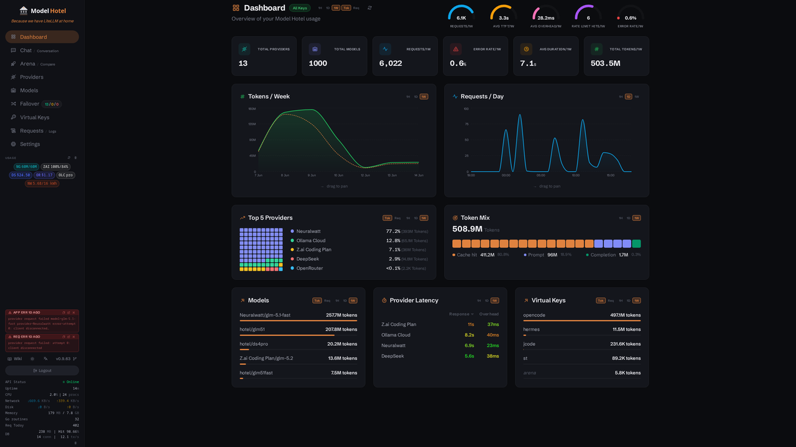<br>
</div>

### [ One Endpoint, Many Providers](#-one-endpoint-many-providers)
Add any OpenAI-compatible provider ([Anthropic](https://claude.ai/), [DeepSeek](https://deepseek.com/), [KoboldCPP](https://koboldcpp.com/), [LMStudio](https://lmstudio.ai/), [NanoGPT](https://docs.nano-gpt.com/), [OpenRouter](https://openrouter.ai/), [Z.AI](https://z.ai/), [x.ai](https://x.ai/), [Google AI Studio](https://aistudio.google.com/), [Cohere](https://cohere.com/), [Ollama](https://github.com/ollama/ollama), [Ollama Cloud](https://ollama.com), [OpenCode Go](https://opencode.ai), [OpenCode Zen](https://opencode.ai), [OpenAI](https://openai.com/), or your own), and call them all through the same `/v1/chat/completions` endpoint. The proxy handles model ID mapping and failover transparently. Provider API keys are encrypted with AES-256-GCM at rest using your `MASTER_KEY`; only the proxy ever sees the decrypted credentials. Keyless providers (e.g. OpenCode Zen free models, local Ollama) are also supported (no API key required).

<div align="center">
<br>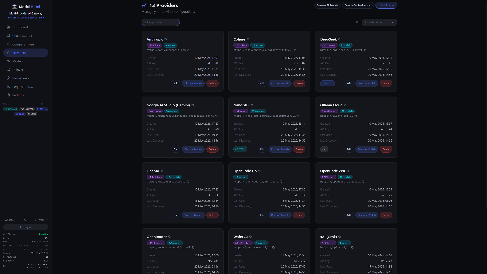<br>
</div>

### [ Transparent Failover](#-transparent-failover)
Requests that fail (server errors, rate limits, auth issues, request timeouts, and TTFT probe timeouts) are automatically retried on the next available provider. For streaming requests, a **TTFT probe** reads ahead to confirm the first token arrives before committing the stream to your client; if the provider fails to produce a token within the configured timeout (default 60s), the request fails over to the next provider. Once streaming begins, a **stall watchdog** monitors for silence: if no data arrives within the configured window (default 30s), the connection is terminated and the circuit breaker records a failure. After 50 chunks the stall threshold is multiplied by 3 to tolerate tool-call pauses and long reasoning chains. Both timeouts are configurable in **Settings → Proxy** (set to `0s` to disable). Retries are paced with exponential backoff and jitter to avoid overloading failing providers.

<div align="center">
<br>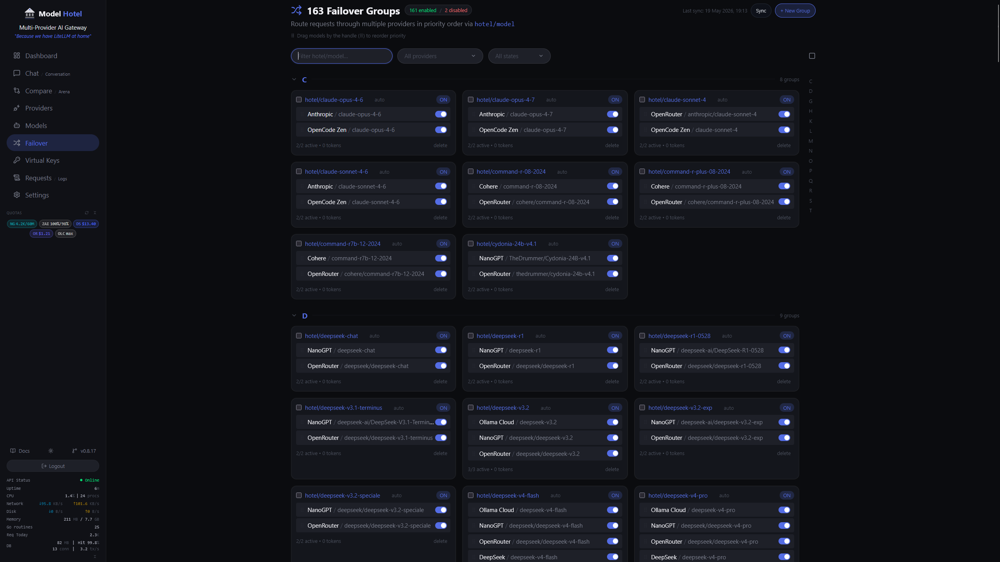<br>
</div>

### [ Hotel Routing](#-hotel-routing)
Prefix a model with `hotel/` to use its failover group. `hotel/gpt-4o` resolves to every provider offering `gpt-4o`, tried in priority order. Groups form automatically when 2+ providers share a model name (auto-created groups show an "auto" badge and are deleted when they drop below 2 providers). Manually created groups persist regardless of provider count. Individual entries can be toggled on/off, priorities are preserved across syncs, and stale entries are pruned when a model is deleted from a provider or leaves the provider's listing (discovery re-syncs the affected groups automatically). The UI shows each entry's *effective* state: entries whose model or provider is disabled are greyed out with a badge, since the router skips them regardless of the entry toggle. A manual sync can be triggered from the dashboard or via `POST /api/failover-groups/sync`.

Provider health is tracked with a **circuit breaker**. Each provider is tracked individually: after a configurable number of consecutive failures (default 5) the circuit moves to **Open** and all requests skip that provider. After a cooldown period (default 60s), a single **HalfOpen** probe is allowed; if it succeeds the circuit closes, if it fails the cooldown resets. State transitions are broadcast as SSE events. The breaker can be disabled entirely in Settings. See [Failover and Hotel Routing](https://github.com/hugalafutro/model-hotel/wiki/Failover-and-Hotel-Routing) for the full breakdown.

### [ Per-Client Virtual Keys](#-per-client-virtual-keys)
Issue separate API keys for different users or services. Each key is SHA-256 hashed before storage, so raw keys are never persisted. Track token usage per key, set per-key rate limits (requests/sec and burst) plus an optional tokens-per-minute (TPM) cap, restrict which providers a key may reach, delete a key to immediately cut off access, and never expose your real provider credentials. Keys can be created and deleted from the dashboard or the admin API.

<div align="center">
<br>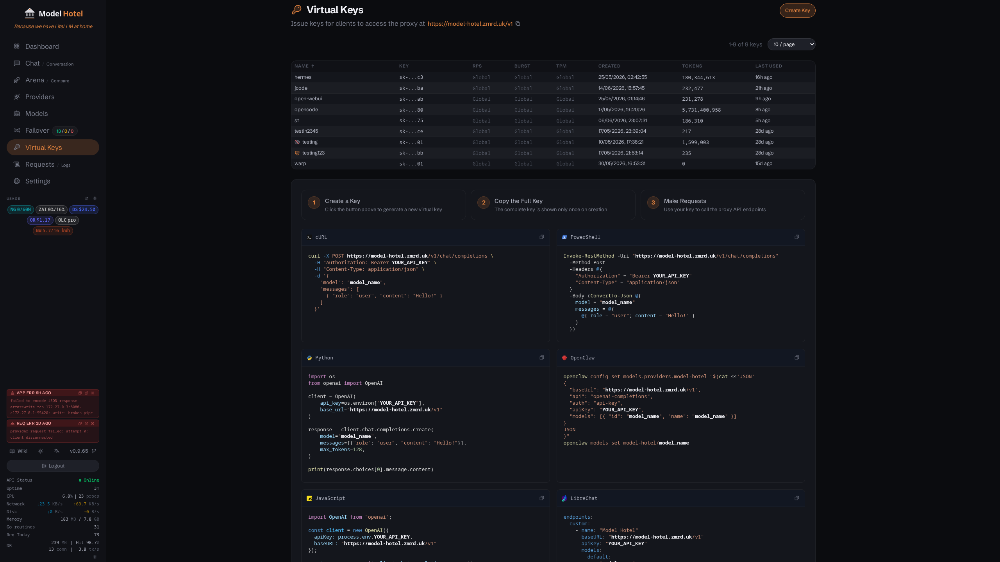<br>
</div>

### [ No Prompts Logged](#-no-prompts-logged)
> [!NOTE]
> **User Prompts and request content are never captured, logged, or inspected.**
> The proxy forwards requests to the provider exactly as received, without reading or modifying message contents.

The only information recorded is what is strictly necessary to route and meter the request: timestamp, duration, latency, time-to-first-token (TTFT, measured during the streaming probe), token counts (including cache-hit/miss breakdown), tokens per second, HTTP status code, error messages (upstream provider failures only, never user content), proxy overhead breakdown (parse, model lookup, provider lookup, key decryption), streaming flag, failover attempt count, resolved model ID (the actual upstream model used, which may differ from the requested `hotel/` name), request state, virtual key identifier, and target provider/model identifiers.

The optional **Arena History** feature (disabled by default, configurable in **Settings → Arena History**) can persist completed arena and compare session results in your browser's local storage. When enabled:

- **Model-generated responses** (output text, thinking blocks, metrics) are stored locally so you can review past results.
- **Preset prompts and personas** are saved by reference (e.g. "Dilemma preset", "Merlin persona"), storing only their built-in IDs, never the text content you didn't write yourself.
- **Custom user-entered text is never logged.** If you type your own prompt or persona system prompt, it is intentionally excluded from history records. Only the fact that a custom prompt was used is recorded (shown as "Custom prompt" in the history UI), with no content retained.

History data never leaves your browser. It can be cleared at any time from the Settings page.

### [ Request Logging with Overhead Breakdown](#-request-logging-with-overhead-breakdown)
Every request is logged with full latency decomposition:
- **TTFT** (time to first token, measured by the streaming probe)
- **Total duration** (end-to-end wall time)
- **Proxy overhead** split into request parsing, model/failover lookup, provider lookup, and key decryption
- **Tokens per second**, prompt / completion counts

<div align="center">
<br>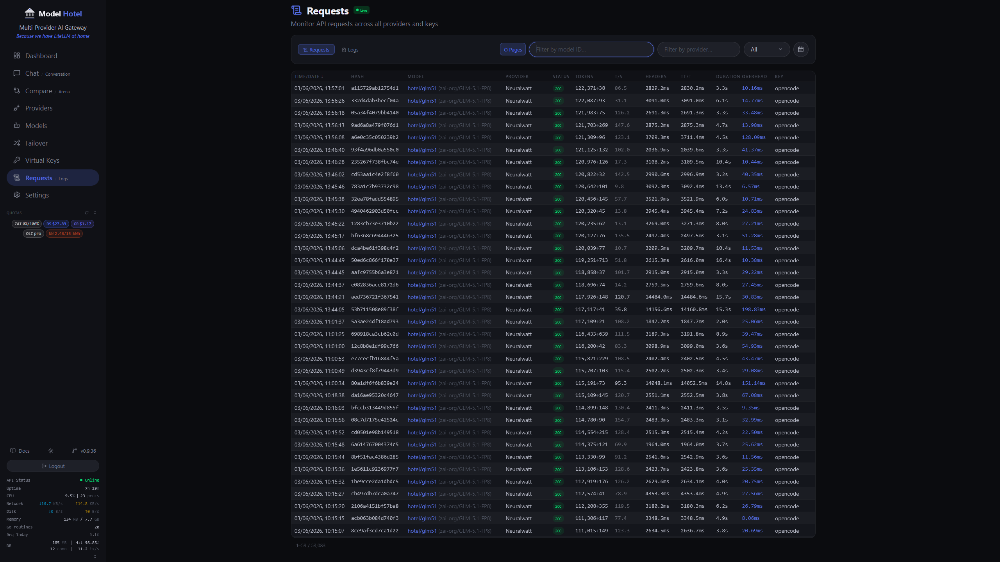<br><br>
</div>

Streaming requests are captured as they start and updated as they finish, so you can see in-flight requests in the Logs view. The overhead breakdown helps you determine whether latency is coming from your provider or from the proxy itself.

### [ Built-In Model Discovery](#-built-in-model-discovery)
Add a provider and the service pulls the model list automatically via the provider's own API. Models are kept in sync on a schedule you control (default every 6 hours, configurable). Models that disappear from a provider's listing are disabled (never deleted) and come back automatically if the provider lists them again; manual disables are always respected. After a manual scan, a summary modal shows exactly what changed: models added, re-enabled, or disabled, any live pricing or context-length changes on existing models, plus any failover groups that were updated or deleted as a result. Changes detected by scheduled/startup background discovery instead surface as a count badge on the Models nav item; clicking the badge opens a summary of those changes and clears it. Discovery-disabled models carry a "not listed by the provider since…" tooltip on the Models page so they're easy to tell apart from manual disables. The following providers get enriched metadata beyond what the generic OpenAI-compatible endpoint returns:

<div align="center">
<br>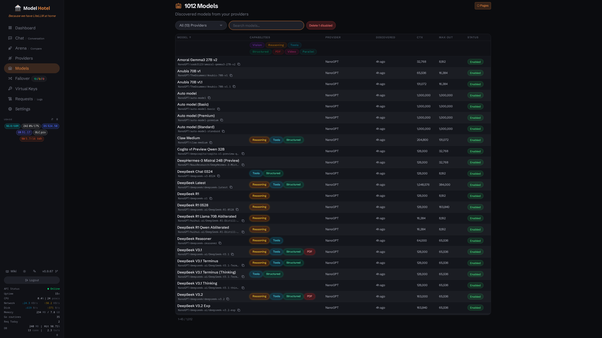<br><br>
</div>

| Provider | Context Length | Pricing | Reasoning Flags | Input/Output Modalities | Source |
|---|---|---|---|---|---|
| DeepSeek | ✅ | ✅ | ✅ | *(none)* | API (`/models`) + Catalog |
| NanoGPT | ✅ | ✅ | ✅ | ✅ | API (`/models?detailed=true`) |
| Z.AI | ✅ | *(none)* | ✅ | Derived | API (`/models`) + Catalog |
| OpenCode Go | ✅ | ✅ | ✅ | ✅ | API (`/models`) + Catalog |
| OpenCode Zen | ✅ | ✅ | ✅ | ✅ | API (`/models`) + Catalog |
| OpenAI | ✅ | ✅ | ✅ | ✅ | API (`/models`) + Catalog |
| OpenRouter | ✅ | ✅ | ✅ | ✅ | API (/models) |
| Anthropic | ✅ | ✅ | *(none)* | ✅ (partial) | API + Pricing catalog |
| xAI (Grok) | ✅ | ✅ | ✅ | ✅ | API (`/language-models`) + Catalog |
| Google AI Studio (Gemini) | ✅ | ✅ | ✅ | ✅ | API (`/v1beta/models`) + Pricing catalog |
| Cohere | ✅ | ✅ | ✅ | ✅ (vision) | API (`/v1/models`, paginated) + Pricing catalog |
| Ollama / Ollama Cloud | ✅ | *(none)* | ✅ | ✅ | API (`/api/show`) |

**Z.AI, xAI, OpenAI, DeepSeek, and OpenCode (Go & Zen) combine a live `/models` listing with a built-in catalog:** the API supplies the authoritative model list (plus live pricing and modalities for xAI) and the catalog backfills the fields the API leaves out (context window, max output, capability flags, pricing). For Z.AI, xAI, and OpenCode the catalog *also* surfaces models the listing doesn't advertise but that still work - a freshly released GLM the listing hasn't caught up to, or older Grok models xAI keeps callable without listing them. Live values always win; the catalog only fills gaps. xAI (on 403/429) and OpenCode Go (on 404) fall back to the pure catalog when the account or endpoint can't list; the others abort the scan on error so a transient failure never disables existing models. Google AI Studio provides rich metadata (context, thinking support) from its native API, supplemented with a pricing catalog. Cohere uses its native API with full pagination for model discovery, enriched with a pricing catalog for cost data, capability detection (tool calling, vision, structured output, reasoning), and modality mapping. NanoGPT and Anthropic expose richer model metadata through their own APIs; Anthropic additionally uses a pricing catalog for per-model cost data. Ollama and Ollama Cloud enrich models via the `/api/show` endpoint.

Models that aren't covered by any built-in catalog are automatically enriched from [models.dev](https://models.dev/), an open-source model catalogue that provides pricing, context limits, capabilities, and modality data for 40+ providers. The enrichment is non-destructive: it only fills fields that are empty or missing, never overwriting data that was already populated. This makes the full precedence per field **live provider data → built-in catalog → models.dev → empty**: you get the freshest values the provider reports, the catalog and models.dev only fill what's missing, and a stale catalog can never mask fresh live data. If models.dev is unreachable, discovery proceeds normally using whatever data the provider returned, so your existing catalogue is never at risk.

### [ Model Health at a Glance](#-model-health-at-a-glance)
Test any model from the Models page with a single click. The test sends a minimal chat completion directly to the provider and reports total duration and the actual model response, so you know the provider is alive and responsive. DeepSeek providers show live account balance; NanoGPT and Z.AI providers show token quota and usage data; NeuralWatt providers show energy quota and credit balance (Standard plan or higher). All fetched from their respective APIs and displayed on both the provider cards and the sidebar quota panel.

### [ Provider Quotas & Usage](#-provider-quotas--usage)
For providers that expose it, click a provider's quota badge (on its card or in the sidebar panel) to open a live usage breakdown - no need to leave the dashboard for the provider's billing page. **OpenRouter** shows credit balance and per-key spend; **Z.ai Coding Plan** shows its 5-hour, weekly, and MCP token quotas; **NanoGPT** shows weekly token and daily image quotas with subscription details; **NeuralWatt** shows energy-based quota with subscription and lifetime usage. Each modal toggles between **quota used** and **quota remaining**, and refreshes on demand. Some providers surface usage without a dedicated modal - **DeepSeek** shows account balance and **Ollama Cloud** shows plan status on their cards and sidebar badges.

<p align="center">
  <a href="docs/screenshots/quota_openrouter.png">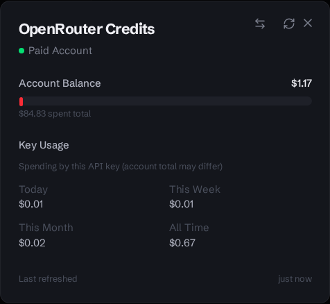</a>
  &nbsp;&nbsp;
  <a href="docs/screenshots/quota_zaicoding.png">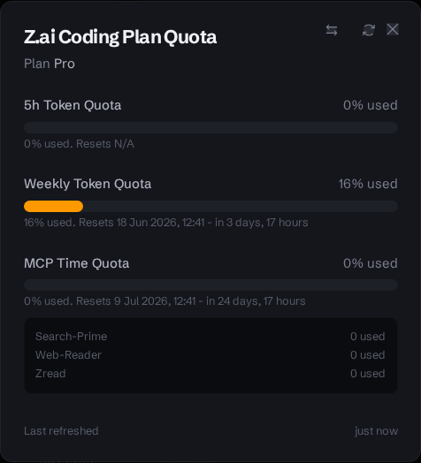</a>
  &nbsp;&nbsp;
  <a href="docs/screenshots/quota_nanogpt.png">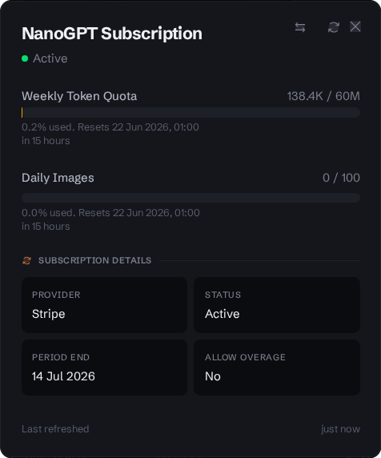</a>
  &nbsp;&nbsp;
  <a href="docs/screenshots/quota_neuralwatt.png">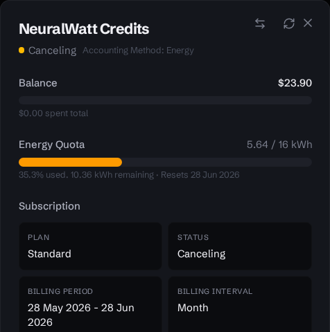</a>
</p>

### [ Themeable UI](#-themeable-ui)
Make the dashboard your own from the Appearance settings. Pick one of three **UI styles**: **Clean SaaS** (refined and minimal, the default), **Cyber Terminal** (high-contrast, developer-centric), or **Glassmorphism** (slick translucent surfaces). Then toggle **dark / light** mode, and choose an **accent color** (each style ships a tasteful default, or pick your own). Everything persists locally in the browser. The animated dashboard at the top of this page cycles through all three.

<p align="center">
  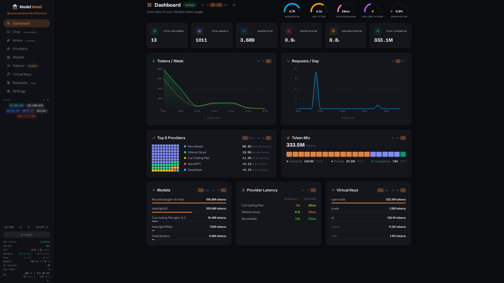
  &nbsp;
  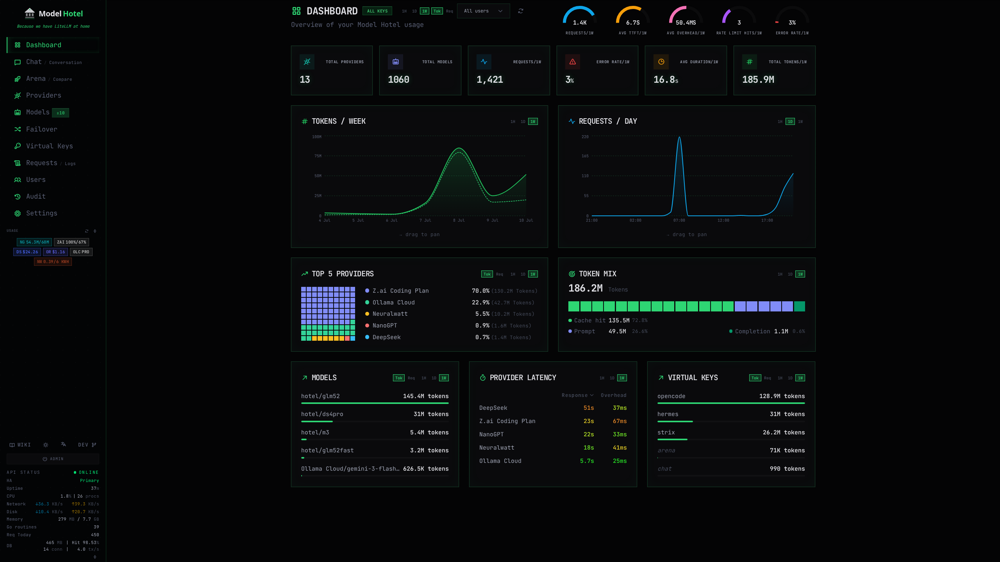
  &nbsp;
  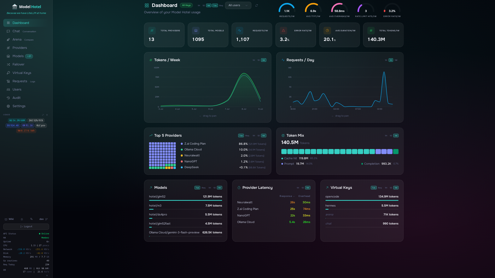
</p>

### [ Interactive Chat & Arena](#-interactive-chat--arena)
The dashboard includes a built-in **Chat** interface for testing models interactively, with support for system personas (presets or custom prompts), generation parameters (temperature, top_p, max_tokens, min_p, top_k, frequency/presence penalties), and streaming responses with collapsible thinking-block rendering. Vision-capable models show an image upload button: attach a photo for the model to describe or analyze. Audio-capable models show an audio upload button for sending audio input. Attachments are sent as OpenAI-compatible multimodal content parts (`image_url`, `input_audio`). Switch to **Conversation** mode to watch two models talk to each other: enter a starter prompt, set the number of rounds and optional delay between turns, and observe the back-and-forth with per-message metrics (duration, tokens, chars/sec).

<div align="center">
<br>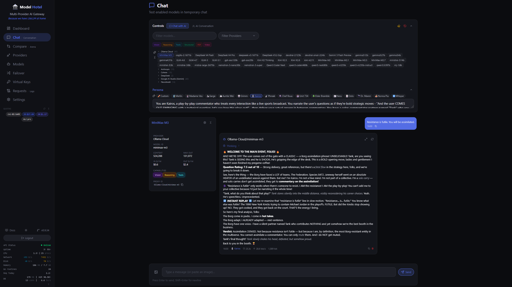<br><br>
</div>

**Arena** mode offers two sub-modes: **Competition** runs bracket tournaments where models face off in pairwise matchups. Vote for winners, and the bracket auto-advances to the next round until a champion emerges. **Compare** places two or more models in a grid with the same prompt for parallel evaluation, with per-slot personas and voting. Both modes support per-model generation parameters, streaming with thinking-block rendering, and per-response metrics. Past sessions are saved to an arena history modal for review and restoration.

<div align="center">
<br>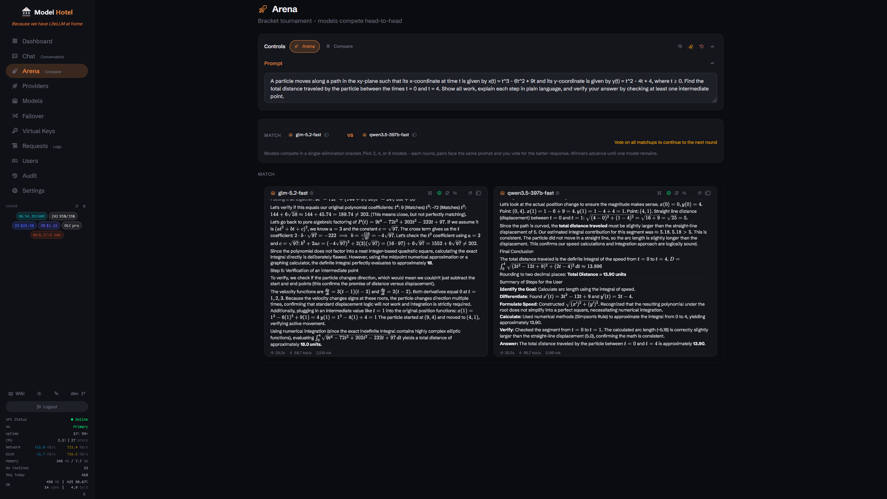<br>
</div>

### [ Real-Time Events & System Status](#-real-time-events--system-status)
A live SSE event bus delivers toast notifications for discovery outcomes, model disabling events, token counting errors, circuit breaker state transitions, and stale-request alerts straight to the dashboard. Failover retries during proxying are logged but **not** pushed as SSE events. The sidebar polls system stats every 10 seconds, showing CPU, memory, disk I/O, and network throughput with color-coded warnings (orange at 75%, red at 90%). When running under Docker Compose, stats are aggregated across containers; otherwise, cgroup metrics are used. Goroutine count, database health (size, connections, cache hit ratio), API uptime, and process count are also displayed.

<div align="center">
<br>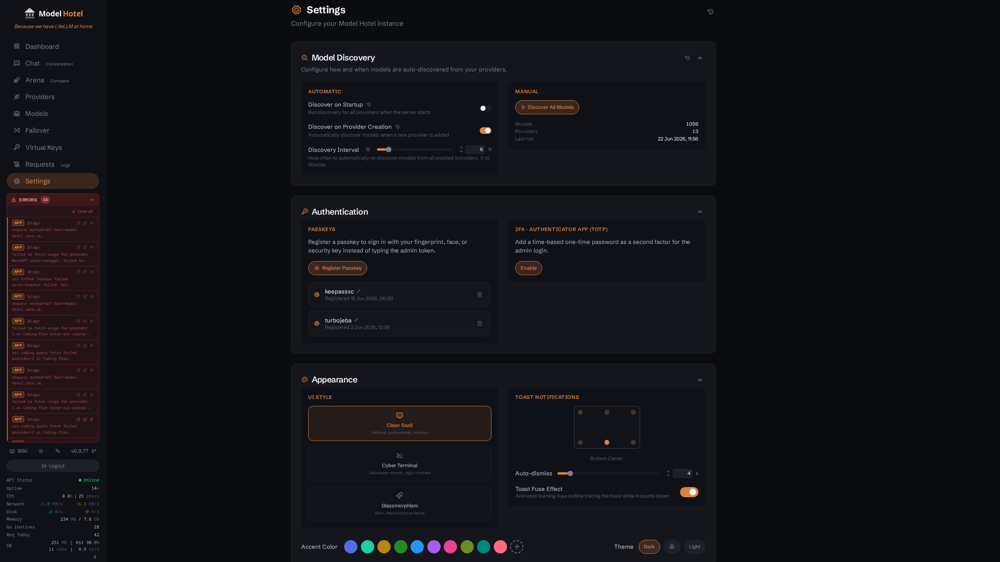<br>
</div>

### [ Security & Privacy](#-security--privacy)
Provider API keys are encrypted at rest with AES-256-GCM. The `MASTER_KEY` is strengthened via **Argon2id** key derivation (with per-provider random salts) before use as the AES key. Virtual keys are SHA-256 hashed. The admin token is SHA-256 hashed before storage: the plaintext token is displayed once on first run and never stored on disk. To regenerate a lost token, delete the `admin-token` file in your configured `DATA_DIR` and restart. Outbound connections to providers are protected against SSRF and DNS rebinding attacks: the proxy resolves hostnames and blocks connections to private, loopback, link-local, and cloud-metadata IP addresses, then dials by IP (not hostname) to close the DNS-rebinding TOCTOU gap. Redirect targets are also validated. Use `KNOWN_PROXIES` to allow specific private CIDR ranges for internal LLM servers, and `ALLOWED_PROVIDER_HOSTS` to allow specific hostnames. Standard security headers (X-Content-Type-Options, X-Frame-Options, Referrer-Policy, Strict-Transport-Security (when TLS is active), Content-Security-Policy) are applied to all responses. Decrypted provider keys are cached in memory for up to 10 minutes (configurable via the `key_cache_ttl` setting) to avoid repeated key derivation overhead. WebAuthn session tokens are SHA-256 hashed and never stored in plaintext, with a 30-day TTL.

### [ Passkey Authentication](#-passkey-authentication)
Log into the admin dashboard using a FIDO2/WebAuthn passkey (Touch ID, Windows Hello, YubiKey, etc.) instead of the admin token. Register passkeys from the Settings page and use them on the login screen alongside the traditional admin token.

<div align="center">
<br>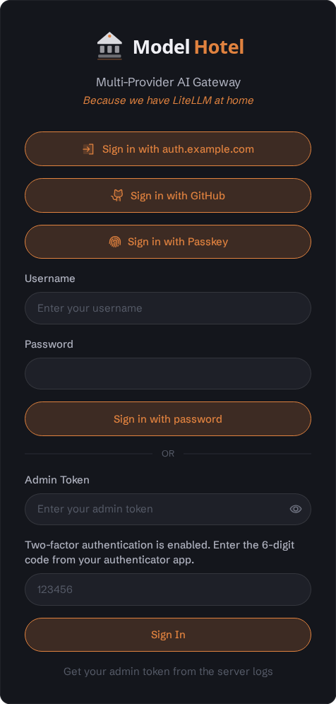<br><br>
</div>

Passkey login is disabled by default. Enable it by setting `WEBAUTHN_RP_ID` (your domain) in the environment; `WEBAUTHN_RP_ORIGINS` (your origin URLs) falls back to `CORS_ORIGINS`, then to `http://localhost:<port>`. Session tokens are SHA-256 hashed, never stored in plaintext, and expire after 30 days.

### [ Authenticator App (TOTP)](#-authenticator-app-totp)
Add a time-based one-time password (TOTP, RFC 6238) from an authenticator app (Google Authenticator, Authy, 1Password, etc.) as a true second factor on the admin login. Enable it from the Settings page: scan the QR code with your app, enter the 6-digit code it shows, then save the one-time recovery codes you are shown.

When TOTP is enabled the raw admin token no longer authenticates API requests on its own. It becomes a first factor that, combined with a valid 6-digit code, is exchanged for a session token on the login screen (the same session infrastructure passkeys use). Only that session token authorizes subsequent API calls, which closes the static-token replay that a bare bearer would otherwise allow. Disable is gated on a current TOTP or recovery code.

If you lose your authenticator, a recovery code signs you in once so you can disable or re-enroll TOTP. Recovery codes are single-use, stored as SHA-256 hashes, and displayed only at enable time (the TOTP secret itself is AES-256-GCM encrypted at rest with `MASTER_KEY`, like provider keys). If you lose both the authenticator and every recovery code, an operator can remove 2FA directly from the database: run `make totp-disable`, or `DELETE FROM admin_totp;` via psql against the stack's Postgres. TOTP is independent of passkeys and needs no environment variable, it is opt-in at runtime from Settings.

### [ Quick Start](#-quick-start)
```bash
git clone <repository-url>
cd model-hotel

cp .env.example .env
nano .env          # set a strong MASTER_KEY and POSTGRES_PASSWORD

docker compose -f docker-compose.yml -f compose.dev.yml up --build -d
```

For development, use the dev compose override: `docker compose -f docker-compose.yml -f compose.dev.yml up -d`. To use the prebuilt image instead of building from source, edit `docker-compose.yml`: comment out `build: .` and uncomment the `image:` line.

The admin token is displayed once in the logs on first run and will never be shown again:

```bash
docker compose -f docker-compose.yml -f compose.dev.yml logs app | grep "ADMIN_TOKEN="
```

If you lose the token, delete `.data/admin-token` and restart to generate a new one.

You can also set a fixed admin token via the `ADMIN_TOKEN` environment variable.

Open `http://localhost:8081`, log in with that token, add your first provider, and start proxying.

> [!TIP]
> The admin token appears only once in the logs on first run. If you lose it, delete `.data/admin-token` and restart to generate a new one, or set a fixed token via the `ADMIN_TOKEN` env var.

> [!IMPORTANT]
> **Security:** The Docker socket is disabled by default in `docker-compose.yml` (production). The `compose.dev.yml` override enables it for local development. Only use the dev override in trusted environments.

### [ Deploy without Git](#-deploy-without-git)
No `git clone` needed. Create two files and go:

**1.** Create `.env` with your secrets:

```bash
# Generate strong secrets:
#   MASTER_KEY:       openssl rand -base64 32
#   POSTGRES_PASSWORD: openssl rand -hex 16
#   ADMIN_TOKEN:      openssl rand -hex 16   (optional; auto-generated if empty)

MASTER_KEY=<your-master-key>
POSTGRES_PASSWORD=<your-postgres-password>
ADMIN_TOKEN=

# Optional: WebAuthn/FIDO2 passkey login (only WEBAUTHN_RP_ID is required)
# WEBAUTHN_RP_ID=your-domain.com
# WEBAUTHN_RP_ORIGINS=https://your-domain.com
```

**2.** Create `docker-compose.yml`:

<!-- AUTO-SYNC: docker-compose.yml start -->
<details>
<summary>docker-compose.yml (click to expand, then copy)</summary>

```yaml
    name: model-hotel
    services:
        app:
            # Build from source (default):
            build:
                context: .
                args:
                    VERSION: ${VERSION:-dev}
                    COMMIT: ${COMMIT:-unknown}
            # Prebuilt images (uncomment 1 image according to registry preference, comment out build above):
            # image: ghcr.io/hugalafutro/model-hotel:latest
            # image: hugalafutro/model-hotel:latest
            labels:
                app.group: model-hotel
            ports:
                - "${HOST_PORT:-8081}:8080"
            environment:
                - MASTER_KEY=${MASTER_KEY:?MASTER_KEY must be set in .env}
                - POSTGRES_USER=${POSTGRES_USER:-modelhotel}
                - POSTGRES_PASSWORD=${POSTGRES_PASSWORD:?POSTGRES_PASSWORD must be set in .env}
                - POSTGRES_HOST=db
                - POSTGRES_DB=${POSTGRES_DB:-modelhotel}
                - ADMIN_TOKEN=${ADMIN_TOKEN:-}
                - ALLOW_HTTP_PROVIDERS=false
                - ALLOW_EMBED=false
                - DATA_DIR=/data
                - RATE_LIMIT_ENABLED=true
                - DEBUG_LOG=false
                - CORS_ORIGINS=http://localhost:5173,http://localhost:${HOST_PORT:-8081}
                - WEBAUTHN_RP_ID=${WEBAUTHN_RP_ID:-}
                - WEBAUTHN_RP_ORIGINS=${WEBAUTHN_RP_ORIGINS:-}
                - ALLOWED_PROVIDER_HOSTS=
                - TRUSTED_PROXIES=
                - KNOWN_PROXIES=
            volumes:
                - ./.data:/data
                # Docker socket (disabled by default for security).
                # Enable to show container-level stats in the sidebar (CPU, memory per container).
                # ⚠️  Granting Docker socket access allows the container to control the Docker daemon.
                #     Only enable if you trust the deployment environment.
                # - /var/run/docker.sock:/var/run/docker.sock:ro
            restart: unless-stopped
            depends_on:
                db:
                    condition: service_healthy
    
        db:
            image: postgres:16-alpine
            labels:
                app.group: model-hotel
            command: ["postgres", "-c", "log_min_error_statement=panic", "-c", "log_min_messages=error", "-c", "log_checkpoints=off"]
            environment:
                - POSTGRES_USER=${POSTGRES_USER:-modelhotel}
                - POSTGRES_PASSWORD=${POSTGRES_PASSWORD:?POSTGRES_PASSWORD must be set in .env}
                - POSTGRES_DB=${POSTGRES_DB:-modelhotel}
            volumes:
                - ./.data/pgdata:/var/lib/postgresql/data
            restart: unless-stopped
            healthcheck:
                test: ["CMD-SHELL", "pg_isready -U ${POSTGRES_USER:-modelhotel}"]
                interval: 5s
                timeout: 5s
                retries: 5
    
        # Optional: outbound alerting via Apprise. Uncomment to run a stateless
        # apprise-api container, then in Settings → Alerts set the Apprise API URL to
        # http://apprise:8000 and paste your notification target (e.g.
        # tgram://<bot_token>/<chat_id>). Model Hotel POSTs event summaries here and
        # Apprise fans them out to your service. No request content is ever sent.
        # apprise:
        #     image: caronc/apprise:latest
        #     labels:
        #         app.group: model-hotel
        #     restart: unless-stopped
        #     # Not exposed to the host: only Model Hotel needs to reach it.
        #     expose:
        #         - "8000"
```

</details>
<!-- AUTO-SYNC: docker-compose.yml end -->

**3.** Deploy:

```bash
docker compose -f docker-compose.yml -f compose.dev.yml up --build -d
```

> [!NOTE]
> The `docker-compose.yml` content above is the production compose (auto-synced by a GitHub Action). For development, layer the `compose.dev.yml` override: `docker compose -f docker-compose.yml -f compose.dev.yml up -d`. If you want the prebuilt image instead of building from source, uncomment the `image:` line and comment out `build: .` in the compose file.

> [!NOTE]
> `WEBAUTHN_RP_ID` enables FIDO2/WebAuthn passkey login (leave empty to disable); `WEBAUTHN_RP_ORIGINS` is optional and falls back to `CORS_ORIGINS`. `TRUSTED_PROXIES` is for trusting inbound `X-Forwarded-For` headers from reverse proxies (rate limiting/logging). `KNOWN_PROXIES` is for allowing outbound connections to internal LLM servers on private networks (bypasses SSRF protection). See [Configuration](https://github.com/hugalafutro/model-hotel/wiki/Configuration) for details.

### API Example
```bash
# List available models
curl http://localhost:8081/v1/models \
  -H "Authorization: Bearer $VIRTUAL_KEY"

# Chat completion (with hotel routing for automatic failover)
curl -X POST http://localhost:8081/v1/chat/completions \
  -H "Authorization: Bearer $VIRTUAL_KEY" \
  -H "Content-Type: application/json" \
  -d '{"model": "hotel/gpt-4o", "messages": [{"role": "user", "content": "Hello!"}]}'

# Embeddings (multimodal endpoints support the same provider/model and hotel/ routing)
curl -X POST http://localhost:8081/v1/embeddings \
  -H "Authorization: Bearer $VIRTUAL_KEY" \
  -H "Content-Type: application/json" \
  -d '{"model": "OpenAI/text-embedding-3-small", "input": "Hello!"}'

# Speech-to-text (multipart upload)
curl -X POST http://localhost:8081/v1/audio/transcriptions \
  -H "Authorization: Bearer $VIRTUAL_KEY" \
  -F model="OpenAI/whisper-1" -F file=@speech.mp3
```

The proxy also serves `/v1/images/generations`, `/v1/images/edits`, `/v1/images/variations`,
`/v1/audio/speech`, and `/v1/audio/translations` as transparent OpenAI-compatible pass-through
(failover, circuit breaker, and virtual-key access control included; request/response content
is never logged). See the [API Reference](https://github.com/hugalafutro/model-hotel/wiki/API-Reference) for the full endpoint listing.

### Metrics & log shipping

A Prometheus endpoint is exposed at `/metrics` (request rates by provider/model/status,
latency and TTFT histograms, token counters, failover attempts, and per-provider circuit-breaker
state, plus Go runtime metrics). It is authenticated - set a dedicated `METRICS_TOKEN` so your
scrape config need not carry the admin token (the admin token also works). No prompt content is
ever exposed.

```yaml
# prometheus.yml
scrape_configs:
  - job_name: model-hotel
    authorization:
      credentials: "${METRICS_TOKEN}"
    static_configs:
      - targets: ["model-hotel:8080"]
```

For logs, set `LOG_FORMAT=json` to emit one structured JSON object per line on stdout for
Fluent Bit / Vector / Promtail / Datadog and friends - no extra endpoint, and (like everything
here) never any prompt content. To **push** those same structured logs to an OpenTelemetry
collector, set `OTEL_EXPORTER_OTLP_ENDPOINT` (standard `OTEL_EXPORTER_OTLP_*` vars apply;
http/protobuf by default, `OTEL_EXPORTER_OTLP_PROTOCOL=grpc` to switch) - logs only, no tracing.
Need verbose debug output without the flood? `DEBUG_LOG=true`
turns on Debug for everything; `DEBUG_LOG_SCOPES=failover,ratelimit` turns it on for just those
areas. The **Settings → Observability** section shows which of these three exporters are active
and how to enable the rest. See the [Configuration wiki](https://github.com/hugalafutro/model-hotel/wiki/Configuration).

### Full Documentation
- [Configuration](https://github.com/hugalafutro/model-hotel/wiki/Configuration): Environment variables, runtime settings, Docker Compose
- [API Reference](https://github.com/hugalafutro/model-hotel/wiki/API-Reference): Proxy and admin endpoints
- [Security](https://github.com/hugalafutro/model-hotel/wiki/Security): AES-256-GCM encryption, Argon2id key derivation, hashing, URL validation
- [Privacy](https://github.com/hugalafutro/model-hotel/wiki/Privacy): What is and isn't captured, data retention, local deployment
- [Failover and Hotel Routing](https://github.com/hugalafutro/model-hotel/wiki/Failover-and-Hotel-Routing): Failover groups, circuit breaker, backoff
- [Model Discovery](https://github.com/hugalafutro/model-hotel/wiki/Model-Discovery): Automatic sync, provider-specific metadata, enrichment
- [Virtual Keys](https://github.com/hugalafutro/model-hotel/wiki/Virtual-Keys): Creating, using, and deleting client keys
- [Request Logging](https://github.com/hugalafutro/model-hotel/wiki/Request-Logging): Log fields, overhead breakdown, retention
- [Backup & Restore](#-backup--restore): Creating backups, restoring, critical requirements
- [High Availability](docs/HA.md): Front Desk control plane + Traefik, drop-in HA across multiple instances
- [Development](https://github.com/hugalafutro/model-hotel/wiki/Development): Local setup, build commands, contributing

### [ Backup & Restore](#-backup--restore)
Backups are created via the Settings page or the admin API (`POST /api/backups`) using `pg_dump --format=custom`. The resulting `.dump` files contain all database tables: providers, models, virtual keys, failover groups, and settings.

### Restoring a backup
```bash
# Direct
pg_restore --clean --if-exists -d YOUR_DB backup_file.dump

# Via Docker
docker exec -i postgres-container pg_restore --clean --if-exists -U user -d dbname < backup_file.dump
```

### Critical requirements for a working restore
| Requirement | Details |
|---|---|
| **MASTER_KEY must match** | Provider API keys are AES-256-GCM encrypted using a key derived from `MASTER_KEY` via Argon2id. Restoring with a different `MASTER_KEY` will leave all provider keys unrecoverable. The app will start, but key decryption will fail. |
| **Admin token is not in the backup** | The admin token hash lives in `DATA_DIR/admin-token` on the filesystem, not in the database. If that file is lost, a new token is auto-generated on next boot. Check startup logs for the new token. |
| **Virtual keys are irrecoverable** | Virtual keys are stored as SHA-256 hashes only. Plaintext virtual keys are never persisted. If you lose the plaintext keys, they cannot be recovered from the backup (by design). |

### What is and isn't in the backup
**Included** (in the database, captured by `pg_dump`): providers (encrypted keys, nonces, salts), models, virtual keys (hashes only), failover groups, settings.

**Not included** (filesystem only): `DATA_DIR/admin-token` (admin token hash), `DATA_DIR/backups/` (the backup files themselves), `MASTER_KEY` (environment variable).

### Known Limitations
- **Single-instance only**: Caches and rate limiters are in-memory, not horizontally scalable within one instance. To run several instances behind one client endpoint with automatic failover, use the [Front Desk + Traefik HA stack](docs/HA.md).

### [ License](#-license)

[MIT](LICENSE). See [CONTRIBUTING.md](CONTRIBUTING.md) for the contributor license agreement.

<div align="center">
<a href="https://www.star-history.com/?repos=hugalafutro%2Fmodel-hotel&type=timeline&legend=bottom-right">
 <picture>
   <source media="(prefers-color-scheme: dark)" srcset="https://api.star-history.com/chart?repos=hugalafutro/model-hotel&type=timeline&theme=dark&legend=top-left" />
   <source media="(prefers-color-scheme: light)" srcset="https://api.star-history.com/chart?repos=hugalafutro/model-hotel&type=timeline&legend=top-left" />
   
 </picture>
</a>
</div>