<p align="center">
  <br>
  <em>"Because we have LiteLLM at home"</em>
</p>
<br>

<p align="center"><strong>Multi-Provider AI Gateway</strong></p>

<p align="center">
 <a href="go.mod"></a>
 
 
 
 <a href="https://hub.docker.com/r/hugalafutro/model-hotel"></a>
 <br>
 <a href="https://github.com/hugalafutro/model-hotel/actions/workflows/ci.yml"></a>
 <a href="https://github.com/hugalafutro/model-hotel/actions/workflows/codeql.yml"></a>
 <a href="https://github.com/hugalafutro/model-hotel/actions/workflows/ci.yml"></a>
 
 <br>
</p>

> [!IMPORTANT]
> **AI-Assisted Project Disclaimer:**<br>
> Human judgment applied at every stage, particularly around architectural decisions, UX flows, and quality control.

<div align="center">
  
 <sub>Localised by AI - _expect mistakes_ - translation fixes welcome as PRs against [`web/src/i18n/locales/`](https://github.com/hugalafutro/model-hotel/tree/master/web/src/i18n/locales)!<br>Made with [OpenCode](https://opencode.ai) + [oh-my-opencode-slim](https://github.com/alvinunreal/oh-my-opencode-slim) & [Claude Code](https://claude.com/claude-code)</sub>
 <br>
 <br>
 <a href="https://mh.site19.ddns.net"></a>
 <br>
 <sub>Poke around a real instance at <a href="https://mh.site19.ddns.net">mh.site19.ddns.net</a> - rebuilds fresh every 30 minutes</sub>
 <br>
 <br>
</div>

A single OpenAI-compatible endpoint in front of all your LLM providers, cloud or self-hosted. Add the same model from any number of providers and a failover group forms around it automatically: requests go to the providers in the order you set, and when one runs out of quota or goes down, the next one answers, with no change on the client side. A provider whose quota is spent is skipped until it resets, then rejoins on its own. Models are auto-discovered the moment you add a provider and, if you want, on a schedule. No prompt data is ever stored.

<p align="center">
 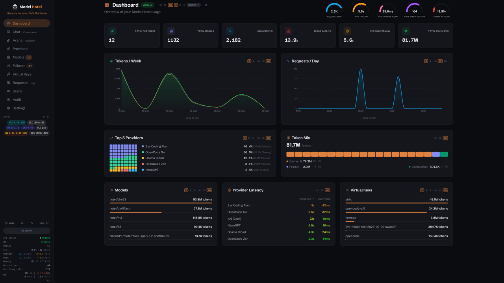
 <br>
 <sub>Model Hotel Dashboard</sub>
</p>

### [ Quick Start](#-quick-start)

Two ways in: clone and build from source (below), or skip the clone and run the published image from two files (see [Deploy without Git](#-deploy-without-git)).

```bash
git clone https://github.com/hugalafutro/model-hotel.git
cd model-hotel

cp .env.example .env
nano .env          # set a strong MASTER_KEY and POSTGRES_PASSWORD; change HOST_PORT if 8081 is taken

docker compose up --build -d
```

For local development, layer the `compose.dev.yml` override instead. It mounts the Docker socket, turns on `DEBUG_LOG`, and allows embedding, so use it only in a trusted environment:

```bash
# Development only:
docker compose -f docker-compose.yml -f compose.dev.yml up --build -d
```

To run a prebuilt image instead of building from source, edit `docker-compose.yml`: comment out the `build:` block and uncomment one of the `image:` lines.

On first run the admin token is printed once, in a boxed **ADMIN TOKEN** block in the startup banner, and never shown again:

```bash
docker compose logs app
```

If you lose it, delete `.data/admin-token` and restart to generate a new one. The `ADMIN_TOKEN` environment variable seeds the token on first boot only: once `.data/admin-token` exists the file wins and the variable is ignored.

Open `http://localhost:8081` (or the `HOST_PORT` you set), log in with that token, add your first provider, and start proxying. To stop, update or remove the stack, see [Stop, Update, Remove](#-stop-update-remove).

### [ One Endpoint, Many Providers](#-one-endpoint-many-providers)
**Hosted:** [Anthropic](https://www.anthropic.com), [AWS Bedrock](https://aws.amazon.com/bedrock/), [Azure AI Foundry](https://ai.azure.com/), [Cohere](https://cohere.com/), [DeepSeek](https://www.deepseek.com), [Google AI Studio](https://aistudio.google.com/), [Kimi Code](https://www.kimi.com/), [MiniMax](https://www.minimax.io/), [NanoGPT](https://nano-gpt.com), [NeuralWatt](https://neuralwatt.com/), [Ollama Cloud](https://ollama.com), [OpenAI](https://openai.com/), [OpenCode Go](https://opencode.ai), [OpenCode Zen](https://opencode.ai), [OpenRouter](https://openrouter.ai/), [Vertex AI](https://cloud.google.com/vertex-ai) (express keys), [xAI](https://x.ai/), [Z.AI](https://z.ai/). All but Anthropic and AWS Bedrock speak the OpenAI API; those two are native families, and a hand-entered endpoint that speaks Anthropic's native `/v1/messages` has its own type (`anthropic-messages`). Any other OpenAI-compatible API, hosted or local, can be added as a custom endpoint.

**Self-hosted:** [Ollama](https://github.com/ollama/ollama), [LM Studio](https://lmstudio.ai), [KoboldCPP](https://github.com/LostRuins/koboldcpp), [LocalAI](https://github.com/mudler/LocalAI), [SGLang](https://github.com/sgl-project/sglang) and [TabbyAPI](https://github.com/theroyallab/tabbyAPI) each have their own provider type: pick it, enter the address and port, done. Some providers need no API key at all (a local Ollama, or OpenCode Zen free models).

All of them are called through the same `/v1/chat/completions` endpoint; the proxy handles model ID mapping and failover transparently. Provider API keys are encrypted with AES-256-GCM at rest using your `MASTER_KEY`; only the proxy ever sees the decrypted credentials.

<p align="center">
 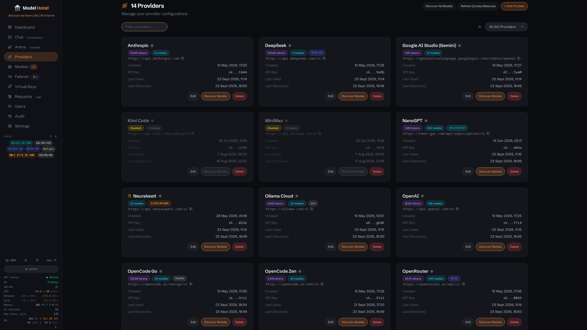
 <br>
 <sub>Provider management screen overview</sub>
</p>

### [ Transparent Failover](#-transparent-failover)
Requests that fail (server errors, rate limits, auth issues, request timeouts) are automatically retried on the next available provider, with exponential backoff and jitter between attempts so a failing provider is not hammered. Streaming requests get three extra guards: a [TTFT probe](https://github.com/hugalafutro/model-hotel/wiki/Failover-and-Hotel-Routing#ttft-probe-time-to-first-token) waits for the first token before committing the stream to your client, so a provider that never answers fails over instead of leaving the client hanging; a [stall watchdog](https://github.com/hugalafutro/model-hotel/wiki/Failover-and-Hotel-Routing#stall-watchdog) terminates a stream that goes silent mid-answer and counts it as a failure; and optional [hedging](https://github.com/hugalafutro/model-hotel/wiki/Failover-and-Hotel-Routing#request-hedging) (off by default) launches the next provider in parallel when the first one is slow to its first token, at the cost of duplicate upstream load. Both timeouts are set in **Settings → Proxy** and hedging under **Settings → Circuit Breaker & Failover**; the [Failover and Hotel Routing wiki](https://github.com/hugalafutro/model-hotel/wiki/Failover-and-Hotel-Routing#transparent-failover) has the full detail.

<p align="center">
 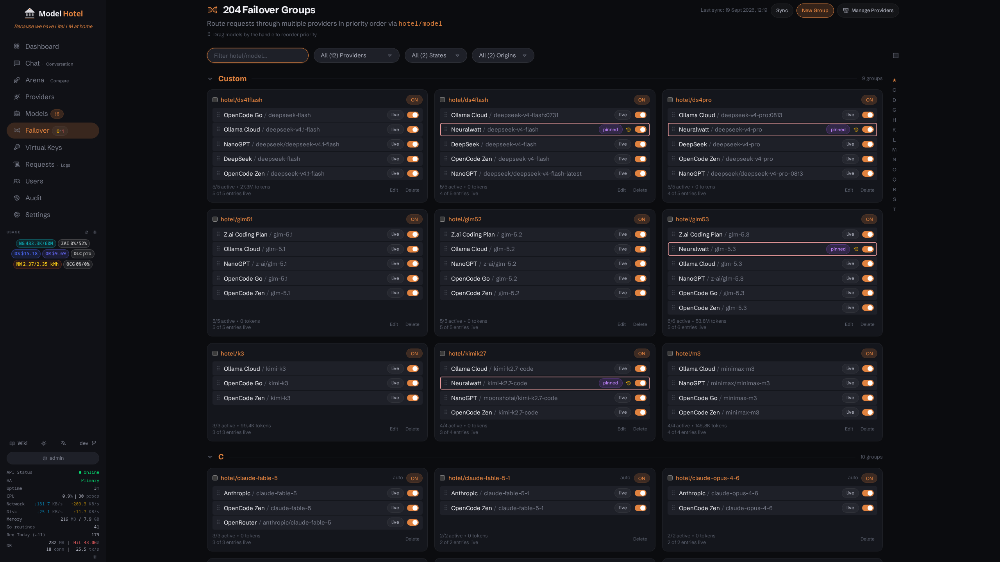
 <br>
 <sub>Failover groups management</sub>
</p>

### [ Hotel Routing](#-hotel-routing)
Prefix any model name with `hotel/` and you get the whole fleet behind it. `hotel/glm-4.6` reaches every provider that offers `glm-4.6`, in the order you set: a [failover group](https://github.com/hugalafutro/model-hotel/wiki/Failover-and-Hotel-Routing#failover-groups) forms on its own the moment two providers share a model name, follows discovery as models and providers come and go, and the request lands on the first healthy provider with no change on the client side. Behind it a per-model [circuit breaker](https://github.com/hugalafutro/model-hotel/wiki/Failover-and-Hotel-Routing#circuit-breaker) keeps track of who is failing: a provider that keeps erroring on one model is skipped for that model only, probed again after a cooldown that grows while it stays broken, and a provider that has run out of quota is [parked until its window resets](https://github.com/hugalafutro/model-hotel/wiki/Failover-and-Hotel-Routing#quota-pinned-cooldowns) and rejoins by itself. You set priorities and switch entries on or off from the dashboard; everything else is automatic. How groups are built, synced and ranked is in the [Failover and Hotel Routing wiki](https://github.com/hugalafutro/model-hotel/wiki/Failover-and-Hotel-Routing#hotel-routing).

### [ High Availability](#-high-availability)
Run several instances behind one client endpoint with no client-side change: a **Front Desk** control plane manages the fleet and replicates config to every member, while **Traefik** load-balances them with health checks and automatic failover. Members share one `MASTER_KEY` (so encrypted provider keys port across the fleet) and each keeps its own admin token.

<p align="center">
  <a href="docs/screenshots/frontdesk_members.png">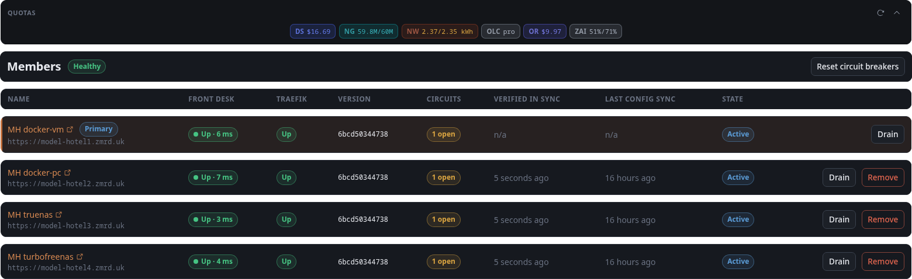</a>
  <br>
  <sub>Front Desk (HA control app) Dashboard</sub>
</p>

Full deployment in the [High Availability wiki](https://github.com/hugalafutro/model-hotel/wiki/High-Availability).

### [ Bellhop Companion App](#-bellhop-companion-app)

**Bellhop**, the native Android companion app for Front Desk, turns a paired phone into a pocket view of the fleet: live member health, request traffic, provider quota badges, the event log, and, for operator devices, one-tap drain, activate, and config-sync behind a biometric prompt. A home-screen widget keeps the fleet and its badges on the launcher without opening anything. It talks only to Front Desk, holds no provider credentials, and authenticates with a device token you can revoke from either side.

<p align="center">
 <a href="docs/screenshots/bellhop_dashboard.png">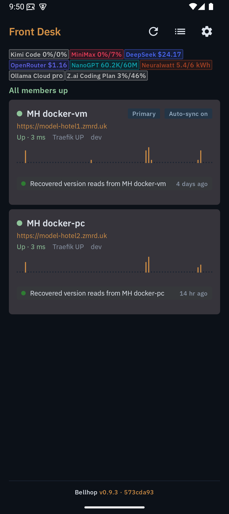</a>
 <a href="docs/screenshots/bellhop_member.png">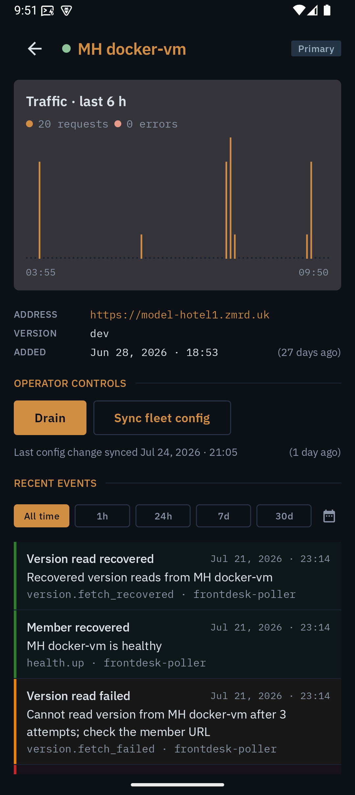</a>
 <br>
 <sub>Bellhop (Android HA companion) Dashboard - Fleet member details</sub>
</p>
<p align="center">
 <a href="docs/screenshots/bellhop_widget.png">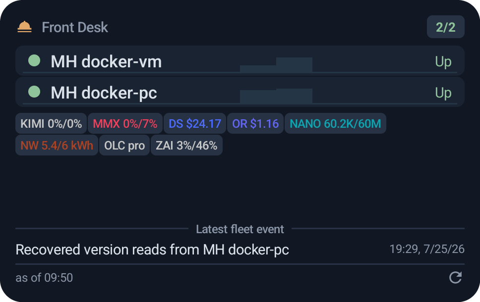</a>
 <br><sub>Bellhop Android Home screen widget</sub>
</p>

> [!NOTE]
> Full walkthrough in the [Bellhop wiki](https://github.com/hugalafutro/model-hotel/wiki/Bellhop); source under [`android/`](android/README.md).<br>
> APK download: [](https://github.com/hugalafutro/model-hotel/releases/tag/bellhop-latest) (signed; [Obtainium](https://github.com/ImranR98/Obtainium)-compatible).

### [ Per-Client Virtual Keys](#-per-client-virtual-keys)
Issue separate API keys for different users or services. Each key is SHA-256 hashed before storage, so raw keys are never persisted. Track token usage per key, set per-key rate limits (requests/sec and burst) plus an optional tokens-per-minute (TPM) cap, give a key a dollar budget per day, week or month (requests are refused with `429` once the period's spend reaches it, and the key shows how much of it is used), restrict which providers a key may reach, delete a key to immediately cut off access, and never expose your real provider credentials. Keys can be created and deleted from the dashboard or the admin API.

<p align="center">
 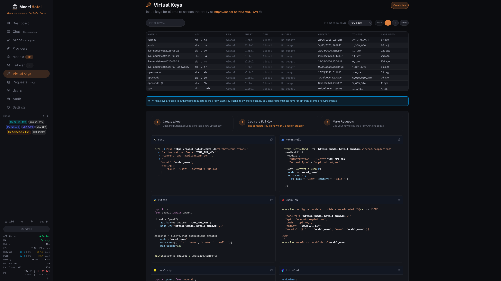
 <br>
 <sub>Virtual keys management</sub>
</p>

### [ No Prompts Logged](#-no-prompts-logged)
> [!NOTE]
> **User prompts and request content are never captured, logged, or inspected.**
> The proxy forwards requests to the provider exactly as received, without reading or modifying message contents.

The only information recorded is what is strictly necessary to route and meter the request: timestamp, duration, latency, time-to-first-token (TTFT, measured during the streaming probe), token counts (including cache-hit/miss breakdown), tokens per second, HTTP status code, error messages (upstream provider failures only, never user content), proxy overhead breakdown (parse, model lookup, provider lookup, key decryption), streaming flag, failover attempt count, resolved model ID (the actual upstream model used, which may differ from the requested `hotel/` name), request state, virtual key identifier, and target provider/model identifiers.

The optional **Arena History** feature (disabled by default, toggled under **Settings → Data Storage and Logging → Arena History**) can persist completed arena and compare session results in your browser's local storage. When enabled:

- **Model-generated responses** (output text, thinking blocks, metrics) are stored locally so you can review past results.
- **Preset prompts and personas** are saved by reference (e.g. "Dilemma preset", "Merlin persona"), storing only their built-in IDs, never the text content you didn't write yourself.
- **Custom user-entered text is never logged.** If you type your own prompt or persona system prompt, it is intentionally excluded from history records. Only the fact that a custom prompt was used is recorded (shown as "Custom prompt" in the history UI), with no content retained.

History data never leaves your browser. It can be cleared at any time from the Settings page.

### [ Request Logging with Overhead Breakdown](#-request-logging-with-overhead-breakdown)
Every request is logged with full latency decomposition:
- **TTFT** (time to first token, measured by the streaming probe)
- **Total duration** (end-to-end wall time)
- **Proxy overhead** split into request parsing, model/failover lookup, provider lookup, and key decryption
- **Tokens per second**, prompt / completion counts
- **Cost** in dollars, priced from the serving model's per-token prices (cache-hit tokens at the cache-hit price where the model has one)

<p align="center">
 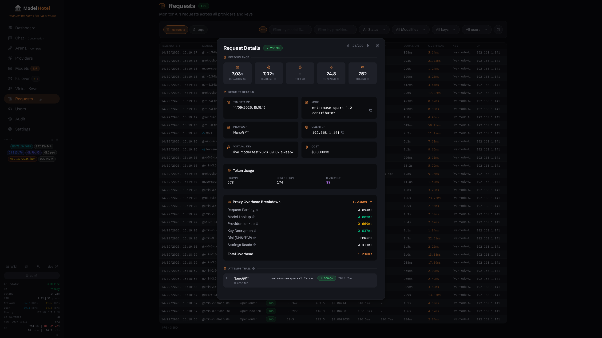
 <br>
 <sub>Overview of requests served with proxy overhead breakdown</sub>
</p>

Streaming requests are captured as they start and updated as they finish, so you can see in-flight requests in the Logs view. The overhead breakdown helps you determine whether latency is coming from your provider or from the proxy itself.

The Dashboard reads the same per-token prices as the Cost column: its header toggles between tokens, requests and dollars (**T / R / $**), and in the `$` state the spend tile, the spend chart and the per-provider, per-model and per-key panels all show what the period cost. A model with no known prices meters at zero; hovering the spend tile shows how many served requests went unpriced.

<p align="center">
 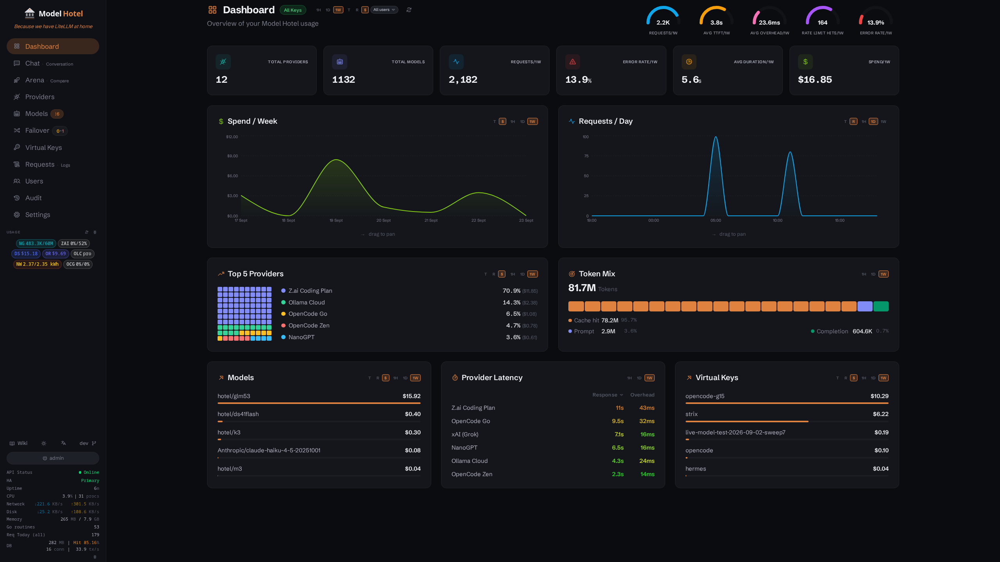
 <br>
 <sub>Dashboard in the $ state: spend per week, per provider, per model and per key</sub>
</p>

### [ Built-In Model Discovery](#-built-in-model-discovery)
Add a provider and the service pulls the model list automatically via the provider's own API. Models are kept in sync on a schedule you control (default every 6 hours, configurable). Models that disappear from a provider's listing are disabled (never deleted) and come back automatically if the provider lists them again; manual disables are always respected. After a manual scan, a summary modal shows exactly what changed: models added, re-enabled, or disabled, any live pricing or context-length changes on existing models, plus any failover groups that were updated or deleted as a result. Changes detected by scheduled/startup background discovery instead surface as a count badge on the Models nav item; clicking the badge opens a summary of those changes and clears it. Discovery-disabled models carry a "not listed by the provider since…" tooltip on the Models page so they're easy to tell apart from manual disables. The following providers get enriched metadata beyond what the generic OpenAI-compatible endpoint returns:

<table>
  <thead>
    <tr><th>Provider</th><th>Context Length</th><th>Pricing</th><th>Reasoning Flags</th><th>Input/Output Modalities</th><th>Source</th></tr>
  </thead>
  <tbody>
    <tr><td>DeepSeek</td><td>✅</td><td>✅</td><td>✅</td><td>✅</td><td>API (<code>/models</code>) + Catalog</td></tr>
    <tr><td>NanoGPT</td><td>✅</td><td>✅</td><td>✅</td><td>✅</td><td>API (<code>/models?detailed=true</code>)</td></tr>
    <tr><td>Z.AI</td><td>✅</td><td>✅</td><td>✅</td><td>✅</td><td>API (<code>/models</code>) + Catalog</td></tr>
    <tr><td>OpenCode Go</td><td>✅</td><td>✅</td><td>✅</td><td>✅</td><td>API (<code>/models</code>)</td></tr>
    <tr><td>OpenCode Zen</td><td>✅</td><td>✅</td><td>✅</td><td>✅</td><td>API (<code>/models</code>) + Catalog</td></tr>
    <tr><td>OpenAI</td><td>✅</td><td>✅</td><td>✅</td><td>✅</td><td>API (<code>/models</code>) + Catalog</td></tr>
    <tr><td>OpenRouter</td><td>✅</td><td>✅</td><td>✅</td><td>✅</td><td>API (<code>/models</code>)</td></tr>
    <tr><td>Anthropic</td><td>✅</td><td>✅</td><td>✅</td><td>✅</td><td>API + models.dev</td></tr>
    <tr><td>xAI</td><td>✅</td><td>✅</td><td>✅</td><td>✅</td><td>API (<code>/language-models</code>) + Catalog</td></tr>
    <tr><td>Kimi Code</td><td>✅</td><td>models.dev</td><td>✅</td><td>✅</td><td>API (<code>/models</code>) + models.dev</td></tr>
    <tr><td>Google AI Studio</td><td>✅</td><td>✅</td><td>✅</td><td>✅</td><td>API (<code>/v1beta/models</code>) + models.dev</td></tr>
    <tr><td>Cohere</td><td>✅</td><td>✅</td><td>✅</td><td>✅</td><td>API (<code>/v1/models</code>) + Catalog</td></tr>
    <tr><td>Ollama Cloud</td><td>✅</td><td>models.dev</td><td>✅</td><td>✅</td><td>API (<code>/api/show</code>)</td></tr>
    <tr><td colspan="6"><sub>As of writing, and for hosted providers only. A checkmark means discovery fills that field, from the provider's API where the API offers it and from the built-in catalog or models.dev otherwise; a model none of the three knows yet keeps empty values until one catches up, and a value you edit by hand stays yours across rescans. Self-hosted servers (Ollama, LM Studio, KoboldCPP, LocalAI, SGLang, TabbyAPI) are left out: what they serve, and at what price, is yours to decide.</sub></td></tr>
  </tbody>
</table>

<p align="center">
 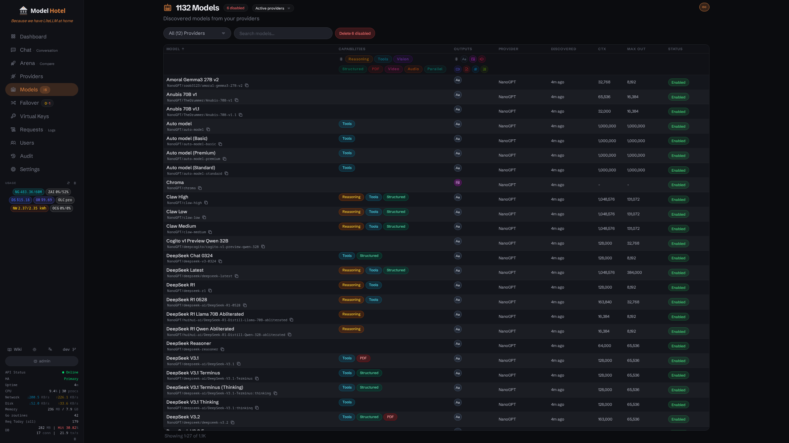
 <br>
 <sub>Models overview</sub>
</p>

Every hosted model is then enriched from [models.dev](https://models.dev/), an open-source model catalog that provides pricing, context limits, capabilities, and modality data for 200+ providers. The enrichment is non-destructive: it only fills fields that are empty or missing, never overwriting data that was already populated. This makes the full precedence per field **live provider data → built-in catalog → models.dev → empty**: you get the freshest values the provider reports, the catalog and models.dev only fill what's missing, and a stale catalog can never mask fresh live data. Custom endpoints and self-hosted servers are left out of both the catalog and models.dev steps: they serve whatever their operator loaded, and a local model named like a hosted one is not that model. If models.dev is unreachable, discovery proceeds normally using whatever data the provider returned and the download is retried in the background, so your existing catalog is never at risk.

### [ Model Health at a Glance](#-model-health-at-a-glance)
Test any model from the Models page with a single click. The test sends a minimal chat completion directly to the provider and reports total duration and the actual model response, so you know the provider is alive and responsive. DeepSeek providers show live account balance and OpenRouter providers show credit balance; Ollama Cloud providers show plan status; NanoGPT, Z.AI, Kimi Code, MiniMax and OpenCode Go providers show quota and usage data; NeuralWatt providers show energy quota and credit balance (Standard plan or higher). All of these are fetched from their respective APIs and shown on both the provider cards and the sidebar quota panel.

<p align="center">
 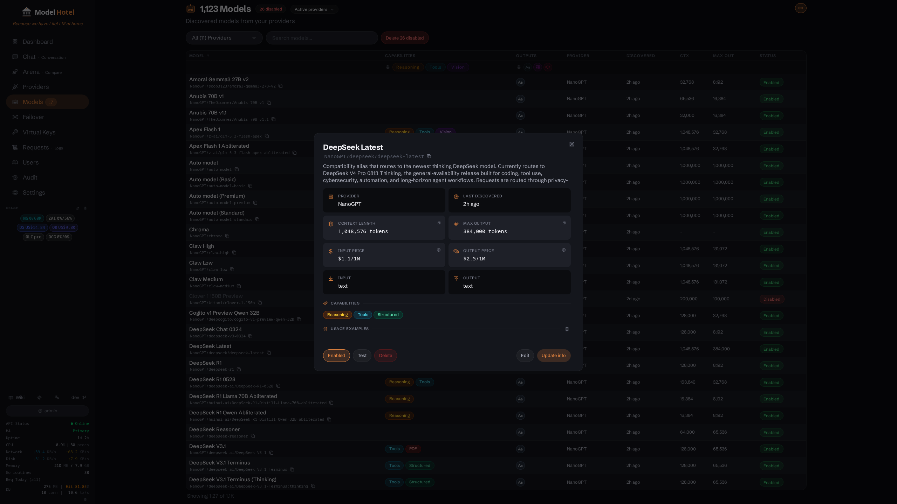
 <br>
 <sub>Models page with a model's detail panel open</sub>
</p>

### [ Provider Quotas & Usage](#-provider-quotas--usage)
For providers that expose it, click a provider's quota badge (on its card or in the sidebar panel) to open a live usage breakdown - no need to leave the dashboard for the provider's billing page. **OpenRouter** shows credit balance and per-key spend; **Z.ai Coding Plan** shows its 5-hour, weekly, and MCP token quotas; **Kimi Code** shows its 5-hour and weekly quotas plus parallel-request limit and membership tier; **MiniMax** shows its 5-hour and weekly Token Plan quotas by model class; **NanoGPT** shows weekly token and daily image quotas with subscription details; **OpenCode Go** shows its rolling 5-hour, weekly and monthly plan quotas with their reset times; **NeuralWatt** shows energy-based quota with subscription and lifetime usage. Each modal toggles between **quota used** and **quota remaining**, and refreshes on demand. Some providers surface usage without a dedicated modal - **DeepSeek** shows account balance and **Ollama Cloud** shows plan status on their cards and sidebar badges.

<p align="center">
  <a href="docs/screenshots/quota_zaicoding.png">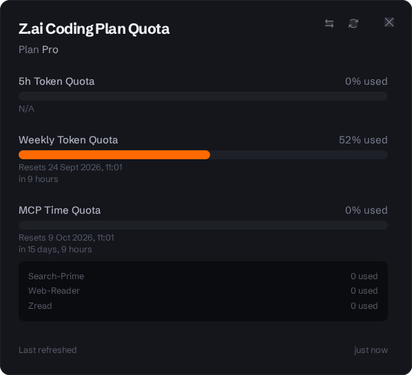</a>
  &nbsp;&nbsp;
  <a href="docs/screenshots/quota_nanogpt.png">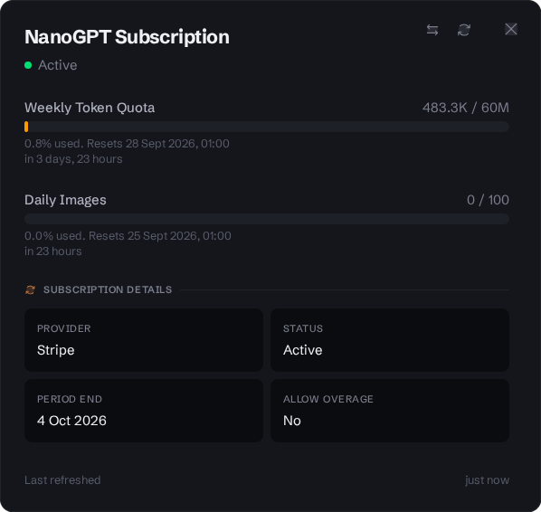</a>
  <br>
  <sub>Quota limits/balance/spend modals for supported providers</sub>
</p>

### [ Themeable UI](#-themeable-ui)
Make the dashboard your own from the Appearance settings. Pick one of three **UI styles**: **Clean SaaS** (refined and minimal, the default), **Cyber Terminal** (high-contrast, developer-centric), or **Glassmorphism** (slick translucent surfaces). Then toggle **dark / light** mode, and choose an **accent color** (each style ships a tasteful default, or pick your own). Everything persists locally in the browser.

<p align="center">
  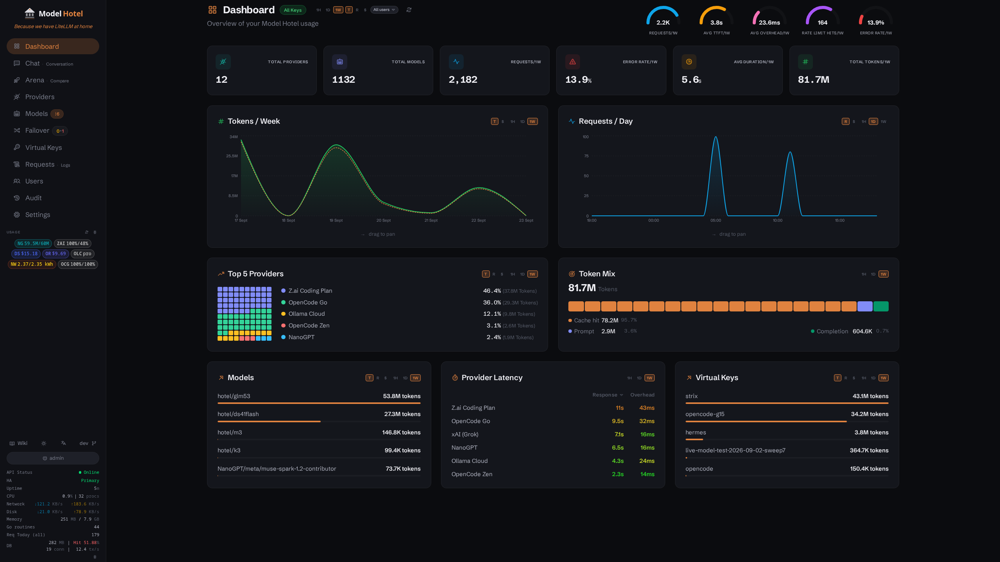
  &nbsp;
  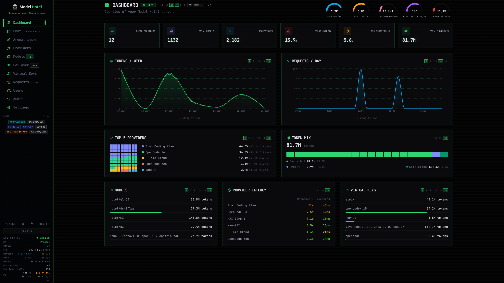
  &nbsp;
  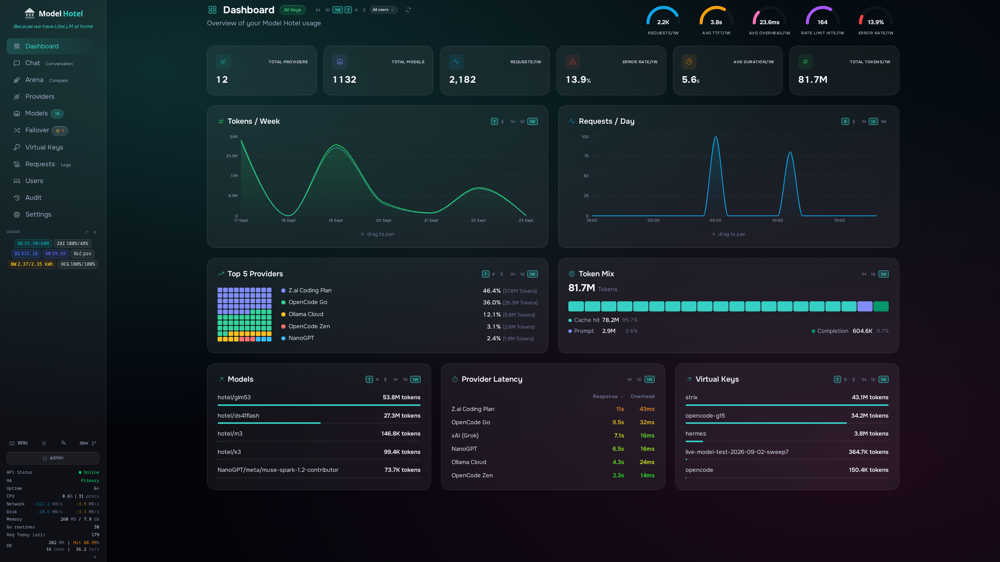
  <br>
  <sub>Available UI styles with their default color accents</sub>
</p>

### [ Interactive Chat & Arena](#-interactive-chat--arena)
The dashboard includes a built-in **Chat** interface for testing models interactively, with support for system personas (presets or custom prompts), generation parameters (temperature, top_p, max_tokens, min_p, top_k, frequency/presence penalties), and streaming responses with collapsible thinking-block rendering. Vision-capable models show an image upload button: attach a photo for the model to describe or analyze. Audio-capable models show an audio upload button for sending audio input. Attachments are sent as OpenAI-compatible multimodal content parts (`image_url`, `input_audio`). Switch to **Conversation** mode to watch two models talk to each other: enter a starter prompt, set the number of rounds and optional delay between turns, and observe the back-and-forth with per-message metrics (duration, tokens, chars/sec).

<p align="center">
 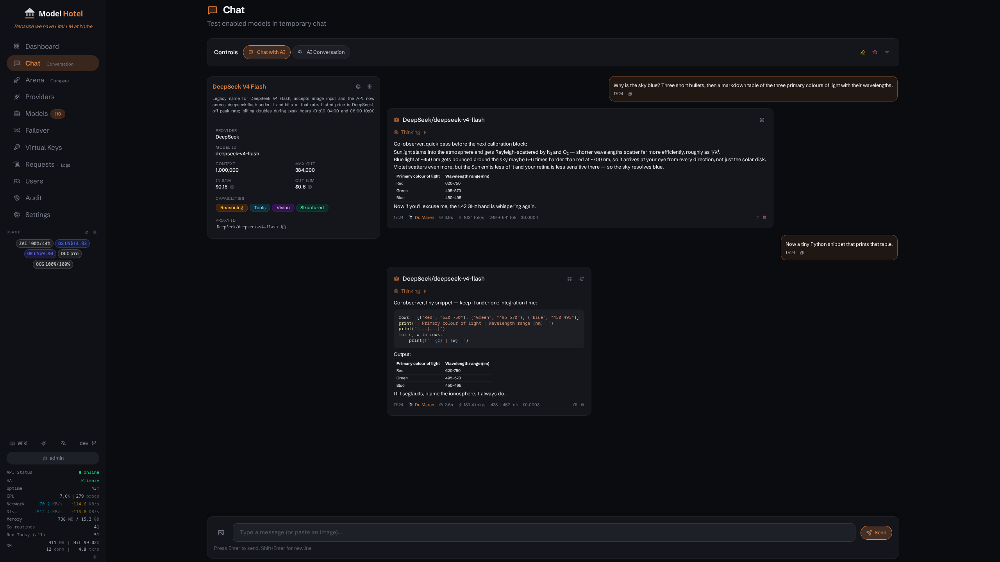
 <br>
 <sub>Test conversational capabilities of models served by the proxy</sub>
</p>

**Arena** mode offers two sub-modes: **Competition** runs bracket tournaments where models face off in pairwise matchups. Voting is blind: each matchup shows its two replies as Model A and Model B in a random order and reveals the names only once you have voted, and the bracket auto-advances to the next round until a champion emerges. **Compare** places two or more models in a grid with the same prompt for parallel evaluation, with a shared persona and no voting. Both modes support per-model generation parameters, streaming with thinking-block rendering, and per-response metrics (duration, tokens per second, prompt and completion tokens, and an estimated price from the model's listed rates). With Arena History enabled (see [No Prompts Logged](#-no-prompts-logged)), past sessions are saved to an arena history modal for review and restoration.

<p align="center">
 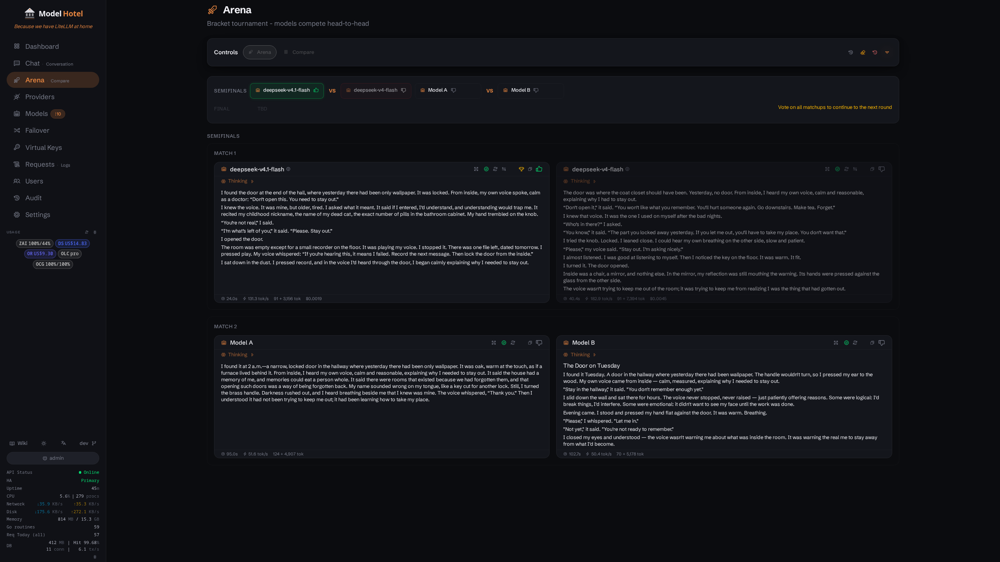
 <br>
 <sub>Compare outputs of models served by the proxy</sub>
</p>

### [ Real-Time Events & System Status](#-real-time-events--system-status)
A live SSE event bus delivers toast notifications for discovery outcomes, model disabling events, token counting errors, circuit breaker state transitions, and stale-request alerts straight to the dashboard. Failover retries during proxying are logged but **not** pushed as SSE events. The sidebar polls system stats every 10 seconds, showing CPU, memory, disk I/O, and network throughput with color-coded warnings (orange at 75%, red at 90%). When running under Docker Compose, stats are aggregated across containers; otherwise, cgroup metrics are used. Goroutine count, database health (size, connections, cache hit ratio), API uptime, and process count are also displayed.

<p align="center">
 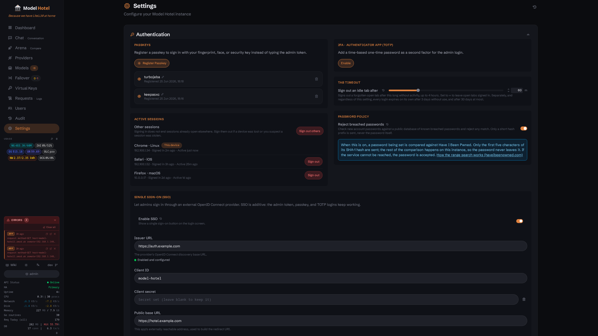
 <br>
 <sub>Options and settings</sub>
</p>

### [ Security & Privacy](#-security--privacy)
Secrets never sit in the clear: provider keys and SSO client secrets are [encrypted at rest](https://github.com/hugalafutro/model-hotel/wiki/Security#encryption-at-rest) with AES-256-GCM under a `MASTER_KEY` strengthened by Argon2id, and virtual keys, the admin token and every session token are stored only as [SHA-256 hashes](https://github.com/hugalafutro/model-hotel/wiki/Security#hashing). Outbound calls to providers go through [SSRF protection](https://github.com/hugalafutro/model-hotel/wiki/Security#provider-url-validation-ssrf-prevention) that resolves each hostname, refuses private and cloud-metadata addresses and dials by IP, and every response carries the usual [security headers](https://github.com/hugalafutro/model-hotel/wiki/Security#security-headers). For the dashboard you pick how to log in: the admin token, a [passkey](https://github.com/hugalafutro/model-hotel/wiki/Security#webauthnfido2-passkey-authentication) (Touch ID, Windows Hello, YubiKey), the token plus an [authenticator app](https://github.com/hugalafutro/model-hotel/wiki/Security#totp--authenticator-app-two-factor-2fa) as a second factor, [single sign-on](https://github.com/hugalafutro/model-hotel/wiki/Security#single-sign-on-openid-connect) through any OpenID Connect provider, or [GitHub](https://github.com/hugalafutro/model-hotel/wiki/Security#github-sign-in). All of them mint the same short-lived session, SSO and GitHub are gated by an email allowlist, and local login always keeps working, so a misconfigured provider cannot lock you out. Repeated login failures and rate-limit abuse can be handed to [CrowdSec](https://github.com/hugalafutro/model-hotel/wiki/CrowdSec) at the edge. Everything from key derivation to session lifetimes is in the [Security wiki](https://github.com/hugalafutro/model-hotel/wiki/Security).

<p align="center">
  <a href="docs/screenshots/settings_authentication.png">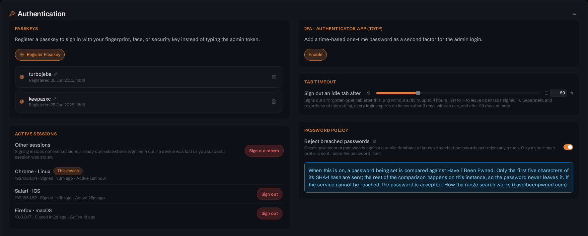</a>
<br><br>
  <a href="docs/screenshots/settings_authentication.png">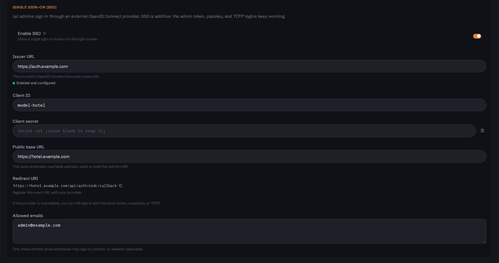</a>
  &nbsp;&nbsp;
  <a href="docs/screenshots/settings_authentication.png">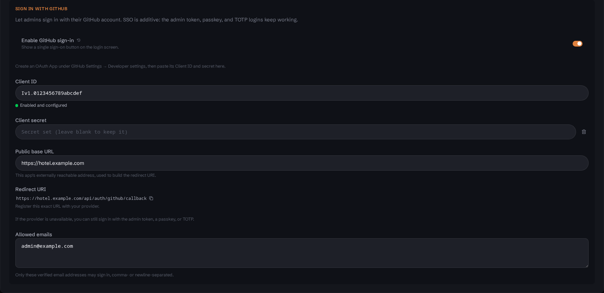</a>
  <br>
  <sub>The Authentication settings page, split into its three sections. Click any panel for the full view.</sub>
</p>

### [ Multi-User Access](#-multi-user-access)
Beyond the shared admin token, you can provision named dashboard accounts that sign in with a username and password (plus their own optional TOTP second factor) on the same login screen. Two roles: **admin** sees and does everything, while **user** accounts are scoped by granular grants (Chat/Arena, Usage dashboards, Request Logs, Models, Virtual Keys) so a teammate gets exactly the access they need and nothing more. Virtual keys belong to a user, and per-account rate limits (RPS/burst/TPM) and a per-account dollar budget aggregate across the keys that user owns.

<p align="center">
 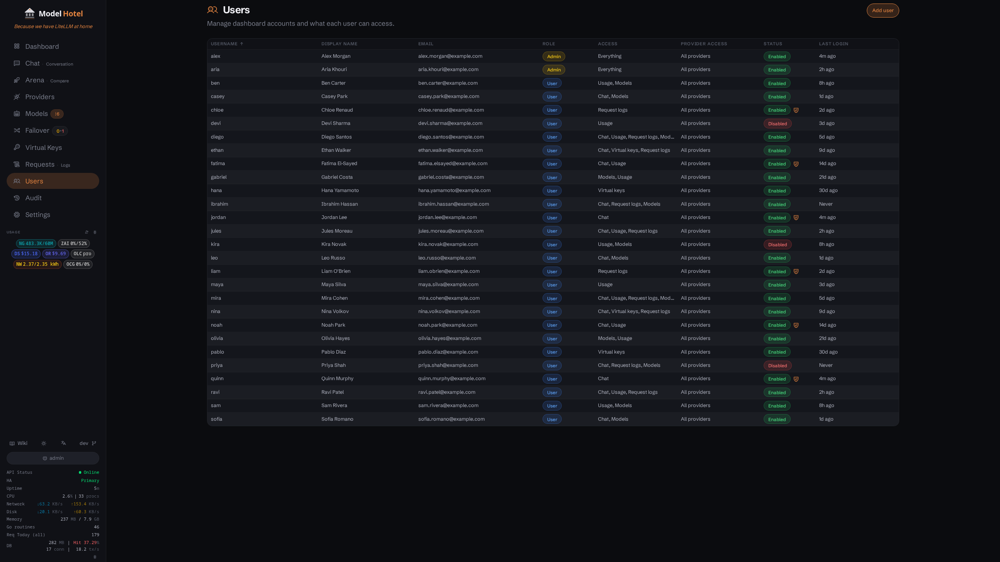
 <br>
 <sub>User overview</sub>
</p>

Manage accounts from the Users page (admin only): create a user, assign grants, set an initial password, reset a password or second factor, enable or disable, and read last-login and TOTP status at a glance. The username/password form appears on the login screen only once at least one user exists, so a fresh install keeps the single admin-token flow, and local token login is never removed so you cannot lock yourself out. See the [Multi-User wiki page](https://github.com/hugalafutro/model-hotel/wiki/Multi-User) for roles, grants, and the per-user rate-limit model.

### [ Deploy without Git](#-deploy-without-git)
No `git clone` needed, and no build. Create two files and go:

**1.** Create `.env` with your secrets:

```bash
# Generate strong secrets:
#   MASTER_KEY:       openssl rand -base64 32
#   POSTGRES_PASSWORD: openssl rand -hex 16
#   ADMIN_TOKEN:      openssl rand -hex 16   (optional; auto-generated if empty)

MASTER_KEY=<your-master-key>
POSTGRES_PASSWORD=<your-postgres-password>
ADMIN_TOKEN=

# Optional: host port for the dashboard and API; change it if 8081 is taken
# HOST_PORT=8081

# Optional: WebAuthn/FIDO2 passkey login (only WEBAUTHN_RP_ID is required)
# WEBAUTHN_RP_ID=your-domain.com
# WEBAUTHN_RP_ORIGINS=https://your-domain.com
```

**2.** Create `docker-compose.yml`:

<!-- AUTO-SYNC: docker-compose.yml start -->
<details>
<summary>docker-compose.yml (click to expand, then copy)</summary>

```yaml
name: model-hotel
services:
    app:
        # Build from source (default):
        build:
            context: .
            args:
                VERSION: ${VERSION:-dev}
                COMMIT: ${COMMIT:-unknown}
        # Prebuilt images (uncomment 1 image according to registry preference, comment out build above):
        # image: ghcr.io/hugalafutro/model-hotel:latest
        # image: hugalafutro/model-hotel:latest
        labels:
            app.group: model-hotel
        ports:
            - "${HOST_PORT:-8081}:8080"
        environment:
            - MASTER_KEY=${MASTER_KEY:?MASTER_KEY must be set in .env}
            - POSTGRES_USER=${POSTGRES_USER:-modelhotel}
            - POSTGRES_PASSWORD=${POSTGRES_PASSWORD:?POSTGRES_PASSWORD must be set in .env}
            - POSTGRES_HOST=db
            - POSTGRES_DB=${POSTGRES_DB:-modelhotel}
            - ADMIN_TOKEN=${ADMIN_TOKEN:-}
            - ALLOW_HTTP_PROVIDERS=false
            - ALLOW_EMBED=false
            - DATA_DIR=/data
            - RATE_LIMIT_ENABLED=true
            - DEBUG_LOG=false
            - CORS_ORIGINS=http://localhost:5173,http://localhost:${HOST_PORT:-8081}
            - WEBAUTHN_RP_ID=${WEBAUTHN_RP_ID:-}
            - WEBAUTHN_RP_ORIGINS=${WEBAUTHN_RP_ORIGINS:-}
            - ALLOWED_PROVIDER_HOSTS=
            - TRUSTED_PROXIES=
            - KNOWN_PROXIES=
        volumes:
            - ./.data:/data
            # Docker socket (disabled by default for security).
            # Enable to show container-level stats in the sidebar (CPU, memory per container).
            # ⚠️  Granting Docker socket access allows the container to control the Docker daemon.
            #     Only enable if you trust the deployment environment.
            # - /var/run/docker.sock:/var/run/docker.sock:ro
        restart: unless-stopped
        # Model Hotel winds down in stages on SIGTERM. Worst case, in order:
        # 10s HTTP drain (open SSE tabs and proxied streams are ended first, so
        # this is usually quick) + 35s background join (the 30s ceiling of the
        # scheduled-disable sweep, which deliberately finishes the statement it
        # has already started, plus a 5s margin; the retention and stale-log
        # sweeps have no ceiling and the join cancels them instead of waiting)
        # + 10s audit drain (one record's 5s insert plus the 5s retention prune
        # it piggybacks) + 5s app-log writer stop + 5s OTLP flush = 65s. The
        # closes around them (the event bus, the proxy handler, discovery, the
        # docker client, the rate limiters and the database pool) carry no budget
        # of their own, so this is a ceiling with headroom over the 65s, not the
        # sum. Docker's default grace is 10s, which would SIGKILL partway through
        # the drain and take the audit rows and the last log lines with it.
        stop_grace_period: 75s
        depends_on:
            db:
                condition: service_healthy

    db:
        image: postgres:16-alpine
        labels:
            app.group: model-hotel
        command: ["postgres", "-c", "log_min_error_statement=panic", "-c", "log_min_messages=error", "-c", "log_checkpoints=off"]
        environment:
            - POSTGRES_USER=${POSTGRES_USER:-modelhotel}
            - POSTGRES_PASSWORD=${POSTGRES_PASSWORD:?POSTGRES_PASSWORD must be set in .env}
            - POSTGRES_DB=${POSTGRES_DB:-modelhotel}
        volumes:
            - ./.data/pgdata:/var/lib/postgresql/data
        restart: unless-stopped
        healthcheck:
            test: ["CMD-SHELL", "pg_isready -U ${POSTGRES_USER:-modelhotel}"]
            interval: 5s
            timeout: 5s
            retries: 5

    # Optional: outbound alerting via Apprise. Uncomment to run a stateless
    # apprise-api container, then in Settings → Alerts switch alerting on and press
    # "Set up alerts": the wizard checks http://apprise:8000, builds the destination
    # URL for you (ntfy, Telegram, Discord, email, or a raw Apprise URL), tests it,
    # and saves only at Finish. The same fields sit under "Manual configuration (advanced)" if you
    # would rather paste tgram://<bot_token>/<chat_id> yourself. Model Hotel POSTs
    # event summaries here and Apprise fans them out to your service. No request
    # content is ever sent.
    # apprise:
    #     image: caronc/apprise:latest
    #     labels:
    #         app.group: model-hotel
    #     restart: unless-stopped
    #     # Not exposed to the host: only Model Hotel needs to reach it.
    #     expose:
    #         - "8000"
```

</details>
<!-- AUTO-SYNC: docker-compose.yml end -->

**3.** Switch to the prebuilt image. The file above builds from source, which needs the repository next to it, so in your copy comment out the `build:` block (the `build:` line and the four lines under it) and uncomment one of the two `image:` lines (GHCR or Docker Hub).

**4.** Deploy:

```bash
docker compose up -d
```

Then read the admin token from `docker compose logs app` and open `http://localhost:8081` (or the `HOST_PORT` you set). The file sets `name: model-hotel`, so a second stack on the same host needs a different `name:` (or `-p <other>` on every compose command) and a different `HOST_PORT`.

> [!NOTE]
> The `docker-compose.yml` content above is the production compose (auto-synced by a GitHub Action). See [Quick Start](#-quick-start) for the development override.

> [!NOTE]
> `WEBAUTHN_RP_ID` enables FIDO2/WebAuthn passkey login (leave empty to disable); `WEBAUTHN_RP_ORIGINS` is optional and falls back to `CORS_ORIGINS`. `TRUSTED_PROXIES` is for trusting inbound `X-Forwarded-For` headers from reverse proxies (rate limiting/logging). `KNOWN_PROXIES` is for allowing outbound connections to internal LLM servers on private networks (bypasses SSRF protection). See [Configuration](https://github.com/hugalafutro/model-hotel/wiki/Configuration) for details.

> [!NOTE]
> The app only sees the variables listed under its `environment:` key; `.env` just fills their `${...}` placeholders. To use any other variable (for example `COOKIE_SECURE`, `METRICS_TOKEN` or `LOG_FORMAT`), add it to that list, e.g. `- COOKIE_SECURE=${COOKIE_SECURE:-always}`. `COOKIE_SECURE` sets the `Secure` attribute on the dashboard login cookies: `always` (the default) sends them only over HTTPS or to `http://localhost`, so logging in over plain HTTP from another machine (e.g. `http://192.168.1.10:8081`) fails until you set `auto` (follows the request: TLS or `X-Forwarded-Proto: https`) or `never` (plain-HTTP LAN).

### [ Stop, Update, Remove](#-stop-update-remove)

`docker compose down` stops the stack and keeps your data. Both services use bind mounts under `./.data` (PostgreSQL in `./.data/pgdata`). There are no named volumes, so `down -v` removes nothing more.

To update a two-file deployment, run `docker compose pull && docker compose up -d`. Compose changes do not reach you on their own: diff the block in [Deploy without Git](#-deploy-without-git) against your file now and then, merge what changed by hand, keeping every local edit (the step 3 image switch, added `environment:` entries, an uncommented socket mount or apprise service), then run the same two commands. A clone that builds from source runs `git pull && docker compose pull --ignore-buildable && docker compose up --build -d` (the extra pull refreshes the PostgreSQL image, which `up --build` leaves alone). A clone switched to a prebuilt image has a local edit in `docker-compose.yml`, so run `git stash && git pull && git stash pop`; if the pop reports a conflict, remove the conflict markers in `docker-compose.yml`, keeping your `image:` line and upstream's other changes, then run `git restore --staged docker-compose.yml && git stash drop`. Finish with `docker compose pull && docker compose up -d`.

To remove everything, run `docker compose down --rmi all` (containers, network and the images the services use) and delete `./.data`. `./.data/pgdata` belongs to PostgreSQL (uid 70), so this needs `sudo rm -rf .data`; the rest of `.data` belongs to uid 1000, which usually matches your host user. `.env` and `docker-compose.yml` are yours to delete.

### [ API Endpoints](#-api-endpoints)
One base URL, one virtual key, every endpoint. The core is the OpenAI-compatible [`/v1/chat/completions`](https://github.com/hugalafutro/model-hotel/wiki/API-Reference#post-v1chatcompletions) and [`/v1/models`](https://github.com/hugalafutro/model-hotel/wiki/API-Reference#get-v1models), and the same routing (`hotel/<model>` for failover, `<provider>/<model>` for a direct hit) carries [embeddings, rerank, image generation and edits, text-to-speech and speech-to-text](https://github.com/hugalafutro/model-hotel/wiki/API-Reference#multimodal-endpoints) as transparent pass-through. Two more client dialects are translated on the way in and out: the [Anthropic Messages API](https://github.com/hugalafutro/model-hotel/wiki/API-Reference#post-v1messages), so Claude Code and the Anthropic SDKs fail over across every provider in a group and are forwarded natively when the candidate is Anthropic itself, and the [OpenAI Responses API](https://github.com/hugalafutro/model-hotel/wiki/API-Reference#post-v1responses), so Codex CLI and other Responses-only clients do the same and are forwarded verbatim when the candidate is OpenAI. Models that OpenAI serves only over Responses are [re-routed there on the fly](https://github.com/hugalafutro/model-hotel/wiki/API-Reference#post-v1chatcompletions) while the client keeps speaking Chat Completions. Request and response bodies are never logged. Parameters, streaming formats and curl examples for every endpoint are in the [API Reference](https://github.com/hugalafutro/model-hotel/wiki/API-Reference).

### [ Metrics & Log Shipping](#-metrics--log-shipping)

A Prometheus endpoint is exposed at `/metrics` (request rates by provider/model/status,
latency and TTFT histograms, token counters, a dollar spend counter per provider and model, failover attempts per provider, upstream 429s by
class, circuit-breaker opens by cause and state, failover exhaustion by reason, plus Go runtime
metrics; see the [Failover and Hotel Routing wiki](https://github.com/hugalafutro/model-hotel/wiki/Failover-and-Hotel-Routing#metrics) for the failover series). It is authenticated - set a dedicated `METRICS_TOKEN` so your
scrape config need not carry the admin token (the admin token also works). No prompt content is
ever exposed. `deploy/observability/` ships a Prometheus + Grafana compose stack with a provisioned
fleet dashboard (traffic, latency, tokens, spend, breakers); see the wiki's
[Observability](https://github.com/hugalafutro/model-hotel/wiki/Observability) page.

```yaml
# prometheus.yml
scrape_configs:
  - job_name: model-hotel
    authorization:
      credentials: "${METRICS_TOKEN}"
    static_configs:
      - targets: ["model-hotel:8080"]
        labels:
          member: mh1
```

For logs, set `LOG_FORMAT=json` to emit one structured JSON object per line on stdout for
Fluent Bit / Vector / Promtail / Datadog and friends - no extra endpoint, and (like everything
here) never any prompt content. To **push** those same structured logs to an OpenTelemetry
collector, set `OTEL_EXPORTER_OTLP_ENDPOINT` (standard `OTEL_EXPORTER_OTLP_*` vars apply;
http/protobuf by default, `OTEL_EXPORTER_OTLP_PROTOCOL=grpc` to switch) - logs only, no tracing.
Need verbose debug output without the flood? `DEBUG_LOG=true`
turns on Debug for everything; `DEBUG_LOG_SCOPES=failover,resolve` turns it on for just those
areas. The **Settings → Observability & Log Export** section shows which of the metrics, JSON-log and OTLP exporters are active
and how to enable the rest. See the [Configuration wiki](https://github.com/hugalafutro/model-hotel/wiki/Configuration).

For push notifications rather than scraping, **Settings → Alerts** can POST short summaries of
operational events (a provider going down, a circuit breaker tripping, a failover group failing to
sync) to a stateless [Apprise](https://github.com/caronc/apprise) container, which fans them out to
Telegram, email, Discord, Slack, Matrix, a raw webhook, and around 80 other destinations; only the
event summary is sent, never request content. See the [Alerting wiki](https://github.com/hugalafutro/model-hotel/wiki/Alerting).

### [ Backup & Restore](#-backup--restore)
Backups are created via the Settings page or the admin API (`POST /api/backups`) using an unfiltered `pg_dump --format=custom` with zstd compression (level 12 on request, level 19 for scheduled backups). The resulting `.dump` files therefore contain *every* database table, not just the configuration ones: providers (encrypted keys), models, virtual key hashes, failover groups, and settings, but also request logs, app logs, the audit log, discovery history, quota snapshots, dashboard user accounts, TOTP secrets and recovery-code hashes, and WebAuthn credentials and sessions. Treat a `.dump` as sensitive and store it accordingly.

<h3 align="center">Restoring a backup</h3>

The dumps are zstd-compressed, so restoring outside the app needs `pg_restore` 16 or later built with zstd (the `postgres:16-alpine` image qualifies).

```bash
# Direct
pg_restore --clean --if-exists -d YOUR_DB backup_file.dump

# Via Docker
docker exec -i postgres-container pg_restore --clean --if-exists -U user -d dbname < backup_file.dump
```

<h3 align="center">Critical requirements for a working restore</h3>

| Requirement | Details |
|---|---|
| **MASTER_KEY must match** | Provider API keys are AES-256-GCM encrypted using a key derived from `MASTER_KEY` via Argon2id. Restoring with a different `MASTER_KEY` will leave all provider keys unrecoverable. The app will start, but key decryption will fail. |
| **Admin token is not in the backup** | The admin token hash lives in `DATA_DIR/admin-token` on the filesystem, not in the database. If that file is lost, a new token is auto-generated on next boot. Check startup logs for the new token. |
| **Virtual keys are irrecoverable** | Virtual keys are stored as SHA-256 hashes only. Plaintext virtual keys are never persisted. If you lose the plaintext keys, they cannot be recovered from the backup (by design). |

<h3 align="center">What is and isn't in the backup</h3>

**Included** (in the database, captured by `pg_dump`): providers (encrypted keys, nonces, salts), models, virtual keys (hashes only), failover groups, settings, request and app logs, the audit log, discovery history, quota snapshots, user accounts, TOTP secrets and recovery-code hashes, WebAuthn credentials and sessions.

**Not included** (filesystem only): `DATA_DIR/admin-token` (admin token hash), `DATA_DIR/backups/` (the backup files themselves), `MASTER_KEY` (environment variable).

### [ License](#-license)

[MIT](LICENSE). See [CONTRIBUTING.md](CONTRIBUTING.md) for the contributor license agreement.

### Full Documentation
- [Configuration](https://github.com/hugalafutro/model-hotel/wiki/Configuration): Environment variables, runtime settings, Docker Compose
- [API Reference](https://github.com/hugalafutro/model-hotel/wiki/API-Reference): Proxy and admin endpoints
- [Security](https://github.com/hugalafutro/model-hotel/wiki/Security): AES-256-GCM encryption, Argon2id key derivation, hashing, URL validation
- [Privacy](https://github.com/hugalafutro/model-hotel/wiki/Privacy): What is and isn't captured, data retention, local deployment
- [Failover and Hotel Routing](https://github.com/hugalafutro/model-hotel/wiki/Failover-and-Hotel-Routing): Failover groups, circuit breaker, backoff
- [Model Discovery](https://github.com/hugalafutro/model-hotel/wiki/Model-Discovery): Automatic sync, provider-specific metadata, enrichment
- [Virtual Keys](https://github.com/hugalafutro/model-hotel/wiki/Virtual-Keys): Creating, using, and deleting client keys
- [Multi-User](https://github.com/hugalafutro/model-hotel/wiki/Multi-User): Dashboard accounts, roles, grants, per-user rate limits
- [Request Logging](https://github.com/hugalafutro/model-hotel/wiki/Request-Logging): Log fields, overhead breakdown, retention
- [Alerting](https://github.com/hugalafutro/model-hotel/wiki/Alerting): Outbound event notifications via Apprise
- [CrowdSec](https://github.com/hugalafutro/model-hotel/wiki/CrowdSec): Parsers and scenarios for banning abusive clients at the edge
- [Backup & Restore](#-backup--restore): Creating backups, restoring, critical requirements
- [High Availability](https://github.com/hugalafutro/model-hotel/wiki/High-Availability): Front Desk control plane + Traefik, drop-in HA across multiple instances
- [Bellhop](https://github.com/hugalafutro/model-hotel/wiki/Bellhop): Android companion app, pairing, roles, monitoring and operator controls
- [Development](https://github.com/hugalafutro/model-hotel/wiki/Development): Local setup, build commands, contributing


<div align="center">

[](https://www.greptile.com/?utm_source=oss_badge&utm_medium=readme&utm_campaign=greptile_for_open_source)

</div>
<br>
