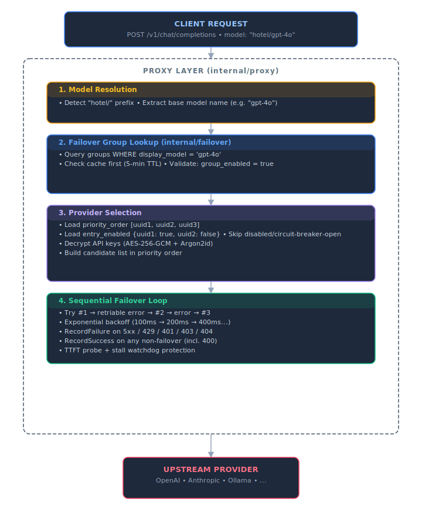

# 🔀 Failover & Hotel Routing

Model Hotel has two related but distinct routing concepts: **transparent failover** and **hotel routing**. Together they ensure requests succeed even when individual providers are unreliable.

---

## Table of Contents

1. [Architecture Overview](#architecture-overview)
2. [Database Schema](#database-schema)
3. [Failover Groups](#failover-groups)
4. [Hotel Routing](#hotel-routing)
5. [Provider Selection Algorithm](#provider-selection-algorithm)
6. [Transparent Failover](#transparent-failover)
7. [Circuit Breaker](#circuit-breaker)
8. [API Reference](#api-reference)
9. [Request Flow Sequence](#request-flow-sequence)

---

## Architecture Overview



---

## Database Schema

### `model_failover_groups` Table

```sql
CREATE TABLE model_failover_groups (
    id              UUID PRIMARY KEY DEFAULT gen_random_uuid(),
    display_model   TEXT NOT NULL UNIQUE,        -- Base model name (e.g. "gpt-4o")
    display_name    TEXT,                        -- Human-readable label (optional)
    description     TEXT DEFAULT '',             -- Human-readable description
    priority_order  JSONB NOT NULL,              -- [uuid1, uuid2, uuid3] - ordered list of model UUIDs
    entry_enabled   JSONB DEFAULT '{}',          -- {uuid1: true, uuid2: false} - per-entry toggle
    group_enabled   BOOLEAN DEFAULT true,        -- Master toggle for entire group
    auto_created    BOOLEAN DEFAULT false,       -- true if auto-generated during discovery sync
    created_at      TIMESTAMPTZ DEFAULT now(),
    updated_at      TIMESTAMPTZ DEFAULT now()
);
```

**Field Details:**

| Field | Type | Description |
|-------|------|-------------|
| `display_model` | TEXT | Exact base model name used in `hotel/` requests. Matched after stripping org prefixes (e.g. `openai/`, `deepseek/`). |
| `priority_order` | JSONB | Array of model UUIDs in **sequential failover order**. First UUID = highest priority. |
| `entry_enabled` | JSONB | Map of `model_uuid → boolean`. Disabled entries are skipped during routing but preserved in priority order. |
| `group_enabled` | BOOLEAN | Master switch. When `false`, the entire group is skipped during `hotel/` resolution (returns 404). |
| `auto_created` | BOOLEAN | `true` if generated by `SyncAllModels` during discovery. Manual groups have `false`. |

**Indexes:**
- Unique index on `display_model` (enforces one group per base model name)
- No additional indexes needed (lookups by `display_model` or `id`)

### Related Tables

```sql
-- models table (references providers)
CREATE TABLE models (
    id            UUID PRIMARY KEY,
    provider_id   UUID REFERENCES providers(id) ON DELETE CASCADE,
    model_id      TEXT NOT NULL,              -- Full model ID (e.g. "openai/gpt-4o")
    enabled       BOOLEAN DEFAULT true,
    UNIQUE(provider_id, model_id)
);

-- providers table
CREATE TABLE providers (
    id            UUID PRIMARY KEY,
    name          TEXT NOT NULL,
    base_url      TEXT NOT NULL,
    encrypted_key BYTEA NOT NULL,             -- AES-256-GCM encrypted API key
    key_nonce     BYTEA NOT NULL,             -- Argon2id-derived nonce
    enabled       BOOLEAN DEFAULT true
);
```

---

## Failover Groups

A **failover group** represents one logical model backed by multiple providers. When you request `hotel/gpt-4o`, the proxy looks up the failover group with `display_model = 'gpt-4o'` and tries providers in the configured priority order.

### Bulk Provider Management

The Failover Groups page includes a **Manage Providers** button (next to "New Group") that opens a modal listing all providers. Disabling a provider in this modal disables all model entries belonging to that provider across **all** failover groups (including custom groups). If disabling a provider causes all entries in a group to be disabled, the group itself is also disabled. A toast notification reports how many groups were affected.

### Group Lifecycle

#### Creation

**Auto-Generation (Discovery Sync):**

Failover groups are automatically created during model discovery sync (`SyncAllModels`):

1. Query all enabled models from enabled providers
2. Strip org prefixes (`openai/`, `deepseek/`, `meta-llama/`, etc.) to get base name
3. Group providers that share the same base name
4. **Require 2+ providers** - single-provider groups are automatically disabled
5. Set `auto_created = true`

```go
// internal/failover/failover.go:SyncAllModels
func (r *Repository) SyncAllModels(ctx context.Context) (*SyncResult, error) {
    // 1. Query enabled models
    rows, _ := r.pool.Query(ctx, `
        SELECT m.id, m.model_id, m.provider_id, p.name
        FROM models m
        JOIN providers p ON m.provider_id = p.id
        WHERE m.enabled = true AND p.enabled = true
        ORDER BY m.model_id, p.created_at ASC
    `)

    // 2. Strip prefixes and group by base name
    baseToModels := make(map[string][]modelInfo)
    for rows.Next() {
        base := stripPrefix(modelID)  // "openai/gpt-4o" → "gpt-4o"
        baseToModels[base] = append(...)
    }

    // 3. Create groups with 2+ providers
    for base, models := range baseToModels {
        if len(models) <= 1 {
            r.disableAutoGroup(ctx, base)  // Disable single-provider groups
            continue
        }
        priorityOrder := extractUUIDs(models)
        r.UpsertWithConfig(ctx, base, priorityOrder, ...)
    }
}
```

**Manual Creation (API):**

```bash
POST /api/failover-groups
Content-Type: application/json
Authorization: Bearer $ADMIN_TOKEN

{
  "display_model": "gpt-4o",
  "display_name": "GPT-4 Omni",
  "description": "Multi-provider failover for GPT-4o",
  "entry_ids": [
    "uuid-of-openai-gpt4o-model",
    "uuid-of-deepseek-gpt4o-model",
    "uuid-of-zai-gpt4o-model"
  ]
}
```

**Validation Rules:**
- Minimum 2 entries required for creation
- `display_model` must be unique (conflict if exists)
- `display_name` and `description` are optional

#### Configuration

**Priority Ordering:**

Providers are tried **sequentially** in `priority_order` array order. Reorder via API or UI drag-and-drop:

```bash
PUT /api/failover-groups/{group_id}
Content-Type: application/json

{
  "priority_order": [
    "uuid-3",  // Now first (highest priority)
    "uuid-1",
    "uuid-2"   // Now last
  ]
}
```

**Per-Entry Enable/Disable:**

Individual entries can be disabled without removing them from the group:

```json
{
  "entry_enabled": {
    "uuid-1": true,
    "uuid-2": false,  // Skipped during routing
    "uuid-3": true
  }
}
```

Disabled entries:
- Appear strikethrough in UI
- Skipped during candidate selection
- Preserved in priority order for re-enablement

**Effective Entry State:**

The per-entry toggle expresses *intent*; whether the router can actually use an entry also depends on the underlying model and provider being enabled. Each entry in API responses therefore carries `model_enabled` and `provider_enabled` alongside the toggle's `enabled`, and the UI greys out entries whose model or provider is disabled and badges them ("Model disabled" / "Provider disabled") even when the entry toggle is on. The toggle stays functional so intent is preserved for when the model comes back. In the group editor, entries that are no longer available are suffixed "(unavailable)" so they stay distinguishable from same-named available candidates.

**Self-Heal on Discovery:**

When a discovery scan disables a model (it left the provider's listing - e.g. a rename), the scan re-syncs that model's failover group the same way a manual sync would: the stale entry is pruned, and a group that drops below 2 enabled members is deleted (auto-created groups only). The changes are reported in the scan's discovery summary. See [Model Discovery](Model-Discovery) for the diff format.

**Group-Level Toggle:**

Master switch disables entire group:

```json
{
  "group_enabled": false
}
```

When `group_enabled = false`:
- `hotel/{display_model}` requests return 404
- Group appears in UI but marked as disabled
- Auto-generated groups are disabled if provider count drops below 2

#### Deletion

```bash
DELETE /api/failover-groups/{group_id}
Authorization: Bearer $ADMIN_TOKEN
```

**Cascade Behavior:**
- Deleting a failover group does NOT delete underlying models or providers
- Only the failover configuration is removed
- Direct provider routing (e.g. `openai/gpt-4o`) continues to work

---

## Hotel Routing

Hotel routing is explicit multi-provider routing via the `hotel/` prefix. It gives you fine-grained control over which providers are used and in what order.

### Using Hotel Routing

Prefix any model ID with `hotel/`:

```bash
curl -X POST http://localhost:8081/v1/chat/completions \
  -H "Authorization: Bearer $PROXY_KEY" \
  -H "Content-Type: application/json" \
  -d '{
    "model": "hotel/gpt-4o",
    "messages": [{"role": "user", "content": "Hello!"}]
  }'
```

This resolves to the failover group named `gpt-4o` and tries providers in priority order.

### Model Name Resolution

**Exact Base Name Matching:**

Hotel routing matches **exact base names** after stripping organization prefixes:

| Request Model | Strips To | Matches Group |
|---------------|-----------|---------------|
| `hotel/gpt-4o` | `gpt-4o` | `display_model = 'gpt-4o'` |
| `hotel/llama-3.1-8b` | `llama-3.1-8b` | `display_model = 'llama-3.1-8b'` |
| `hotel/gpt-4o-mini` | `gpt-4o-mini` | `display_model = 'gpt-4o-mini'` (different group) |

**Base Name Extraction:**

The code does not maintain a hardcoded prefix list. Instead, `normalizeBaseModel()` in `internal/failover/failover.go` strips everything before the last `/` in the model ID, then lowercases the result:

```go
func normalizeBaseModel(modelID string) string {
    if idx := strings.LastIndex(modelID, "/"); idx >= 0 {
        return strings.ToLower(modelID[idx+1:])
    }
    return strings.ToLower(modelID)
}
```

This handles any org prefix depth (e.g. `zai-org/glm-5.1`, `zai-org/anthracite-org/magnum-v4-72b`) without needing to enumerate known providers. The SQL in `SyncForModel` uses `SUBSTRING(m.model_id FROM '[^/]+$')` to match on the same leaf segment.

Example: `openai/gpt-4o`, `deepseek/gpt-4o`, and `zai-org/gpt-4o` all map to the same failover group `gpt-4o`.

### Resolution Logic

```go
// internal/proxy/resolve.go:resolveHotelModel
func (h *Handler) resolveHotelModel(ctx context.Context, displayModel string) ([]modelCandidate, resolveTimings, error) {
    // 1. Lookup failover group (with cache)
    fg, err := h.failoverRepo.GetByModel(ctx, displayModel)
    if err != nil {
        return nil, t, err  // 404 to client
    }

    // 2. Check group enabled
    if !fg.GroupEnabled {
        return nil, t, fmt.Errorf("failover group disabled")
    }

    // 3. Collect enabled model UUIDs
    enabledModelIDs := make([]uuid.UUID, 0, len(fg.PriorityOrder))
    for _, modelUUID := range fg.PriorityOrder {
        entryEnabled := true
        if val, ok := fg.EntryEnabled[modelUUID.String()]; ok {
            entryEnabled = val
        }
        if entryEnabled {
            enabledModelIDs = append(enabledModelIDs, modelUUID)
        }
    }

    // 4. Batch load models and providers
    models, _ := h.modelRepo.GetByIDs(ctx, enabledModelIDs)
    providers, _ := h.providerRepo.GetByIDs(ctx, uniqueProviderIDs)

    // 5. Build candidate list (filtering disabled, circuit breakers)
    candidates := make([]modelCandidate, 0)
    for _, modelUUID := range fg.PriorityOrder {
        // Skip if entry disabled
        if !entryEnabled { continue }

        // Skip if model/provider disabled
        if !m.Enabled || !prov.Enabled { continue }

        // Skip if circuit breaker open
        if cbEnabled && h.circuitBreaker.IsOpen(prov.ID) { continue }

        // Decrypt API key
        apiKey, _ := auth.DecryptCached(prov.EncryptedKey, ...)

        candidates = append(candidates, modelCandidate{model: m, provider: prov, apiKey: apiKey})
    }

    return candidates, t, nil
}
```


*Failover Groups page - showing groups with enabled status, model entries, and priority badges*


*Failover group entries with per-entry enable/disable toggles, strikethrough for disabled entries, and priority ordering.*

---

## Provider Selection Algorithm

The provider selection algorithm builds an ordered list of candidates from a failover group:


**Key Properties:**

1. **Priority order preserved**: Candidates are always in `priority_order` sequence
2. **Graceful degradation**: Disabled/failed entries are skipped, not fatal
3. **Circuit breaker integration**: Unhealthy providers filtered before failover loop
4. **Batch efficiency**: Single DB query for all models, single query for all providers

---

## Transparent Failover

Transparent failover happens automatically when an upstream provider request fails with a retriable error. It is the proxy's mechanism to ensure requests succeed even when individual providers are flaky or misconfigured.

Failover applies to **all** `/v1` endpoints, not just chat completions - the multimodal endpoints (embeddings, images, audio) share the same candidate-resolution and failover loop. For streaming or binary responses, failover is only possible before the first response byte has been forwarded to the client; once a stream is committed, the proxy stays with that provider.

### How It Works

Failover is **sequential** - providers are tried one at a time, in order:

1. Client requests a model (e.g. `hotel/gpt-4o` or `openai/gpt-4o`)
2. The proxy resolves a list of candidate providers
3. The first candidate is tried
4. If the upstream returns a retriable error, the proxy moves to the next candidate
5. This continues until the request succeeds or all candidates are exhausted
6. If all candidates fail, a generic 502 error is returned to the client

### Failover Decisions

Failover triggers on:

| Condition | Behavior | Source |
|-----------|----------|--------|
| **Any 5xx status** (status >= 500) | Always triggers failover | Server errors indicate upstream problems |
| **HTTP 429** (rate limit) | Triggers failover **if** `failover_on_rate_limit=true` (default) | Configurable via settings |
| **HTTP 401 / 403** (auth errors) | Always triggers failover | Stale or rotated API keys |
| **HTTP 404** (model not found at provider) | Always triggers failover | Stale DB entry, overloaded provider returning not_found |
| **Timeouts** | Always triggers failover | Network timeout, connection refused, DNS failure |

Failover does **not** trigger on:

| Condition | Behavior | Reason |
|-----------|----------|--------|
| **HTTP 400** (bad request / param rejection) | **Triggers auto-retry on SAME provider with stripped parameters** | Parameter rejection may be due to unsupported/invalid parameters; retry removes rejected params and tries again on the same provider |
| **HTTP 404** (model not found at provider) | Always triggers failover | Stale DB entry, overloaded provider returning not_found |
| **Other 4xx errors** (422, etc.) | Returned to client as-is | Client errors (validation errors) are not retriable |
| **Slow responses** | No latency-based failover exists | There is no response-time threshold that triggers failover |

#### Exponential Backoff Between Failover Attempts

Each failover attempt includes an exponential backoff delay to prevent overwhelming failing providers:

- **Base delay**: 100ms
- **Maximum delay**: 2s
- **Jitter**: [0, base) (adds 0 to base-1ms random offset, not symmetric)
- **First attempt (attempt=0)**: No delay
- **Client disconnection during backoff**: Returns HTTP 499

The delay doubles with each subsequent attempt (100ms → 200ms → 400ms → 800ms → 1.6s → capped at 2s), with jitter applied to prevent thundering herd issues.

```go
// internal/proxy/proxy.go:failoverBackoff
func failoverBackoff(base, capacity time.Duration, attempt int) time.Duration {
    exp := time.Duration(float64(base) * math.Pow(2, float64(attempt-1)))
    if exp > capacity {
        exp = capacity
    }
    jitter := time.Duration(rand.Int64N(int64(base)))
    return exp + jitter
}
```

#### The `failover_on_rate_limit` Setting

By default, a 429 rate-limit response from one provider triggers failover to the next. This is controlled by the `failover_on_rate_limit` setting (default: `true`). If you prefer to return 429 errors directly to the client rather than retrying on another provider, set this to `false`.

#### The `shouldFailover` Logic

The proxy evaluates whether an upstream response should trigger failover based on the HTTP status code:

```go
// internal/proxy/resolve.go:shouldFailover
func (h *Handler) shouldFailover(ctx context.Context, statusCode int) bool {
    if statusCode >= 500 {
        return true  // 5xx → failover immediately
    }
    if statusCode == 429 {
        enabled := h.settingsRepo.GetBool(ctx, "failover_on_rate_limit", true)
        return enabled  // 429 → failover only if setting enabled
    }
    if statusCode == 401 || statusCode == 403 {
        return true  // Auth errors → failover immediately
    }
    if statusCode == 404 {
        return true  // Model not found at provider → failover (stale DB, overloaded provider)
    }
    return false  // Other status codes → no failover
}
```

Note: failover only proceeds if there are remaining candidates. If the last candidate returns a retriable error, that error is returned to the client directly.

#### The `request_timeout` Setting

The proxy uses the `request_timeout` setting (default: `1m`) for all upstream requests:

- **Non-streaming requests**: Uses the setting value directly
- **Streaming requests**: Uses 10× the timeout value (10 minutes by default)

This setting is configurable at runtime via the **Settings** UI or the admin API.

#### Request Body Caching

The request body is cached in the context at the start of the failover loop. This allows the body to be re-read for each retry without requiring the client to resend it. The cached body is used when building upstream requests for each failover attempt.

#### TTFT Probe (Time-to-First-Token)

For streaming requests, the proxy reads ahead to confirm the first token arrives before committing the stream to the client. This prevents the client from receiving a broken or partial stream from a provider that responded 200 but fails to produce content.

- **Timeout**: Configurable via `ttft_timeout` setting (default: `1m0s`). If the provider fails to produce a token within this timeout, the request fails over to the next provider.
- **Measurement**: The actual TTFT measured during the probe is stored in `logEntry.ttftMs` for request logging.
- **Disable**: Set `ttft_timeout` to `0s` to disable the probe (immediate stream commit, backward-compatible behavior).

#### Stall Watchdog

Once streaming begins, a **stall watchdog** monitors for silence in the SSE stream:

- **Timeout**: Configurable via `stream_stall_timeout` setting (default: `30s`). If no data arrives within this window, the connection is terminated and the circuit breaker records a failure.
- **Progressive extension**: After 50 chunks, the effective stall timeout is multiplied by 3 (default: 30s × 3 = 90s) to tolerate tool-call pauses and long reasoning chains.
- **Disable**: Set `stream_stall_timeout` to `0s` to disable the watchdog.

#### resolved_model_id

The `resolved_model_id` field in request logs records the actual upstream model ID used (e.g. `openai/gpt-4o`), which may differ from the requested `hotel/` name (e.g. `hotel/gpt-4o`). For non-hotel requests where the requested and resolved model are the same, this field is NULL.

### Failover Attempt Logging

Each request produces **one `request_logs` row** containing the **final attempt's** data:

- **Intermediate failover attempts** are logged to **stdout only** (via `log.Printf`), not to the database
- The final `request_logs` record includes the `failover_attempt` number indicating how many attempts were made (0-indexed)
- A request that succeeds on the first try has `failover_attempt = 0`
- The `resolved_model_id` field records the actual upstream model ID used

This means the `request_logs` table always has exactly one row per incoming request, and the `failover_attempt` field tells you whether failover occurred and how many providers were tried before the final result.

Intermediate attempts appear in stdout logs like:

```
[proxy] failover triggered: attempt=1 provider=<uuid> status=429
[proxy] failover triggered: attempt=2 provider=<uuid> status=502
```

#### Virtual Key Token Tracking

During proxy requests, token usage is tracked against the virtual key used for authentication. Token counts (prompt tokens, completion tokens, and total tokens) are extracted from the upstream provider's response and recorded in the `request_logs` table. This enables usage tracking and quota enforcement per virtual key.

---

## Circuit Breaker

The proxy includes a per-provider circuit breaker that prevents sending requests to providers that are consistently failing, giving them time to recover.

**Success Recording:** The circuit breaker records success for **any response that does NOT trigger failover**. This includes 400 errors (parameter rejections), since these indicate the provider successfully processed the request but rejected it due to invalid parameters - not a provider health issue. Only 5xx, 429 (when enabled), 401/403, and timeouts are recorded as failures.

### State Machine

The circuit breaker operates as a three-state machine:


### Implementation

```go
// internal/failover/circuitbreaker.go
type CircuitBreaker struct {
    mu       sync.RWMutex
    circuits map[string]*circuit  // provider UUID → circuit state

    Threshold         int           // Default: 5 consecutive failures
    Cooldown          time.Duration // Default: 60s
    HalfOpenMaxProbes int           // Default: 1 success to close
}

type circuit struct {
    state            State       // Closed, Open, or HalfOpen
    consecutiveFails int
    openedAt         time.Time   // When transitioned to Open
    halfOpenProbes   int         // Successful probes in HalfOpen
}
```

**State Transitions:**

| Current State | Trigger | Next State | Action |
|---------------|---------|------------|--------|
| Closed | Failure count >= threshold | Open | Block all requests, start cooldown |
| Closed | Success | Closed | Reset failure counter |
| Open | Cooldown elapsed | HalfOpen | Allow one probe request |
| HalfOpen | Probe success | Closed | Resume normal operation |
| HalfOpen | Probe failure | Open | Restart cooldown |

### Failover Integration

Open circuits are filtered out during provider resolution:

```go
// internal/proxy/resolve.go:resolveHotelModel
cbEnabled := h.settingsRepo.GetBool(ctx, "circuit_breaker_enabled", true)
if cbEnabled && h.circuitBreaker.IsOpen(prov.ID) {
    debuglog.Info("resolve: skipping candidate: circuit breaker open")
    continue  // Skip this provider entirely
}
```

This means providers with open circuits are **never tried at all** - they are skipped during the initial provider selection phase, not during the failover process.

**Client Disconnections:**

Client disconnections (`context.Canceled`) and deadlines (`context.DeadlineExceeded`) do NOT count as provider failures:

```go
// internal/proxy/proxy.go:ChatCompletions
if !errors.Is(err, context.Canceled) && !errors.Is(err, context.DeadlineExceeded) {
    if circuitBreakerEnabled {
        h.circuitBreaker.RecordFailure(candidate.provider.ID)
    }
} else {
    debuglog.Info("proxy: client disconnected - not counting as provider failure")
}
```

These are treated as user-side cancellations rather than provider health issues.

### Settings

| Setting | Type | Default | Description |
|---------|------|---------|-------------|
| `circuit_breaker_enabled` | bool | `true` | Global kill switch. When disabled, no circuit tracking occurs. |
| `circuit_breaker_threshold` | int | `5` | Number of consecutive failures before a circuit opens. Only effective when value > 0. |
| `circuit_breaker_cooldown` | duration | `60s` | How long an open circuit stays open before transitioning to half-open. |
| `ttft_timeout` | duration | `1m0s` | Time-to-first-token probe timeout for streaming requests. Set to `0s` to disable. |
| `stream_stall_timeout` | duration | `30s` | Maximum silence during streaming before termination. After 50 chunks, timeout is multiplied by 3. Set to `0s` to disable. |

All of these settings are runtime-configurable and take effect immediately. They have UI controls in the Settings page: the **Circuit Breaker & Failover** section (enabled, threshold, cooldown, failover-on-429) and the **Proxy** section (`ttft_timeout`, `stream_stall_timeout`). They can also be changed via `PUT /api/settings`.

### SSE Events

The circuit breaker publishes real-time events via the SSE event bus:

| Event | When |
|-------|------|
| `circuit_breaker.open` | A provider's circuit transitions from Closed to Open |
| `circuit_breaker.half-open` | Circuit transitions from Open to Half-Open |
| `circuit_breaker.closed` | Circuit recovers (Half-Open → Closed) |

These events appear in the real-time sidebar and dashboard.

```go
// internal/failover/circuitbreaker.go:publishEvent
func (cb *CircuitBreaker) publishEvent(providerID uuid.UUID, state string, c *circuit) {
    events.Publish(events.Event{
        Type:     "circuit_breaker." + state,
        Severity: cb.severityForState(state),
        Message:  fmt.Sprintf("Provider %s circuit breaker: %s", providerID, state),
        Metadata: map[string]interface{}{
            "provider_id":       providerID.String(),
            "state":             state,
            "consecutive_fails": c.consecutiveFails,
        },
    })
}
```

---

## API Reference

### List All Failover Groups

**`GET /api/failover-groups`**

Returns all failover groups with their entries and configuration.

**Response (200):**

```json
{
  "groups": [
    {
      "id": "uuid-of-group",
      "display_model": "gpt-4o",
      "display_name": "GPT-4 Omni",
      "description": "Multi-provider failover",
      "group_enabled": true,
      "auto_created": true,
      "entries": [
        {
          "model_uuid": "uuid-1",
          "model_id": "openai/gpt-4o",
          "provider_id": "uuid-prov-1",
          "provider_name": "OpenAI",
          "display_name": "GPT-4o",
          "enabled": true,
          "model_enabled": true,
          "provider_enabled": true,
          "context_length": 128000,
          "owned_by": "openai"
        },
        {
          "model_uuid": "uuid-2",
          "model_id": "deepseek/gpt-4o",
          "provider_id": "uuid-prov-2",
          "provider_name": "DeepSeek",
          "display_name": "GPT-4o",
          "enabled": false,
          "model_enabled": true,
          "provider_enabled": true,
          "context_length": 64000,
          "owned_by": "deepseek"
        }
      ],
      "total_tokens": 1234567,
      "created_at": "2024-01-15T10:30:00Z",
      "updated_at": "2024-01-20T14:45:00Z"
    }
  ],
  "last_synced_at": "2024-01-20T14:45:00Z"
}
```

`enabled` on each entry is the per-entry intent toggle; `model_enabled` / `provider_enabled` expose the underlying model and provider state the router also checks. An entry is effectively routable only when all three are true - the UI greys out and badges entries where they disagree.

### Get Failover Group by ID

**`GET /api/failover-groups/{id}`**

**Response (200):** Same structure as single group in list response.

**Response (404):** `{"error": "failover group not found"}`

### Create Failover Group

**`POST /api/failover-groups`**

**Request:**

```json
{
  "display_model": "llama-3.1-8b",
  "display_name": "Llama 3.1 8B",
  "description": "Custom failover group for Llama 3.1 8B",
  "entry_ids": [
    "uuid-model-1",
    "uuid-model-2",
    "uuid-model-3"
  ]
}
```

**Validation:**
- Minimum 2 entries required
- `display_model` must be unique
- All `entry_ids` must be valid model UUIDs

**Response (201):** Full group object (same as GET response).

**Response (400):** Validation error (e.g. "at least 2 entries required").

**Response (409):** `{"error": "failover group with display_model '...' already exists"}`

### Update Failover Group

**`PUT /api/failover-groups/{id}`**

**Request:**

```json
{
  "display_name": "Updated Name",
  "description": "Updated description",
  "group_enabled": true,
  "priority_order": ["uuid-3", "uuid-1", "uuid-2"],
  "entry_enabled": {
    "uuid-1": true,
    "uuid-2": false,
    "uuid-3": true
  }
}
```

All fields are optional. Only provided fields are updated.

**Response (200):** Updated group object.

**Response (400):** Validation error (e.g. "at least one entry must be enabled").

**Response (404):** Group not found.

### Delete Failover Group

**`DELETE /api/failover-groups/{id}`**

**Response (204):** No content (success).

**Response (404):** Group not found.

### Sync Failover Groups

**`POST /api/failover-groups/sync`**

Manually trigger failover group synchronization with current model discovery state.

**Response (200):**

```json
{
  "deleted_groups": [
    {
      "display_model": "gpt-4o-mini",
      "reason": "only 1 enabled provider (need 2+ for failover)",
      "provider_count": 1,
      "provider_names": ["OpenAI"]
    }
  ],
  "purged_entries": [],
  "sync_errors": []
}
```

Per-model syncs (run automatically during discovery) additionally report membership changes as `updated_groups` entries (`display_model` plus `removed_model_ids` / `added_model_ids`); a newly created auto-group reports every member as added. These appear in the discovery diff's `failover_updated_groups`, not in this endpoint's response.

### Get Failover Group by Model UUID

**`GET /api/failover-groups/by-model/{model_uuid}`**

Returns brief info about the failover group containing a specific model UUID.

**Response (200):**

```json
{
  "id": "uuid-of-group",
  "display_model": "gpt-4o",
  "position": 2,
  "total_entries": 3
}
```

**Response (404):** `{"error": "model not in any failover group"}`

### Get Candidate Models

**`GET /api/failover-groups/candidates`**

Returns all enabled models that can be added to failover groups.

**Response (200):**

```json
[
  {
    "model_uuid": "uuid-1",
    "model_id": "openai/gpt-4o",
    "provider_id": "uuid-prov-1",
    "provider_name": "OpenAI",
    "display_name": "GPT-4o",
    "context_length": 128000,
    "owned_by": "openai"
  }
]
```

---

## Request Flow Sequence

### Complete Request Flow: `hotel/gpt-4o`


### Circuit Breaker State Transitions


---

## Cache Behavior

### Failover Group Cache

Failover group lookups are cached with a 5-minute TTL:

```go
// internal/failover/cache.go
const failoverCacheTTL = 5 * time.Minute

type failoverCacheEntry struct {
    group     FailoverGroup
    expiresAt time.Time
}

var failoverByModelCache = make(map[string]failoverCacheEntry)
```

**Cache Operations:**

| Operation | Function | When Called |
|-----------|----------|-------------|
| Read | `GetCachedFailoverByModel(displayModel)` | Every `GetByModel` query (before DB) |
| Write | `cacheFailoverGroup(&fg)` | After successful DB query |
| Invalidate | `InvalidateFailoverCache()` | On group create/update/delete |
| Warm | `WarmFailoverCache(groups)` | On startup, periodic refresh |

**Cache Invalidation:**

The cache is invalidated on any mutation:

```go
// internal/failover/failover.go:UpsertWithConfig
func (r *Repository) UpsertWithConfig(...) (*FailoverGroup, error) {
    // ... INSERT/UPDATE query ...
    cacheFailoverGroup(&fg)  // Update cache entry
    return &fg, nil
}

// internal/failover/failover.go:Delete
func (r *Repository) Delete(ctx context.Context, displayModel string) error {
    _, err := r.pool.Exec(ctx, `DELETE FROM model_failover_groups WHERE display_model = $1`, displayModel)
    InvalidateFailoverCache()  // Clear entire cache
    return err
}
```

**Cache Warming:**

On startup and periodic sync, the cache is pre-populated:

```go
// internal/failover/cache.go:WarmFailoverCache
func WarmFailoverCache(groups []*FailoverGroup) {
    for _, fg := range groups {
        cacheFailoverGroup(fg)
    }
}
```

---

## Combined Behavior

Transparent failover and hotel routing work together seamlessly:

1. Client requests `hotel/gpt-4o`
2. Hotel routing resolves the failover group and selects the first provider (highest priority)
3. That provider returns a retriable error (5xx, 429, 401/403, 404, or timeout) → transparent failover kicks in
4. Proxy tries the next provider in the group's priority order
5. Retries continue sequentially through `provider-b`, `provider-c`, etc.
6. If all providers in the group fail, a generic 502 error is returned to the client

This means hotel routing provides **ordered preference** (which provider to try first), while transparent failover provides **exhaustive sequential retry** - together they give you the best chance of a successful request.

---

## Troubleshooting

### Common Issues

**"Failover group disabled" Error:**

- Check `group_enabled` flag in group configuration
- Auto-created groups are disabled if provider count drops below 2
- Manual intervention required: re-enable after adding providers

**"No available provider" Error:**

- All entries in priority order are disabled (`entry_enabled: false`)
- All providers have open circuit breakers
- API key decryption fails (wrong `MASTER_KEY`)

**Circuit Breaker Opens Frequently:**

- Check provider health (API status, rate limits)
- Increase `circuit_breaker_threshold` (default: 5)
- Reduce `circuit_breaker_cooldown` for faster recovery (default: 60s)

**Single-Provider Groups Auto-Disabled:**

- Expected behavior: groups need 2+ providers for failover
- Add another provider with the same base model name
- Or use direct provider routing (e.g. `openai/gpt-4o`) instead

### Debug Logging

Enable debug logging via `DEBUG_LOG=true` environment variable:

```
[resolve] failover group found: model=gpt-4o entries=3 enabled=true
[resolve] building candidates from failover group: model=gpt-4o priority_order_count=3
[resolve] skipping candidate: circuit breaker open provider=uuid-xyz model=gpt-4o
[resolve] hotel model resolved: model=gpt-4o candidates=2 decrypt_failures=0
[proxy] failover triggered: attempt=1 provider=uuid-abc status=502
[proxy] failover backoff: backoff=150ms attempt=2
[circuit-breaker] provider state=closed→open provider=uuid-abc consecutive_failures=5
```

---

## Performance Considerations

**Batch Queries:**

Provider selection uses batch queries to minimize DB round-trips:

```go
// Single query for all models
models, err := h.modelRepo.GetByIDs(ctx, enabledModelIDs)

// Single query for all providers
providers, err := h.providerRepo.GetByIDs(ctx, providerIDs)
```

**Cache Hit Rate:**

Failover group cache (5-minute TTL) should achieve >95% hit rate under normal load. Monitor cache misses in debug logs.

**Circuit Breaker Overhead:**

Circuit breaker state checks are O(1) with RWMutex-protected map lookups. The fast path (Closed state) uses only read locks.

---

## Security Notes

- **API Key Encryption**: Provider keys are AES-256-GCM encrypted with Argon2id key derivation. Decryption happens in-memory only during request processing.
- **Never Log Keys**: Decrypted API keys are never logged or stored in request_logs.
- **Virtual Key Hashing**: Client virtual keys are SHA-256 hashed; only the hash is stored and compared.

---

## Related Documentation

- [[Configuration]] - Environment variables, database settings, runtime configuration
- [[Model Discovery]] - How models are discovered and failover groups are auto-generated
- [[Security]] - Provider key encryption and virtual key hashing
- [[API Reference]] - Proxy and admin API endpoints with examples
- [[Home]] - Architecture overview and feature summary
