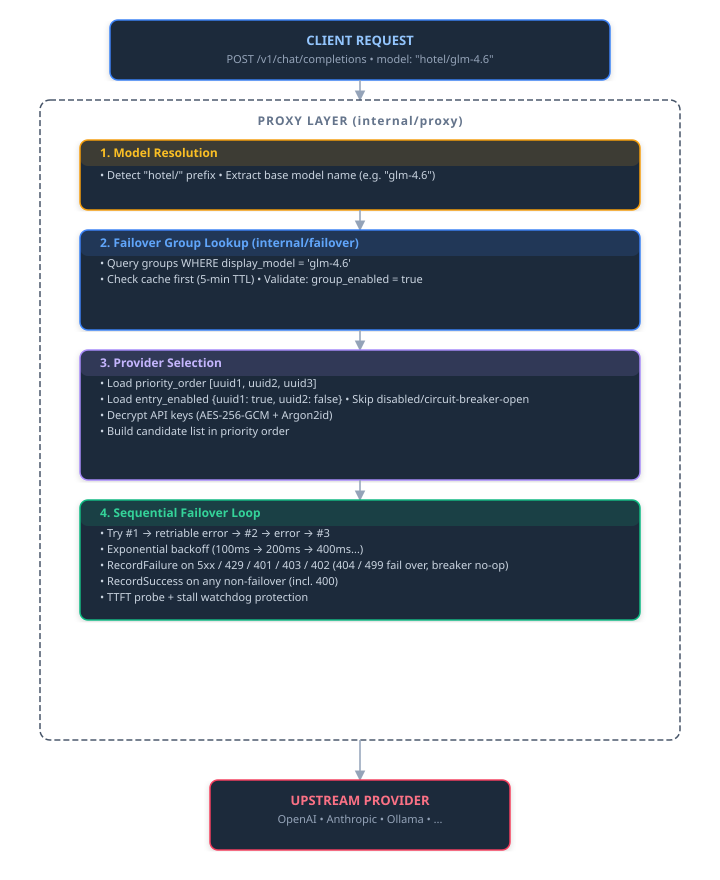
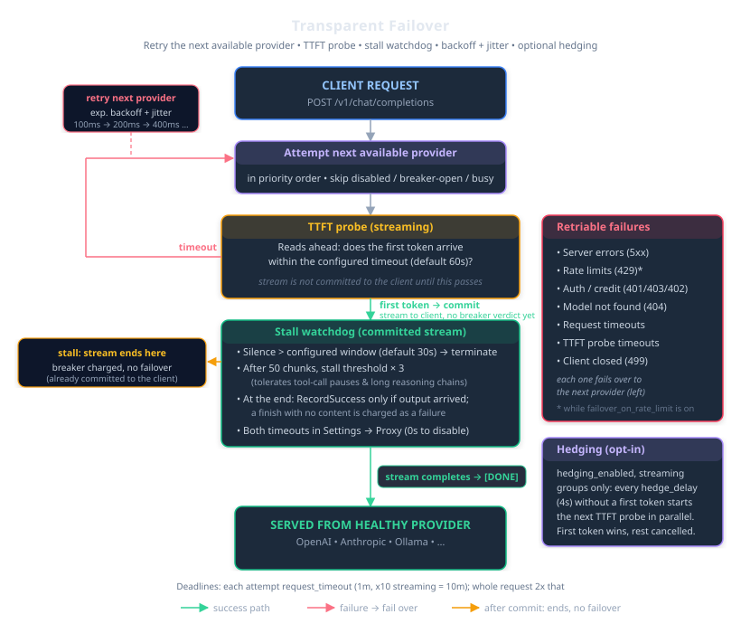

# 🔀 Failover & Hotel Routing

Model Hotel has two related but distinct routing concepts: **transparent failover** and **hotel routing**. Together they ensure requests succeed even when individual providers are unreliable.

---

## Table of Contents

1. [Architecture Overview](#architecture-overview)
2. [Database Schema](#database-schema)
3. [Failover Groups](#failover-groups)
4. [Hotel Routing](#hotel-routing)
5. [Provider Selection Algorithm](#provider-selection-algorithm)
6. [Transparent Failover](#transparent-failover)
7. [Circuit Breaker](#circuit-breaker)
8. [API Reference](#api-reference)
9. [Request Flow Sequence](#request-flow-sequence)

---

## Architecture Overview



---

## Database Schema

### `model_failover_groups` Table

```sql
CREATE TABLE model_failover_groups (
    id              UUID PRIMARY KEY DEFAULT gen_random_uuid(),
    display_model   TEXT NOT NULL UNIQUE,        -- Base model name (e.g. "glm-4.6")
    display_name    TEXT,                        -- Human-readable label (optional)
    description     TEXT DEFAULT '',             -- Human-readable description
    priority_order  JSONB NOT NULL,              -- [uuid1, uuid2, uuid3] - ordered list of model UUIDs
    entry_enabled   JSONB DEFAULT '{}',          -- {uuid1: true, uuid2: false} - per-entry toggle
    group_enabled   BOOLEAN DEFAULT true,        -- Master toggle for entire group
    auto_created    BOOLEAN DEFAULT false,       -- true if auto-generated during discovery sync
    created_at      TIMESTAMPTZ DEFAULT now(),
    updated_at      TIMESTAMPTZ DEFAULT now()
);
```

**Field Details:**

| Field | Type | Description |
|-------|------|-------------|
| `display_model` | TEXT | Exact base model name used in `hotel/` requests. Matched after stripping org prefixes (e.g. `openai/`, `deepseek/`). |
| `priority_order` | JSONB | Array of model UUIDs in **sequential failover order**. First UUID = highest priority. |
| `entry_enabled` | JSONB | Map of `model_uuid → boolean`. Disabled entries are skipped during routing but preserved in priority order. |
| `group_enabled` | BOOLEAN | Master switch. When `false`, the entire group is skipped during `hotel/` resolution (returns 404). |
| `auto_created` | BOOLEAN | `true` if generated by `SyncAllModels` during discovery. Manual groups have `false`. |

**Indexes:**
- Unique index on `display_model` (enforces one group per base model name)
- No additional indexes needed (lookups by `display_model` or `id`)

### Related Tables

```sql
-- models table (references providers)
CREATE TABLE models (
    id            UUID PRIMARY KEY,
    provider_id   UUID REFERENCES providers(id) ON DELETE CASCADE,
    model_id      TEXT NOT NULL,              -- Full model ID (e.g. "z-ai/glm-4.6")
    enabled       BOOLEAN DEFAULT true,
    UNIQUE(provider_id, model_id)
);

-- providers table
CREATE TABLE providers (
    id            UUID PRIMARY KEY,
    name          TEXT NOT NULL,
    base_url      TEXT NOT NULL,
    encrypted_key BYTEA NOT NULL,             -- AES-256-GCM encrypted API key
    key_nonce     BYTEA NOT NULL,             -- Argon2id-derived nonce
    enabled       BOOLEAN DEFAULT true
);
```

---

## Failover Groups

A **failover group** represents one logical model backed by multiple providers. When you request `hotel/glm-4.6`, the proxy looks up the failover group with `display_model = 'glm-4.6'` and tries providers in the configured priority order.

### Bulk Provider Management

The Failover Groups page includes a **Manage Providers** button (next to "New Group") that opens a modal listing all providers. Disabling a provider in this modal disables all model entries belonging to that provider across **all** failover groups (including custom groups). If disabling a provider causes all entries in a group to be disabled, the group itself is also disabled. A toast notification reports how many groups were affected.

### Group Lifecycle

#### Creation

**Auto-Generation (Discovery Sync):**

Failover groups are automatically created during model discovery sync (`SyncAllModels`):

1. Query all enabled models from enabled providers
2. Strip org prefixes (`openai/`, `deepseek/`, `meta-llama/`, etc.) to get base name
3. Group providers that share the same base name
4. **Require 2+ providers** - single-provider groups are automatically disabled
5. Set `auto_created = true`

```go
// internal/failover/failover.go:SyncAllModels
func (r *Repository) SyncAllModels(ctx context.Context) (*SyncResult, error) {
    // 1. Query enabled models
    rows, _ := r.pool.Query(ctx, `
        SELECT m.id, m.model_id, m.provider_id, p.name
        FROM models m
        JOIN providers p ON m.provider_id = p.id
        WHERE m.enabled = true AND p.enabled = true
        ORDER BY m.model_id, p.created_at ASC
    `)

    // 2. Strip prefixes and group by base name
    baseToModels := make(map[string][]modelInfo)
    for rows.Next() {
        base := stripPrefix(modelID)  // "z-ai/glm-4.6" → "glm-4.6"
        baseToModels[base] = append(...)
    }

    // 3. Create groups with 2+ providers
    for base, models := range baseToModels {
        if len(models) <= 1 {
            r.disableAutoGroup(ctx, base)  // Disable single-provider groups
            continue
        }
        priorityOrder := extractUUIDs(models)
        r.UpsertWithConfig(ctx, base, priorityOrder, ...)
    }
}
```

**Manual Creation (API):**

```bash
POST /api/failover-groups
Content-Type: application/json
Authorization: Bearer $ADMIN_TOKEN

{
  "display_model": "glm-4.6",
  "display_name": "GLM 4.6",
  "description": "Multi-provider failover for GLM 4.6",
  "entry_ids": [
    "uuid-of-openai-gpt4o-model",
    "uuid-of-deepseek-gpt4o-model",
    "uuid-of-zai-gpt4o-model"
  ]
}
```

**Validation Rules:**
- Minimum 2 entries required for creation
- `display_model` must be unique (conflict if exists)
- `display_name` and `description` are optional

#### Configuration

**Priority Ordering:**

Providers are tried **sequentially** in `priority_order` array order. Reorder via API or UI drag-and-drop:

```bash
PUT /api/failover-groups/{group_id}
Content-Type: application/json

{
  "priority_order": [
    "uuid-3",  // Now first (highest priority)
    "uuid-1",
    "uuid-2"   // Now last
  ]
}
```

**Per-Entry Enable/Disable:**

Individual entries can be disabled without removing them from the group:

```json
{
  "entry_enabled": {
    "uuid-1": true,
    "uuid-2": false,  // Skipped during routing
    "uuid-3": true
  }
}
```

Disabled entries:
- Appear strikethrough in UI
- Skipped during candidate selection
- Preserved in priority order for re-enablement

**Effective Entry State:**

The per-entry toggle expresses *intent*; whether the router can actually use an entry also depends on the underlying model and provider being enabled. Each entry in API responses therefore carries `model_enabled` and `provider_enabled` alongside the toggle's `enabled`, and the UI greys out entries whose model or provider is disabled and badges them ("Model disabled" / "Provider disabled") even when the entry toggle is on. The toggle stays functional so intent is preserved for when the model comes back. In the group editor, entries that are no longer available are suffixed "(unavailable)" so they stay distinguishable from same-named available candidates.

**Self-Heal on Discovery:**

When a discovery scan disables a model (it left the provider's listing - e.g. a rename), the scan re-syncs that model's failover group the same way a manual sync would: the stale entry is pruned, and a group that drops below 2 enabled members is deleted (auto-created groups only). The changes are reported in the scan's discovery summary. See [Model Discovery](Model-Discovery) for the diff format.

**Group-Level Toggle:**

Master switch disables entire group:

```json
{
  "group_enabled": false
}
```

When `group_enabled = false`:
- `hotel/{display_model}` requests return 404
- Group appears in UI but marked as disabled
- Auto-generated groups are disabled if provider count drops below 2

#### Deletion

```bash
DELETE /api/failover-groups/{group_id}
Authorization: Bearer $ADMIN_TOKEN
```

**Cascade Behavior:**
- Deleting a failover group does NOT delete underlying models or providers
- Only the failover configuration is removed
- Direct provider routing (e.g. `OpenRouter/z-ai/glm-4.6`) continues to work

---

## Hotel Routing

Hotel routing is explicit multi-provider routing via the `hotel/` prefix. It gives you fine-grained control over which providers are used and in what order.

### Using Hotel Routing

Prefix any model ID with `hotel/`:

```bash
curl -X POST http://localhost:8081/v1/chat/completions \
  -H "Authorization: Bearer $PROXY_KEY" \
  -H "Content-Type: application/json" \
  -d '{
    "model": "hotel/glm-4.6",
    "messages": [{"role": "user", "content": "Hello!"}]
  }'
```

This resolves to the failover group named `glm-4.6` and tries providers in priority order.

### Model Name Resolution

**Exact Base Name Matching:**

Hotel routing matches **exact base names** after stripping organization prefixes:

| Request Model | Strips To | Matches Group |
|---------------|-----------|---------------|
| `hotel/glm-4.6` | `glm-4.6` | `display_model = 'glm-4.6'` |
| `hotel/llama-3.1-8b` | `llama-3.1-8b` | `display_model = 'llama-3.1-8b'` |
| `hotel/glm-4.5-air` | `glm-4.5-air` | `display_model = 'glm-4.5-air'` (different group) |

**Base Name Extraction:**

The code does not maintain a hardcoded prefix list. Instead, `normalizeBaseModel()` in `internal/failover/failover.go` strips everything before the last `/` in the model ID, then lowercases the result:

```go
func normalizeBaseModel(modelID string) string {
    if idx := strings.LastIndex(modelID, "/"); idx >= 0 {
        return strings.ToLower(modelID[idx+1:])
    }
    return strings.ToLower(modelID)
}
```

This handles any org prefix depth (e.g. `zai-org/glm-5.1`, `zai-org/anthracite-org/magnum-v4-72b`) without needing to enumerate known providers. The SQL in `SyncForModel` uses `SUBSTRING(m.model_id FROM '[^/]+$')` to match on the same leaf segment.

Example: `z-ai/glm-4.6`, `zai-org/glm-4.6`, and `glm-4.6` all map to the same failover group `glm-4.6`.

### Resolution Logic

```go
// internal/proxy/resolve.go:resolveHotelModel
func (h *Handler) resolveHotelModel(ctx context.Context, displayModel string) ([]modelCandidate, resolveTimings, error) {
    // 1. Lookup failover group (with cache)
    fg, err := h.failoverRepo.GetByModel(ctx, displayModel)
    if err != nil {
        return nil, t, err  // 404 to client
    }

    // 2. Check group enabled
    if !fg.GroupEnabled {
        return nil, t, fmt.Errorf("failover group disabled")
    }

    // 3. Collect enabled model UUIDs
    enabledModelIDs := make([]uuid.UUID, 0, len(fg.PriorityOrder))
    for _, modelUUID := range fg.PriorityOrder {
        entryEnabled := true
        if val, ok := fg.EntryEnabled[modelUUID.String()]; ok {
            entryEnabled = val
        }
        if entryEnabled {
            enabledModelIDs = append(enabledModelIDs, modelUUID)
        }
    }

    // 4. Batch load models and providers
    models, _ := h.modelRepo.GetByIDs(ctx, enabledModelIDs)
    providers, _ := h.providerRepo.GetByIDs(ctx, uniqueProviderIDs)

    // 5. Build candidate list (filtering disabled, circuit breakers)
    candidates := make([]modelCandidate, 0)
    for _, modelUUID := range fg.PriorityOrder {
        // Skip if entry disabled
        if !entryEnabled { continue }

        // Skip if model/provider disabled
        if !m.Enabled || !prov.Enabled { continue }

        // Skip if this model's circuit is open, or the provider verdict is
        if cbEnabled && h.circuitBreaker.IsOpen(prov.ID, prov.Name, m.ModelID) { continue }

        // Decrypt API key
        apiKey, _ := auth.DecryptCached(prov.EncryptedKey, ...)

        candidates = append(candidates, modelCandidate{model: m, provider: prov, apiKey: apiKey})
    }

    return candidates, t, nil
}
```


*Failover Groups page - showing groups with enabled status, model entries, and priority badges*


*Failover group entries with per-entry enable/disable toggles, strikethrough for disabled entries, and priority ordering.*

---

## Provider Selection Algorithm

The provider selection algorithm builds an ordered list of candidates from a failover group:


**Key Properties:**

1. **Priority order preserved**: Candidates are always in `priority_order` sequence
2. **Graceful degradation**: Disabled/failed entries are skipped, not fatal
3. **Circuit breaker integration**: Candidates whose own model circuit is open, and every candidate of a provider the derived verdict indicts, are filtered before the failover loop
4. **Batch efficiency**: Single DB query for all models, single query for all providers

---

## Transparent Failover

Transparent failover happens automatically when an upstream provider request fails with a retriable error. It is the proxy's mechanism to ensure requests succeed even when individual providers are flaky or misconfigured.

Failover applies to **all** `/v1` endpoints, not just chat completions - the multimodal endpoints (embeddings, images, audio) share the same candidate-resolution and failover loop. For streaming or binary responses, failover is only possible before the first response byte has been forwarded to the client; once a stream is committed, the proxy stays with that provider.

The diagram below focuses on the streaming safeguards - the **TTFT probe** that gates commit, the **stall watchdog** that guards a committed stream, and the backoff-paced retry loop. The [Architecture Overview](#architecture-overview) diagram above shows the complementary resolution-to-selection pipeline.



### How It Works

Failover is **sequential** - providers are tried one at a time, in order:

1. Client requests a model (e.g. `hotel/glm-4.6` or `OpenRouter/z-ai/glm-4.6`)
2. The proxy resolves a list of candidate providers
3. The first candidate is tried
4. If the upstream returns a retriable error, the proxy moves to the next candidate
5. This continues until the request succeeds or all candidates are exhausted
6. If all candidates fail, a generic 502 error is returned to the client

### Failover Decisions

Failover triggers on:

| Condition | Behavior | Source |
|-----------|----------|--------|
| **Any 5xx status** (status >= 500) | Always triggers failover | Server errors indicate upstream problems |
| **HTTP 429** (rate limit) | Triggers failover **if** `failover_on_rate_limit=true` (default) | Configurable via settings |
| **HTTP 401 / 403** (auth errors) | Always triggers failover | Stale or rotated API keys |
| **HTTP 404** (model not found at provider) | Always triggers failover | Stale DB entry, overloaded provider returning not_found |
| **Timeouts** | Always triggers failover | Network timeout, connection refused, DNS failure |

Failover does **not** trigger on:

| Condition | Behavior | Reason |
|-----------|----------|--------|
| **HTTP 400** (bad request / param rejection) | **Triggers auto-retry on SAME provider with the offending parameter stripped or renamed** | The provider's 400 names the unsupported parameter; the retry drops it (e.g. an injected `chat_template_args` or `thinking` a strict backend rejects) and tries again on the same provider. The one exception is a param that carries the caller's token budget: when a model demands `max_completion_tokens` instead of `max_tokens` (OpenAI gpt-5 / o-series), the value is renamed rather than dropped, so the response stays capped. The learned rejection is cached per model, so later requests skip the round-trip. A second 400 self-heal covers OpenAI's newest models rejecting tools+reasoning on Chat Completions entirely: the retry re-issues the request against the provider's `/v1/responses` (translated both ways) and the requirement is cached per model, so later tools+reasoning requests route there preemptively. See [API Reference](API-Reference#post-v1chatcompletions). |
| **HTTP 404** (model not found at provider) | Always triggers failover | Stale DB entry, overloaded provider returning not_found |
| **Other 4xx errors** (422, etc.) | Returned to client as-is | Client errors (validation errors) are not retriable |
| **Slow responses** | No latency-based failover exists | There is no response-time threshold that triggers failover |

#### Exponential Backoff Between Failover Attempts

Each failover attempt includes an exponential backoff delay to prevent overwhelming failing providers:

- **Base delay**: 100ms
- **Maximum delay**: 2s
- **Jitter**: [0, base) (adds 0 to base-1ms random offset, not symmetric)
- **First attempt (attempt=0)**: No delay
- **Client disconnection during backoff**: Returns HTTP 499

The delay doubles with each subsequent attempt (100ms → 200ms → 400ms → 800ms → 1.6s → capped at 2s), with jitter applied to prevent thundering herd issues.

```go
// internal/proxy/proxy.go:failoverBackoff
func failoverBackoff(base, capacity time.Duration, attempt int) time.Duration {
    exp := time.Duration(float64(base) * math.Pow(2, float64(attempt-1)))
    if exp > capacity {
        exp = capacity
    }
    jitter := time.Duration(rand.Int64N(int64(base)))
    return exp + jitter
}
```

#### The `failover_on_rate_limit` Setting

By default, a 429 rate-limit response from one provider triggers failover to the next. This is controlled by the `failover_on_rate_limit` setting (default: `true`). If you prefer to return 429 errors directly to the client rather than retrying on another provider, set this to `false`.

#### The `shouldFailover` Logic

The proxy evaluates whether an upstream response should trigger failover based on the HTTP status code:

```go
// internal/proxy/resolve.go:shouldFailover
func (h *Handler) shouldFailover(ctx context.Context, statusCode int) bool {
    if statusCode >= 500 {
        return true  // 5xx → failover immediately
    }
    if statusCode == 429 {
        enabled := h.settingsRepo.GetBool(ctx, "failover_on_rate_limit", true)
        return enabled  // 429 → failover only if setting enabled
    }
    if statusCode == 401 || statusCode == 403 {
        return true  // Auth errors → failover immediately
    }
    if statusCode == 404 {
        return true  // Model not found at provider → failover (stale DB, overloaded provider)
    }
    return false  // Other status codes → no failover
}
```

Note: failover only proceeds if there are remaining candidates. If the last candidate returns a retriable error, that error is returned to the client directly.

#### The `request_timeout` Setting

The proxy uses the `request_timeout` setting (default: `1m`) for all upstream requests:

- **Non-streaming requests**: Uses the setting value directly
- **Streaming requests**: Uses 10× the timeout value (10 minutes by default)

This setting is configurable at runtime via the **Settings** UI or the admin API.

#### Request Body Caching

The request body is cached in the context at the start of the failover loop. This allows the body to be re-read for each retry without requiring the client to resend it. The cached body is used when building upstream requests for each failover attempt.

#### TTFT Probe (Time-to-First-Token)

For streaming requests, the proxy reads ahead to confirm the first token arrives before committing the stream to the client. This prevents the client from receiving a broken or partial stream from a provider that responded 200 but fails to produce content.

- **Timeout**: Configurable via `ttft_timeout` setting (default: `1m0s`). If the provider fails to produce a token within this timeout, the request fails over to the next provider.
- **Measurement**: The actual TTFT measured during the probe is stored in `logEntry.ttftMs` for request logging.
- **Disable**: Set `ttft_timeout` to `0s` to disable the probe (immediate stream commit, backward-compatible behavior).

#### Stall Watchdog

Once streaming begins, a **stall watchdog** monitors for silence in the SSE stream:

- **Timeout**: Configurable via `stream_stall_timeout` setting (default: `30s`). If no data arrives within this window, the connection is terminated and the circuit breaker records a failure.
- **Progressive extension**: After 50 chunks, the effective stall timeout is multiplied by 3 (default: 30s × 3 = 90s) to tolerate tool-call pauses and long reasoning chains.
- **Disable**: Set `stream_stall_timeout` to `0s` to disable the watchdog.

#### resolved_model_id

The `resolved_model_id` field in request logs records the actual upstream model ID used (e.g. `z-ai/glm-4.6`), which may differ from the requested `hotel/` name (e.g. `hotel/glm-4.6`). For non-hotel requests where the requested and resolved model are the same, this field is NULL.

### Failover Attempt Logging

Each request produces **one `request_logs` row** containing the **final attempt's** data:

- **Intermediate failover attempts** are logged to **stdout only** (via `log.Printf`), not to the database
- The final `request_logs` record includes the `failover_attempt` number indicating how many attempts were made (0-indexed)
- A request that succeeds on the first try has `failover_attempt = 0`
- The `resolved_model_id` field records the actual upstream model ID used

This means the `request_logs` table always has exactly one row per incoming request, and the `failover_attempt` field tells you whether failover occurred and how many providers were tried before the final result.

Intermediate attempts appear in stdout logs like:

```
[proxy] failover triggered: attempt=1 provider=<uuid> status=429
[proxy] failover triggered: attempt=2 provider=<uuid> status=502
```

#### Virtual Key Token Tracking

During proxy requests, token usage is tracked against the virtual key used for authentication. Token counts (prompt tokens, completion tokens, and total tokens) are extracted from the upstream provider's response and recorded in the `request_logs` table. This enables usage tracking and quota enforcement per virtual key.

---

## Circuit Breaker

The proxy includes a circuit breaker that prevents sending requests to models that are consistently failing, giving them time to recover.

**What a circuit is keyed on:** one circuit per **(provider, resolved upstream model)** pair - the model id actually sent upstream, never the `hotel/` group alias. A model that fails for its own reasons (a plan that excludes it, a retired id, a per-model refusal) darkens only itself; its healthy siblings behind the same provider keep serving. The provider as a whole is a **derived** verdict, never a circuit that anything charges directly: see [Provider-wide verdict](#provider-wide-verdict).

**Success Recording:** The circuit breaker records success for **any response that does NOT trigger failover**. This includes 400 errors (parameter rejections), since these indicate the provider successfully processed the request but rejected it due to invalid parameters - not a provider health issue. Only 5xx, 429 (when enabled), 401/403, and timeouts are recorded as failures. A success resets **that model's** circuit only: a working model says nothing about a failing sibling, and crediting the sibling is how a broken model stays in rotation forever.

### State Machine

Each model circuit is a three-state machine:


### Implementation

```go
// internal/failover/circuitbreaker.go
type CircuitBreaker struct {
    mu sync.RWMutex
    // provider UUID → resolved upstream model id → circuit state
    circuits map[string]modelCircuits

    Threshold         int           // Default: 5 consecutive failures
    SpanModels        int           // Default: 2 open model circuits to indict the provider
    Cooldown          time.Duration // Default: 60s
    HalfOpenMaxProbes int           // Default: 1 success to close
}

// internal/failover/model_circuits.go
type modelCircuits map[string]*circuit

type circuit struct {
    state            State         // Closed, Open, or HalfOpen
    consecutiveFails int
    openedAt         time.Time     // When transitioned to Open
    halfOpenProbes   int           // Successful probes in HalfOpen
    cooldownOverride time.Duration // Quota pin, when one governs this circuit
    failedProbes     int           // Half-open probes that failed since the circuit last closed
    cooldownBackoff  time.Duration // The cooldown those failures earned: base doubled per probe, capped
    lastCharged      time.Time     // Orders eviction above the per-provider cap
}
```

The map is capped at 256 circuits per provider. When a provider reaches it, the least recently charged **closed** circuit is evicted to make room; an open or half-open circuit is never dropped, because evicting one would silently restore a model the breaker has decided is broken. The cap is therefore a soft one: a provider holding 256 circuits that are all open has no eligible victim, so the map keeps every one of them and is allowed to grow past 256 rather than un-darken a broken model.

**State Transitions** (per model circuit):

| Current State | Trigger | Next State | Action |
|---------------|---------|------------|--------|
| Closed | Failure count >= threshold | Open | Block requests for that model, start cooldown |
| Closed | Success | Closed | Reset that model's failure counter |
| Open | Cooldown elapsed | HalfOpen | Allow one probe request for that model |
| HalfOpen | Probe success | Closed | Resume normal operation |
| HalfOpen | Probe failure | Open | Restart cooldown, doubled for every probe that has failed since the circuit last closed (see [Probe backoff](#probe-backoff)) |

### Provider-wide verdict

A provider is skipped for **every** model when either of these holds:

- a **quota pin** is in force, i.e. the provider itself reported that its window is spent (see [Quota-pinned cooldowns](#quota-pinned-cooldowns)), or
- at least `circuit_breaker_span_models` distinct model circuits are open and still inside their cooldown.

Nothing stores that verdict; it is recomputed from the circuits on every read, so it cannot go stale against a cooldown that elapsed a moment ago. A circuit owed a probe blocks nothing, so it counts towards neither the verdict nor the list of models beside it.

That also means the verdict holds for exactly as long as its blocking circuits do. With [probe backoff](#probe-backoff) on, a circuit whose probes keep failing stays inside its cooldown for up to `circuit_breaker_backoff_max` at a stretch, and a provider indicted by two such circuits stays skipped for that long too, healthy siblings included, rather than clearing for a probe every `circuit_breaker_cooldown`. The 15-minute default ceiling is chosen with that in mind.

The span default of `2` is the smallest number that requires corroboration: one model refusing is evidence about that model, two models refusing is evidence about the provider. Setting it to `1` restores the older behaviour, where the first open circuit sidelines the whole provider, and is the escape hatch if you want that back.

The dashboard reads it the same way. The **red number** in the Failover nav badge counts providers the breaker is skipping - the derived verdict, read off the `provider_open` field of the detail rows - and the amber number beside it counts providers that hold an open or probing circuit but are still routing. The status endpoint's own `closed` / `half_open` / `open` counts are per-circuit-state tallies of the most degraded circuit per provider, which is a different question: a provider serving three models with one dark appears under `open` there and in the **amber** number here.

### Failover Integration

Blocked candidates are filtered out during provider resolution:

```go
// internal/proxy/resolve.go:resolveHotelModel
cbEnabled := h.settingsRepo.GetBool(ctx, "circuit_breaker_enabled", true)
if cbEnabled && h.circuitBreaker.IsOpen(prov.ID, prov.Name, m.ModelID) {
    debuglog.Info("resolve: skipping candidate: circuit breaker open", "provider", prov.Name, "model", m.ModelID)
    continue  // Skip this candidate
}
```

`IsOpen` skips a candidate when **its own** model circuit is open, or when the provider-wide verdict is open. So a group member whose model is dark is never tried at all, while its sibling behind the same provider stays in rotation until the span is reached.

**Client Disconnections:**

Client disconnections (`context.Canceled`) and deadlines (`context.DeadlineExceeded`) do NOT count as provider failures:

```go
// internal/proxy/proxy_failover.go:attemptCandidate
if !isContextErr {
    if st.circuitBreakerEnabled {
        h.circuitBreaker.RecordFailure(candidate.provider.ID, candidate.provider.Name, candidateModelID(candidate))
    }
}
```

These are treated as user-side cancellations rather than provider health issues.

### Settings

| Setting | Type | Default | Description |
|---------|------|---------|-------------|
| `circuit_breaker_enabled` | bool | `true` | Global kill switch. When disabled, no circuit tracking occurs. |
| `circuit_breaker_threshold` | int | `5` | Number of consecutive failures before a circuit opens. Only effective when value > 0. |
| `circuit_breaker_span_models` | int | `2` | How many of a provider's models must have an open circuit before the provider itself is skipped for every model. `1` restores the older behaviour, where the first open circuit sidelines the whole provider. |
| `circuit_breaker_cooldown` | duration | `60s` | How long an open circuit stays open before transitioning to half-open. |
| `circuit_breaker_quota_pin_enabled` | bool | `true` | When a provider's circuit opens because its quota window is spent, pin the cooldown to the provider's real reset deadline instead of `circuit_breaker_cooldown`. |
| `circuit_breaker_quota_pin_max` | duration | `24h` | Ceiling on how far out a quota pin may push the cooldown. |
| `circuit_breaker_backoff_enabled` | bool | `true` | Double an open circuit's cooldown for every half-open probe that fails, so a model that stays broken is retried less and less often. Turning it off also releases a backoff already in force. |
| `circuit_breaker_backoff_max` | duration | `15m` | Ceiling the backed-off cooldown may grow to. A non-positive value restores the default rather than disabling backoff; a value at or below `circuit_breaker_cooldown` leaves backoff nothing to add. |
| `ttft_timeout` | duration | `1m0s` | Time-to-first-token probe timeout for streaming requests. Set to `0s` to disable. |
| `stream_stall_timeout` | duration | `30s` | Maximum silence during streaming before termination. After 50 chunks, timeout is multiplied by 3. Set to `0s` to disable. |

All of these settings are runtime-configurable and take effect immediately. They have UI controls in the Settings page: the **Circuit Breaker & Failover** section (enabled, threshold, model span, cooldown, failover-on-429, quota pinning and its ceiling, probe backoff and its ceiling) and the **Proxy** section (`ttft_timeout`, `stream_stall_timeout`). They can also be changed via `PUT /api/settings`.

#### Quota-pinned cooldowns

Without pinning, a provider that has exhausted its quota is re-probed every `circuit_breaker_cooldown` until the window resets. On a weekly plan that is thousands of doomed requests, each one a real user request that fails first. Quota pinning stretches an **already-open** circuit's cooldown out to the provider's actual reset deadline, clamped to `circuit_breaker_quota_pin_max` and jittered so a fleet does not stampede the provider at the same instant.

Pinning only ever changes the cooldown of a circuit that has already opened. HTTP responses remain the sole source of truth for whether a circuit opens at all, so a wrong or stale quota reading can delay a retry but can never sideline a healthy provider.

Four behaviours are worth knowing before you reach for these controls:

- **A pin ends by itself when the provider recovers.** A pin is stamped on at the moment the circuit opens, but it is not a commitment to wait that long. The quota poller refreshes its picture every `quota_refresh_interval_min` minutes (5 by default), and any provider that is no longer out of quota has its pin lifted on the spot. The circuit falls back to `circuit_breaker_cooldown` (or to its probe backoff, if its probes had been failing before the pin) and, if that has already elapsed, goes half-open and probes on the next request. So an operator who tops up a spent plan gets the provider back within one poll interval instead of waiting out a pin that could run to the 24h ceiling. Lifting a pin only ever shortens a wait: it does not close the circuit, and the probe still has to succeed before traffic resumes. Look for `circuit-breaker: quota pin released (provider no longer exhausted)` in the logs. Note that a pin is released only on positive evidence of recovery: a refresh that actually succeeded, which read a snapshot fresh enough to trust and understood it well enough to say the window is no longer spent. Everything short of that leaves the pin exactly where it is. A refresh that could not read the database, a provider whose quota endpoint has been failing long enough for its last snapshot to go stale, a snapshot whose own most recent refresh attempt failed (the last good payload is kept on file for the dashboard, so it can still look fresh even though nothing since has confirmed it), and a payload the gateway cannot interpret all say nothing about provider health, and treating any of them as recovery would put a still-exhausted provider back into rotation precisely when quota reporting is broken. In a fleet this judgement is made on the same evidence everywhere: members mostly act on snapshots Front Desk distributes from the primary rather than on their own polls, and a snapshot travels with the record of whether the refresh behind it succeeded, so a member reaches the same verdict on it as the primary does.
- **Turning quota polling off releases pins already in force, too.** Setting `quota_refresh_interval_min` to `0` ("Disabled") stops the feature acting on that node completely, not just from that moment on. It stops new pins, because there is no fresh snapshot to advise from, and it releases every pin currently held, because nothing is left running that could ever report a recovery — a pin left standing would be served out to the 24h ceiling on evidence you deliberately stopped collecting. The rule above still holds while the poller is running: absence of evidence keeps a pin only for as long as the gateway is still looking. Look for `circuit-breaker: quota pin released (quota polling disabled)` in the logs, one line per released pin.
- **Turning pinning off releases a pin that is already in force.** The kill switch is re-read on every check rather than only when a circuit opens, so an operator whose provider has been sidelined for hours can recover it by flipping `circuit_breaker_quota_pin_enabled` to `false`. Allow up to about 30 seconds for the change to reach the proxy: settings are cached with a 30 second TTL, so the release is not instantaneous.
- **Setting the maximum to zero does not disable pinning.** A non-positive `circuit_breaker_quota_pin_max` is treated as unset and falls back to the 24h default. `circuit_breaker_quota_pin_enabled` is the off switch; the ceiling only bounds how long a pin may last.

Between them, these give you three ways out of a long pin, from least to most blunt: wait for the poller to notice (automatic, up to one poll interval), reset the one provider whose circuit you want back (immediate, see [Resetting a circuit](#resetting-a-circuit)), or turn pinning off fleet-wide (releases every pin at once). Only the reset also clears a [probe backoff](#probe-backoff); the other two release the pin into whatever backoff the circuit had earned. Disabling quota polling altogether releases every pin as well, but it also blinds the quota dashboard, so reach for `circuit_breaker_quota_pin_enabled` when pinning is the only thing you want stopped.

#### Probe backoff

The half-open probe is not a synthetic health check: `IsOpen` hands it to the next real request for that model, and if the model is still broken that request fails before failover moves on (or, when the model has no healthy sibling in its group, fails outright). At the default 60s cooldown a model that stays broken all day therefore wastes about 1,440 real requests, one per cooldown, and `circuit_breaker.unstable` only reports that waste. Probe backoff removes most of it: every probe that fails doubles the cooldown before the next one, and a probe that succeeds closes the circuit and resets the count. At the defaults the waits run 1, 2, 4, 8 minutes and then hold at the `circuit_breaker_backoff_max` ceiling of 15 minutes, so the same broken model wastes under a hundred requests a day, and a model fixed upstream is back in rotation within a quarter of an hour with nobody touching anything.

The ceiling is deliberately not longer. A probe is the only way a model with no healthy sibling ever gets tried again, so the ceiling is also the longest such a model can stay unreachable after it has actually recovered; and the provider-wide verdict holds for as long as its blocking circuits do, so it bounds how long a partially broken provider's healthy models stay skipped as well. Raise it if you would rather retry less often and can wait longer for a recovery to be noticed.

What counts is a **failed probe**, not an open: a circuit that closes on a successful probe and is later charged back to threshold by fresh failures is a new incident and starts again from the base cooldown. That is deliberate. Doubling on every open would slow the recovery of a model that had two real, separate outages in one day, which is exactly the model an operator wants back promptly.

Three things are worth knowing:

- **The longest cooldown in force governs, and a pin is floored at the backoff.** A circuit can carry a quota pin and a backoff at once; it serves whichever reaches further, and `quota_pinned` and `backed_off` each say whether their override is in force. A pin is floored at the cooldown in force when it is stamped, after the `circuit_breaker_quota_pin_max` ceiling has been applied, so a quota reading that says the window resets in three minutes does not pull a four-minute backoff in, and neither does a low pin ceiling; only a reading further out than the backoff pins, and then the pin is the longest. When a pin is lifted early, the circuit falls back to its backoff, not to the base cooldown: a provider that recovered its quota is still a provider whose probes failed. Raising `circuit_breaker_cooldown` past a backoff stamped earlier makes the new cooldown govern, and the row stops claiming a backoff.
- **Turning backoff off releases a backoff already in force.** Like the quota-pin switch, `circuit_breaker_backoff_enabled` is re-read on every check, so flipping it off puts every backed-off circuit back on `circuit_breaker_cooldown` within the settings cache TTL (about 30 seconds). The failed-probe count keeps accruing while the switch is off, and flipping it back on applies the backoff those failures have earned by then; the status API reports the count whether or not it governs anything.
- **Setting the ceiling to zero does not disable backoff.** A non-positive `circuit_breaker_backoff_max` restores the default of 15 minutes; a ceiling at or below `circuit_breaker_cooldown` leaves backoff with nothing to add and is the same as off. `circuit_breaker_backoff_enabled` is the switch.

Every surface derives from the same predicate. The status API's `cooldown_ms` and `next_retry_at` are the backed-off values, `backed_off` says that is why, and `failed_probes` says how many times. The `circuit_breaker.open` event carries all four and says so in its message (`... (backing off after 3 failed retries, next retry in 8m)`), which is what an outbound alert renders; the log line carries the flag, the count and the cooldown; and a `quota pin released` log line reports the cooldown the circuit actually falls back to. Resetting a circuit (below) clears the count with everything else. The Prometheus gauge is unchanged: it buckets by state and cannot tell a 60-second circuit from a fifteen-minute one.

### SSE Events

The circuit breaker publishes real-time events via the SSE event bus:

| Event | When |
|-------|------|
| `circuit_breaker.open` | One model circuit transitions from Closed to Open. `provider_open` says whether that also takes the whole provider out |
| `circuit_breaker.closed` | One model circuit recovers (Half-Open → Closed) |
| `circuit_breaker.unstable` | One model circuit has opened 3 times inside 24 hours, so every cooldown it serves out returns it to service still broken |

`circuit_breaker.unstable` reports and never retires, which is the whole of its
design. Retiring a model means asserting the provider no longer serves it, and
only a request refused by name establishes that; a model failing that way is
already handled by the model-gone path on its first refusal. What is left for
this event is the model that fails some other way over and over (timeouts, 5xx,
a provider having a bad week), and disabling that model would take a working one
out of routing on evidence that says only "upstream is unwell". It reports at
most once per model per 24 hours: the window keeps running after it fires, so a
permanently broken model does not report every third open.

It is off by default in the alert catalogue, so it sends no outbound (Apprise)
notification until an operator turns it on under Settings, Alerts. That default
covers outbound alerting only: the dashboard's live event feed is not
catalogue-gated, so the event still appears there as it happens. It is off by
default because an instance upgrading with a long-flaky provider would otherwise
notify on the third open about a condition its operator already lives with.

The transition into Half-Open itself (an open circuit whose cooldown has elapsed, now allowing a probe through) is not published as an event: it is a transient internal state, surfaced only via the circuit-breaker status API's `half_open` count, not the alert/SSE event stream.

These events appear in the real-time sidebar and dashboard.

`circuit_breaker.open` and `circuit_breaker.closed` carry the same metadata block:

| Field | Type | Present | Meaning |
|-------|------|---------|---------|
| `provider_id` | string (UUID) | always | The provider whose circuit changed state |
| `provider` | string | always | Provider name |
| `model` | string | always | The resolved upstream model id whose circuit changed state |
| `model_id` | string | unless `provider_open` is `true` | The same value as `model`, carried separately because it is the identity outbound alerts debounce on: without it two models opening on one provider inside the alert cooldown would collapse to one notification. Omitted once the provider itself is skipped, because then the outage is one fact however many models it reaches, and alerts fall back to debouncing on `provider_id` |
| `state` | string | always | `open` or `closed` |
| `provider_open` | bool | always | Whether the provider as a whole is now being skipped, derived from how many of its model circuits are open (see `circuit_breaker_span_models`) |
| `consecutive_fails` | int | always | Consecutive failures recorded against that model's circuit |
| `quota_pinned` | bool | always | `true` when a quota reset deadline is in force on this circuit |
| `backed_off` | bool | always | `true` when the probe backoff is in force on this circuit (see [Probe backoff](#probe-backoff)); the longer of the two overrides governs |
| `failed_probes` | int | always | Half-open probes that failed since the circuit last closed; `0` on a first open |
| `cooldown_ms` | int | on `open` | The cooldown actually enforced, whichever override produced it |
| `next_retry_at` | string (RFC3339) | on `open`, when `quota_pinned` or `backed_off` is `true` | When the circuit is next eligible to probe |

`next_retry_at` is the **retry deadline, not the provider's quota reset time**: under a pin it is the clamped and jittered pin, so a weekly quota that resets days out still yields a `next_retry_at` at the `circuit_breaker_quota_pin_max` ceiling, and under a backoff it is the doubled cooldown. It is the same value the circuit-breaker status API publishes under that name.

```go
// internal/failover/circuitbreaker.go:publishEvent
meta := map[string]any{
    "provider_id":       providerID.String(),
    "provider":          providerName,
    "model":             model,
    "state":             state,
    "provider_open":     providerOpen,
    "consecutive_fails": c.consecutiveFails,
    "quota_pinned":      pinned,
    "backed_off":        backedOff,
    "failed_probes":     c.failedProbes,
}
if !providerOpen {
    meta["model_id"] = model
}
if state == "open" {
    meta["cooldown_ms"] = cooldown.Milliseconds()
    if pinned || backedOff {
        meta["next_retry_at"] = c.openedAt.Add(cooldown).Format(time.RFC3339)
    }
}
msg := breakerEventMessage(providerName, state, model, providerOpen)
if state == "open" && backedOff {
    msg += backoffSuffix(cooldown, c.failedProbes)
}
events.Publish(events.Event{
    Type:     "circuit_breaker." + state,
    Severity: cb.severityForState(state),
    Source:   "failover",
    Message:  msg,
    Metadata: meta,
})
```

The message names the model, because the event is about one model circuit: `Provider zai circuit breaker: open for model glm-4.6`. When that transition also flips the provider-wide verdict, the message says so as well - `... for model glm-4.6 (provider skipped)` - since that is the moment the remaining models leave rotation. Without the model in the sentence, a toast or an Apprise alert about one sidelined model reads as a whole provider going down.

A separate `quota.schema_drift` event fires when a provider changes the *shape* of its quota response (the set of key paths, not the values). It carries the added and removed paths and is alert-only: it never opens a circuit, never pins a cooldown, and never affects routing. See [Alerting](Alerting) and the [API Reference](API-Reference) for its metadata.

A pin being lifted early is likewise **not** an event. Nothing transitions at that moment: the circuit is still open, it has simply gone back to the cooldown it would otherwise serve (its probe backoff if one is in force, else the ordinary one). The change shows up in the next circuit-breaker status poll (`quota_pinned` flips to `false` and `next_retry_at` moves in) and in the log line quoted above.

### Resetting a circuit

Waiting out a cooldown is not always what you want. If you have just fixed the provider yourself (rotated a dead key, restarted a local runtime, paid an overdue invoice) the breaker has no way to know, and you can force the circuit back into rotation:

**One provider:**

```bash
curl -X POST http://localhost:8080/api/failover-groups/circuit-breaker/$PROVIDER_ID/reset \
  -H "Authorization: Bearer $ADMIN_TOKEN"
```

This is also the circular-arrow button ("Reset circuit breaker") beside each open or half-open member on the Failover page, so the common case needs no curl at all.

**Every provider at once:**

```bash
curl -X POST http://localhost:8080/api/failover-groups/circuit-breaker/reset \
  -H "Authorization: Bearer $ADMIN_TOKEN"
```

Reset-all is deliberately **API only, with no UI control**. That is a decision, not an omission. Per-provider reset is the operation you want almost every time, and it names the provider you are recovering; a fleet-wide button sitting next to it is far too easy to reach for when a single circuit is the problem, and it discards evidence about every other provider at the same time. The bulk endpoint exists for the case it was written for: a fleet-wide upstream incident that tripped many circuits at once, cleared from a script or a runbook where the blast radius is spelled out.

Resetting clears the circuit outright: state, failure count, and any quota pin. The provider is tried again on the very next request, so if it is still broken the circuit simply reopens after `circuit_breaker_threshold` failures. Both endpoints are safe to call when nothing is wrong: an untracked or already-closed provider reports success and no change rather than an error. See the [API Reference](API-Reference#failover-groups) for the response shapes.

---

## API Reference

### List All Failover Groups

**`GET /api/failover-groups`**

Returns all failover groups with their entries and configuration.

**Response (200):**

```json
{
  "groups": [
    {
      "id": "uuid-of-group",
      "display_model": "glm-4.6",
      "display_name": "GLM 4.6",
      "description": "Multi-provider failover",
      "group_enabled": true,
      "auto_created": true,
      "entries": [
        {
          "model_uuid": "uuid-1",
          "model_id": "z-ai/glm-4.6",
          "provider_id": "uuid-prov-1",
          "provider_name": "OpenRouter",
          "display_name": "GLM 4.6",
          "enabled": true,
          "model_enabled": true,
          "provider_enabled": true,
          "context_length": 200000,
          "owned_by": "z-ai"
        },
        {
          "model_uuid": "uuid-2",
          "model_id": "zai-org/glm-4.6",
          "provider_id": "uuid-prov-2",
          "provider_name": "NanoGPT",
          "display_name": "GLM 4.6",
          "enabled": false,
          "model_enabled": true,
          "provider_enabled": true,
          "context_length": 200000,
          "owned_by": "zai-org"
        }
      ],
      "total_tokens": 1234567,
      "created_at": "2024-01-15T10:30:00Z",
      "updated_at": "2024-01-20T14:45:00Z"
    }
  ],
  "last_synced_at": "2024-01-20T14:45:00Z"
}
```

`enabled` on each entry is the per-entry intent toggle; `model_enabled` / `provider_enabled` expose the underlying model and provider state the router also checks. An entry is effectively routable only when all three are true - the UI greys out and badges entries where they disagree.

### Get Failover Group by ID

**`GET /api/failover-groups/{id}`**

**Response (200):** Same structure as single group in list response.

**Response (404):** `{"error": "failover group not found"}`

### Create Failover Group

**`POST /api/failover-groups`**

**Request:**

```json
{
  "display_model": "llama-3.1-8b",
  "display_name": "Llama 3.1 8B",
  "description": "Custom failover group for Llama 3.1 8B",
  "entry_ids": [
    "uuid-model-1",
    "uuid-model-2",
    "uuid-model-3"
  ]
}
```

**Validation:**
- Minimum 2 entries required
- `display_model` must be unique
- All `entry_ids` must be valid model UUIDs

**Response (201):** Full group object (same as GET response).

**Response (400):** Validation error (e.g. "at least 2 entries required").

**Response (409):** `{"error": "failover group with display_model '...' already exists"}`

### Update Failover Group

**`PUT /api/failover-groups/{id}`**

**Request:**

```json
{
  "display_name": "Updated Name",
  "description": "Updated description",
  "group_enabled": true,
  "priority_order": ["uuid-3", "uuid-1", "uuid-2"],
  "entry_enabled": {
    "uuid-1": true,
    "uuid-2": false,
    "uuid-3": true
  }
}
```

All fields are optional. Only provided fields are updated.

**Response (200):** Updated group object.

**Response (400):** Validation error (e.g. "at least one entry must be enabled").

**Response (404):** Group not found.

### Delete Failover Group

**`DELETE /api/failover-groups/{id}`**

**Response (204):** No content (success).

**Response (404):** Group not found.

### Sync Failover Groups

**`POST /api/failover-groups/sync`**

Manually trigger failover group synchronization with current model discovery state.

**Response (200):**

```json
{
  "deleted_groups": [
    {
      "display_model": "glm-4.5-air",
      "reason": "only 1 enabled provider (need 2+ for failover)",
      "provider_count": 1,
      "provider_names": ["OpenAI"]
    }
  ],
  "purged_entries": [],
  "sync_errors": []
}
```

Per-model syncs (run automatically during discovery) additionally report membership changes as `updated_groups` entries (`display_model` plus `removed_model_ids` / `added_model_ids`); a newly created auto-group reports every member as added. These appear in the discovery diff's `failover_updated_groups`, not in this endpoint's response.

### Get Failover Group by Model UUID

**`GET /api/failover-groups/by-model/{model_uuid}`**

Returns brief info about the failover group containing a specific model UUID.

**Response (200):**

```json
{
  "id": "uuid-of-group",
  "display_model": "glm-4.6",
  "position": 2,
  "total_entries": 3
}
```

**Response (404):** `{"error": "model not in any failover group"}`

### Get Candidate Models

**`GET /api/failover-groups/candidates`**

Returns all enabled models that can be added to failover groups.

**Response (200):**

```json
[
  {
    "model_uuid": "uuid-1",
    "model_id": "z-ai/glm-4.6",
    "provider_id": "uuid-prov-1",
    "provider_name": "OpenRouter",
    "display_name": "GLM 4.6",
    "context_length": 128000,
    "owned_by": "openai"
  }
]
```

---

## Request Flow Sequence

### Complete Request Flow: `hotel/glm-4.6`


### Circuit Breaker State Transitions


---

## Cache Behavior

### Failover Group Cache

Failover group lookups are cached with a 5-minute TTL:

```go
// internal/failover/cache.go
const failoverCacheTTL = 5 * time.Minute

type failoverCacheEntry struct {
    group     FailoverGroup
    expiresAt time.Time
}

var failoverByModelCache = make(map[string]failoverCacheEntry)
```

**Cache Operations:**

| Operation | Function | When Called |
|-----------|----------|-------------|
| Read | `GetCachedFailoverByModel(displayModel)` | Every `GetByModel` query (before DB) |
| Write | `cacheFailoverGroup(&fg)` | After successful DB query |
| Invalidate | `InvalidateFailoverCache()` | On group create/update/delete |
| Warm | `WarmFailoverCache(groups)` | On startup, periodic refresh |

**Cache Invalidation:**

The cache is invalidated on any mutation:

```go
// internal/failover/failover.go:UpsertWithConfig
func (r *Repository) UpsertWithConfig(...) (*FailoverGroup, error) {
    // ... INSERT/UPDATE query ...
    cacheFailoverGroup(&fg)  // Update cache entry
    return &fg, nil
}

// internal/failover/failover.go:Delete
func (r *Repository) Delete(ctx context.Context, displayModel string) error {
    _, err := r.pool.Exec(ctx, `DELETE FROM model_failover_groups WHERE display_model = $1`, displayModel)
    InvalidateFailoverCache()  // Clear entire cache
    return err
}
```

**Cache Warming:**

On startup and periodic sync, the cache is pre-populated:

```go
// internal/failover/cache.go:WarmFailoverCache
func WarmFailoverCache(groups []*FailoverGroup) {
    for _, fg := range groups {
        cacheFailoverGroup(fg)
    }
}
```

---

## Combined Behavior

Transparent failover and hotel routing work together seamlessly:

1. Client requests `hotel/glm-4.6`
2. Hotel routing resolves the failover group and selects the first provider (highest priority)
3. That provider returns a retriable error (5xx, 429, 401/403, 404, or timeout) → transparent failover kicks in
4. Proxy tries the next provider in the group's priority order
5. Retries continue sequentially through `provider-b`, `provider-c`, etc.
6. If all providers in the group fail, a generic 502 error is returned to the client

This means hotel routing provides **ordered preference** (which provider to try first), while transparent failover provides **exhaustive sequential retry** - together they give you the best chance of a successful request.

---

## Troubleshooting

### Common Issues

**"Failover group disabled" Error:**

- Check `group_enabled` flag in group configuration
- Auto-created groups are disabled if provider count drops below 2
- Manual intervention required: re-enable after adding providers

**"No available provider" Error:**

- All entries in priority order are disabled (`entry_enabled: false`)
- All providers have open circuit breakers
- API key decryption fails (wrong `MASTER_KEY`)

**Circuit Breaker Opens Frequently:**

- Check provider health (API status, rate limits)
- Increase `circuit_breaker_threshold` (default: 5)
- Reduce `circuit_breaker_cooldown` for faster recovery (default: 60s)

**Single-Provider Groups Auto-Disabled:**

- Expected behavior: groups need 2+ providers for failover
- Add another provider with the same base model name
- Or use direct provider routing (e.g. `OpenRouter/z-ai/glm-4.6`) instead

### Debug Logging

Enable debug logging via `DEBUG_LOG=true` environment variable:

```
[resolve] failover group found: model=glm-4.6 entries=3 enabled=true
[resolve] building candidates from failover group: model=glm-4.6 priority_order_count=3
[resolve] skipping candidate: circuit breaker open provider=uuid-xyz model=glm-4.6
[resolve] hotel model resolved: model=glm-4.6 candidates=2 decrypt_failures=0
[proxy] failover triggered: attempt=1 provider=uuid-abc status=502
[proxy] failover backoff: backoff=150ms attempt=2
[circuit-breaker] provider state=closed→open provider=uuid-abc consecutive_failures=5
```

---

## Performance Considerations

**Batch Queries:**

Provider selection uses batch queries to minimize DB round-trips:

```go
// Single query for all models
models, err := h.modelRepo.GetByIDs(ctx, enabledModelIDs)

// Single query for all providers
providers, err := h.providerRepo.GetByIDs(ctx, providerIDs)
```

**Cache Hit Rate:**

Failover group cache (5-minute TTL) should achieve >95% hit rate under normal load. Monitor cache misses in debug logs.

**Circuit Breaker Overhead:**

Circuit breaker state checks are O(1) with RWMutex-protected map lookups. The fast path (Closed state) uses only read locks.

---

## Security Notes

- **API Key Encryption**: Provider keys are AES-256-GCM encrypted with Argon2id key derivation. Decryption happens in-memory only during request processing.
- **Never Log Keys**: Decrypted API keys are never logged or stored in request_logs.
- **Virtual Key Hashing**: Client virtual keys are SHA-256 hashed; only the hash is stored and compared.

---

## Related Documentation

- [[Configuration]] - Environment variables, database settings, runtime configuration
- [[Model Discovery]] - How models are discovered and failover groups are auto-generated
- [[Security]] - Provider key encryption and virtual key hashing
- [[API Reference]] - Proxy and admin API endpoints with examples
- [[Home]] - Architecture overview and feature summary
