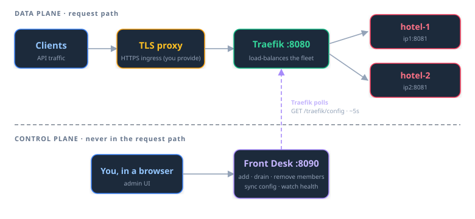

# 🏨 High Availability: Front Desk + Traefik

Run two or more independent Model Hotel installations behind a single client
endpoint, with no client-side change. This is the **Front Desk** HA stack: a
Traefik v3 **data plane** that carries traffic, and a small **Front Desk**
control-plane app where you manage membership in a browser.

Front Desk is **never in the request path**. If it stops, Traefik keeps serving
with the last config it fetched; only membership changes pause until it returns.

<p align="center"><a href="screenshots/frontdesk_members.png"></a></p>

## Table of Contents

1. [Architecture Overview](#architecture-overview)
2. [What You Deploy](#what-you-deploy)
3. [Prerequisites](#prerequisites)
4. [Quick Start](#quick-start)
5. [Drop-in Migration Runbook](#drop-in-migration-runbook)
6. [Three Secrets, Three Jobs](#three-secrets-three-jobs)
7. [Front Desk Settings](#front-desk-settings)
8. [Admin Authentication (Passkeys & TOTP)](#admin-authentication-passkeys--totp)
9. [Replicating Config Across the Fleet](#replicating-config-across-the-fleet)
10. [TLS Proxy](#tls-proxy)
11. [Observability](#observability)
12. [Alerting](#alerting)
13. [Paired Devices (Bellhop)](#paired-devices-bellhop)
14. [What This Does and Does Not Give You](#what-this-does-and-does-not-give-you)
15. [Acceptance Checks](#acceptance-checks)

---

## Architecture Overview

<p align="center"><a href="ha-architecture.svg"></a></p>

- **Traefik (data plane)** carries all client traffic and load-balances across
  members. It pulls its routing config from Front Desk over the internal compose
  network via Traefik's HTTP provider, polling `GET /traefik/config` every ~5s
  (optionally locked to a shared `FRONTDESK_TRAEFIK_TOKEN` bearer; see
  [TLS Proxy](#tls-proxy)). Setting that token is worth more than the member
  URLs it hides: serving the config also stamps the poll that the
  Traefik-stalled watchdog measures silence against, so while the endpoint is
  open, any caller that reaches it resets that watchdog and a Traefik that has
  actually died is never reported. Front Desk logs a warning at startup when the
  token is unset.
- **Front Desk (control plane)** is a small Go binary with an embedded SQLite
  database and its own web UI. You add, drain, and remove members here, replicate
  config across the fleet, and watch health. It is **never** in the request path.
  Adding a member requires its admin token **and a verified reply**: an
  unreachable host, a wrong token, or a host that is already in the fleet (matched
  by a stable per-instance id, so the same instance can't be added twice under two
  URLs) is rejected outright rather than saved with a warning. The current primary
  can never be removed.
- **Members** are normal, independent Model Hotel installs (app + their own
  Postgres), each on its own host and update schedule. The HA stack does not
  touch them beyond reading health/version and pushing config when you sync.

Because Traefik caches the last config it fetched, a Front Desk outage degrades
gracefully: traffic keeps flowing, and only membership changes wait.

---

## What You Deploy

Everything lives in
[`deploy/ha/`](https://github.com/hugalafutro/model-hotel/tree/master/deploy/ha):

- `docker-compose.yml` - Traefik + Front Desk, two containers.
- `.env.example` - copy to `.env` and fill in the secrets.

---

## Prerequisites

- **A TLS-terminating reverse proxy in front of the stack.** Ingress is
  HTTPS-only. This stack speaks plain HTTP internally; an external proxy (nginx,
  Caddy, nginx-proxy-manager, etc.) terminates TLS for both published ports.
  There is no plain-HTTP ingress path. Passkeys require HTTPS and work the moment
  TLS is in front.
- **The same `MASTER_KEY` on every member** (see
  [Three Secrets](#three-secrets-three-jobs)).
- **`TRUSTED_PROXIES` on every member**, including the HA host and the edge
  proxy, so per-IP rate limiting and logs see real client IPs.

---

## Quick Start

```bash
cd deploy/ha
cp .env.example .env
# Edit .env: set FRONTDESK_PUBLIC_ORIGIN, FRONTDESK_MASTER_KEY, etc.
docker compose up -d        # or, from the repo root: make ha-up
docker compose logs -f      # capture the generated FRONTDESK_TOKEN if you left it blank
```

> Build stamping: the Front Desk footer shows the version and commit stamped in
> at build time. `make ha-up` (from the repo root) passes both into the build; a
> bare `docker compose up -d` built from source does not, so its footer reads
> `dev`. The prebuilt image (uncomment `image:` in the compose file) carries its
> own release stamp.

Traefik answers client traffic on `:8080`; Front Desk's UI is on `:8090`. Point
your external TLS proxy at both (see [TLS Proxy](#tls-proxy)).

---

## Drop-in Migration Runbook

You have one instance at `ip1:8080`. Move it aside and let the HA stack take over
`:8080` so clients never change their base URL.

1. On the existing host: change the published port `8080` to `8081`, then
   `docker compose up -d`.
2. Copy `deploy/ha/` to the HA host, fill in `.env`, `docker compose up -d`.
   Traefik now answers on `:8080`; clients work again.
3. In Front Desk: add `http://ip1:8081` as "hotel-1" (supplying its admin token),
   confirm the health badge is green. Front Desk highlights the **first member as
   the default config-sync primary** (the instance the rest of the fleet copies).
4. On machine 2: deploy Model Hotel on `:8081` with the **same `MASTER_KEY`** and
   `TRUSTED_PROXIES` including the HA host. Each member keeps its own dashboard
   `ADMIN_TOKEN`; supply it to Front Desk when adding the member. To sign in to
   every dashboard with one password, set the same `ADMIN_TOKEN` on each member
   (a shared env secret, like `MASTER_KEY`).
5. In Front Desk: add `http://ip2:8081` as "hotel-2" (supplying its admin token),
   then converge its config from the primary via **Settings -> Fleet sync wizard**.
6. **Repeat steps 4-5 for each additional member.** Same secrets, add it with its
   admin token, run the config sync.
7. Maintenance: drain a member in Front Desk, rebuild it, re-activate. Re-run the
   config sync after any provider/key/settings change on the primary.

<p align="center"><a href="screenshots/frontdesk_addmember.png"></a></p>

---

## Three Secrets, Three Jobs

Do not conflate these:

1. **`FRONTDESK_TOKEN`** logs you into the **Front Desk UI**. Its own secret,
   unrelated to any member. Leave it blank in `.env` to auto-generate one printed
   once to the logs on first boot.
2. **A member's `ADMIN_TOKEN`** logs you into **that member's dashboard**, reached
   directly by that member's own URL (the LB serves `/v1` only, not dashboards).
   It is per-member; set the same value on every member if you want one password
   to log into them all. Front Desk stores each member's token (you supply it when
   adding the member) so it can authenticate to it; it never changes them for you.
3. **`MASTER_KEY`** is not a login. It is the AES-256-GCM key that decrypts each
   member's provider API keys at rest.

Plus, internal to Front Desk: **`FRONTDESK_MASTER_KEY`** encrypts the member
admin tokens (and Front Desk's own TOTP secret) that Front Desk stores. It is
independent of any member's `MASTER_KEY`. Generate it the same way
(`openssl rand -base64 32`); Front Desk warns at boot when it is shorter than
32 bytes, like the main server does for `MASTER_KEY`.

### `MASTER_KEY` must match across members

Backup/restore is raw `pg_dump`/`pg_restore`, so provider keys travel as
ciphertext. A member with a different `MASTER_KEY` restores the rows but cannot
decrypt them, leaving every provider dead there. It is a live decryption secret:
set it out-of-band, the same way you would a shared DB password, never
auto-transmitted between instances.

### Member admin token: per-instance, set by hand

`internal/admin` persists the credential as `sha256:<hex>` in
`DATA_DIR/admin-token` (a file, not the DB, so `pg_dump` skips it) and validates
by hash-compare. The file is authoritative; the `ADMIN_TOKEN` env only seeds it
when missing. To use one password across the fleet, set the same `ADMIN_TOKEN` on
every member before its first boot (a shared env secret, exactly like
`MASTER_KEY`). API clients use virtual keys and never see it.

### Recovery

Because the `admin-token` file is authoritative, editing `.env` and rebuilding
does **not** change an existing member's token when `DATA_DIR` persists (the
normal case). To rotate a member's token, delete its `DATA_DIR/admin-token` file
(it regenerates on the next boot, printed once to the logs) or set a new
`ADMIN_TOKEN` on a fresh `DATA_DIR`, then update that member's stored token in
Front Desk. The data plane (`/v1` traffic) is unaffected; clients use virtual keys.

---

## Front Desk Settings

Most of what follows is configured on Front Desk's **Settings** tab: the polling
and data-plane intervals and the fleet sync wizard across the full width, then
three side-by-side card pairs (Alerts and Observability, Passkeys and
Authenticator app, Active sessions and Paired devices), with single sign-on at
the bottom. The pairs collapse to one column on a narrow window. The
Admin Authentication, Replicating Config, Alerting and Paired Devices sections
below zoom into individual cards; TLS Proxy and the closing sections are about
the stack around Front Desk, not this tab.

<p align="center"><a href="screenshots/frontdesk_settings.png"></a></p>

---

## Admin Authentication (Passkeys & TOTP)

Front Desk's own login supports a raw token (`FRONTDESK_TOKEN`), and optionally a
**passkey** (WebAuthn) and **authenticator-app TOTP**, managed under Front Desk's
**Settings**, in the **Passkeys** and **Authenticator app (TOTP)** cards. Passkeys
require the stack to be reached over HTTPS,
which the external TLS proxy provides.

A successful login (token, passkey, TOTP, or OIDC) mints an HttpOnly `fd_session`
cookie plus a readable `fd_csrf` cookie for the browser tab; the raw
`FRONTDESK_TOKEN` never persists client-side after that point. Header-bearer auth
is unchanged for every non-browser caller: Bellhop pairing and paired devices, raw
`FRONTDESK_TOKEN` M2M scripts, and `FRONTDESK_METRICS_TOKEN` scrapes of `/metrics`
all keep sending the token in a header, same as before.

The `Secure` attribute on those cookies is controlled by `COOKIE_SECURE`, default
`always`. That default works out of the box behind the TLS-terminating proxy this
stack requires (see [Prerequisites](#prerequisites)) and on localhost dev, since
both are secure contexts. Set `COOKIE_SECURE=auto` to derive `Secure` from the
request scheme (TLS or `X-Forwarded-Proto: https`) instead. Set
`COOKIE_SECURE=never` only if you deliberately reach Front Desk over plain
`http://<LAN-IP>` (for example, testing without the TLS proxy in front);
otherwise the browser silently drops the cookies and login loops back to the
login screen.

Two things are worth understanding about authentication in an HA deployment:

- **Passkeys and TOTP are per-instance and are never synced.** Config sync pushes
  providers, virtual keys, dashboard accounts, custom failover groups, per-model
  disables and the syncable settings subset (the full list is below); it does not
  read, write, or transfer WebAuthn credentials or TOTP secrets. Each member keeps
  its own in its own Postgres, and Front Desk keeps its own in its own SQLite. This is by design: a passkey is bound to an origin (its relying-party
  ID is the hostname), so a credential created for one origin would not validate
  against another anyway. Register a passkey on each surface you actually log in
  to.
- **The passkey button only appears once a passkey exists.** A freshly
  provisioned instance shows token (and TOTP, if enabled) login but not a passkey
  button, because no credential is registered yet. Register one under Settings →
  Passkeys and the button appears on the next login.

<p align="center"><a href="screenshots/frontdesk_settings_security.png"></a></p>

### Single Sign-On (OIDC)

Front Desk's admin login also accepts **OpenID Connect single sign-on** as a fourth path alongside the token, passkey, and TOTP, useful when you already operate an OIDC provider (Authentik, Authelia, Keycloak, Pocket ID, Okta, Google, …) for the rest of your infra. Configure it under **Settings → Single sign-on (OIDC)**: paste the issuer URL, client ID, and client secret from an app you register with your provider, point the provider's redirect URI at `<Front Desk public origin>/api/auth/oidc/callback`, and list the verified emails allowed to sign in. A **Sign in with SSO** button then appears on the Front Desk login screen.

This is Front Desk's *own* login, independent of each member's admin login and of the main gateway's SSO, and it lives in Front Desk's SQLite, the client secret encrypted at rest with `FRONTDESK_MASTER_KEY`. Local login (token / passkey / TOTP) never goes away, so a misconfigured or unreachable provider cannot lock you out.

Front Desk runs the *same* OIDC implementation as the main dashboard, so everything in [Security → Single Sign-On](Security#single-sign-on-openid-connect) applies here unchanged: PKCE, a single-use state nonce, an allowlist that fails closed, the guarded outbound client, and the retry that absorbs a momentary DNS or dial failure to the provider rather than sending you back to the login screen to repeat the whole round trip.

<p align="center"><a href="screenshots/frontdesk_settings_oidc.png"></a></p>


## Replicating Config Across the Fleet

A fresh member starts empty: no providers, no virtual keys. Instead of
re-entering everything on each instance, replicate one member's configuration to
the rest from **Front Desk → Settings → Fleet sync wizard**.

You pick a **primary** (the config source of truth); Front Desk pulls its config
and pushes it to every other member so the fleet converges. Because replacing
config can remove providers or keys on a replica, the wizard shows a per-member
diff (added / overwritten / removed) and double-confirms before it writes.

The primary is the fleet's single source of truth, so Front Desk protects it: the
**primary can never be deleted** (its row has no remove button and no token can
bypass the guard), and it is changed only by re-running this wizard behind the
admin token. Re-selecting the same host is caught even when it is added under a
second URL (public DNS vs a LAN address): Front Desk asks each candidate for its
own HA self-report and refuses a host that already is the primary.

**What replicates, and what does not:**

| Replicated (config) | Stays per-instance |
|---|---|
| Providers (including their encrypted keys) | Request logs, metering, events |
| Virtual keys (matched by hash) | Backups, runtime stats |
| Dashboard user accounts | Passkeys / TOTP (auth is per-instance) |
| Custom failover groups | Auto-formed failover groups |
| Models you switched off by hand | Discovered models themselves |
| Syncable settings (discovery, timeouts, circuit breaker, hedging, backups, retention) | Alerting destination (apprise URL/targets) |
| SSO email allowlists (who may log in, fleet-wide) | SSO provider config (enable flags, issuer, client credentials, callback base URL - each member chooses which IdPs it offers) |
| Password policy (breached-password check) | Tab timeout (per-instance operator preference) |

Model rows and auto-formed failover groups are **not** copied: each member
rediscovers models from the synced providers and re-forms those groups on its own.
What does travel is your intent about them. A custom failover group is carried as
stable (provider, model) references and rebuilt against each member's own model
IDs, and a model you disabled by hand is disabled fleet-wide.

The other two ways a model can be switched off deliberately do **not** travel: one
that discovery stopped seeing in a provider's listing, and one the proxy retired
after the provider refused it three times running. Both are evidence about what
that member's provider served that member, so replicating them would turn one
member's provider trouble into a fleet-wide outage. Switching a model off on the
primary leaves that evidence intact on each member.

**Switching one back on does not.** Re-enabling a model on the primary is you
telling the fleet to trust the provider's listing again, so it clears those local
marks everywhere, exactly as re-enabling by hand on that member would. If one
member's provider is genuinely refusing the model, it will route there again and
fail until the proxy retires it afresh. That is the one place a fleet-wide action
overrides a member's own findings, so re-enable deliberately.

A member that does not hold a model you disabled elsewhere cannot apply the
disable, so it records the intent instead and reports which models it is missing.
It still counts as in sync, because nothing is mis-served: a member cannot route
to a model it does not have. If that model later appears there, the next sync
switches it off for real; if you re-enable it on the primary first, the member
forgets it. Either way the fleet converges on its own and needs nothing from you.

Provider keys travel as stored ciphertext and decrypt on each member because the
fleet shares `MASTER_KEY`. A member whose `MASTER_KEY` differs is flagged
**blocked** and nothing is written to it. A virtual key's per-key provider
restriction is carried by provider **name** and re-resolved to each member's own
provider IDs.

**Runbook:**

1. Configure providers and virtual keys on the primary as usual.
2. Front Desk → Settings → **Fleet sync wizard** → choose the primary. The preview
   shows, per member, what will be added, updated, or removed, and flags blocked
   members. Anything the primary lacks is **removed** from a replica that has it,
   so review before confirming.
3. Confirm. Front Desk imports the config into each member the preview lists a
   change for. It takes no snapshot first, so keep member backups enabled if you
   want a rollback point. Each member is independent, and re-running retries any
   left behind. Request logs and metering are never touched.

<p align="center"><a href="screenshots/frontdesk_settings_configsync.png"></a></p>

### Automatic config sync (set and forget)

The runbook above is the manual path. For an unattended fleet, the **Fleet sync
wizard** lets you designate a primary and, once the fleet has converged, switch
**Auto-sync** on; from then on you only manage the primary. Flipping it on converges
the fleet to the primary right away, then Front Desk keeps it there by itself,
propagating any change to the replicated config across the
fleet. The Members table's **Last Config Sync** column shows when each member last
converged and why.

What makes this safe to leave running:

- **Convergence is measured, not assumed.** Every 15 seconds Front Desk reads each
  member's own config hash and compares it with the primary's, so a member is only
  counted in sync when it demonstrably serves the same config. A member that does
  not is pushed to again, at most once every 10 minutes so a member that cannot
  converge never re-imports on every tick; one that still does not match after a
  push is badged amber and raises `config.sync_incomplete`.
- **No pre-sync snapshot.** Front Desk does not ask a member to back itself up
  before overwriting it. Members back themselves up on their own schedule when you
  have enabled backups, so keep those on if you want a rollback point.
- **Converges, does not thrash.** A change is propagated only after it settles,
  members already matching the primary are skipped without so much as a diff, and
  an unreachable or `MASTER_KEY`-blocked member is retried later rather than
  overwritten.
- **Newer config always wins.** Each push carries a monotonic source generation,
  and a member refuses any import older than the one it has already applied, so
  repointing the primary while an earlier push is still in flight can never strand a
  member on the older config. The fence engages when both ends run this build; an
  older member applies in arrival order as before.

It reconciles continuously, in both directions. A direct edit on a replica
(managed members are read-only, so you shouldn't) is measured on the next pass and
the full config is pushed back over it, usually within a tick or two, rather than
sitting invisible until the primary happens to change. A member that already
matches costs one hash read per tick and nothing else: no diff, no import, no
member-side model discovery.

Automatic sync is **off by default**: it trades the per-change diff review for
convenience. Leave it off to approve every fleet-wide change by hand, or turn it
on once you trust the primary as the source of truth.

### Resetting circuit breakers fleet-wide

Each member keeps its own circuit breaker: it is local runtime health, computed from that member's own upstream traffic, and nothing syncs it. When an upstream incident trips the same group's circuits on every member, clearing them meant one reset per member. The Members page's **Reset circuit breakers** button does the round for you: it lists the primary's failover groups (`GET /api/fleet/failover-groups?primary_id=...`), you pick one, and Front Desk asks every member with a stored token to clear the circuits behind that group's entries (`POST /api/fleet/circuit-breaker/reset` with `{"group_id": "..."}`, relayed to each member's `POST /api/failover-groups/{id}/circuit-breaker/reset`). The response names each member with what it cleared and recovered, and a member that could not be reached is reported rather than hidden; a `fleet.circuit_breaker_reset` event records the action. Sending an empty `group_id` clears every circuit on every member; like the member-side reset-all that is deliberately API only, with no button. The button asks for confirmation: it is a mutation across the fleet.

### Upgrade the whole fleet before expecting config sync to run

Config sync carries a schema version in every envelope, and a member applies an
envelope only when that version is exactly the one it understands. Anything else
is refused outright rather than half-applied, because a member that guessed at an
envelope it does not understand could silently widen a restricted virtual key.

The refusal is **symmetric**. It is not "old members are rejected": a new primary
pushing to an old member and an old primary pushing to a new member both fail, so
config sync stops fleet-wide the moment two builds disagree. What you see is:

- In the **Fleet sync wizard**, affected members are flagged with
  `this member's app version is too old to sync with the primary` (the wording
  names the member regardless of which side is actually behind).
- With **automatic sync** on, those members stop converging and report
  `version mismatch with the primary`. Their **Last Config Sync** column stops
  advancing.
- Nothing is written to a refusing member, so no member is left half-converged.
  Health, traffic, metrics, alerting and Bellhop pairing are unaffected: only
  config replication pauses.

The fix is to **upgrade every Model Hotel instance to the same build**, primary
and members alike, then re-run config sync (or wait for automatic sync's next
pass, which picks the fleet back up on its own). Upgrading the primary first is
the case that looks alarming, since the whole members list goes red at once, but
nothing is broken and no config was lost. Front Desk itself relays the primary's
envelope untouched, so its version is not what matters here.

Schema versions move rarely, and only when the meaning of the config on the wire
changes rather than when a field is added. The most recent bump is an example:
a virtual key restricted to providers that no longer exist on the primary now
travels as an empty provider list instead of an absent one, and an older member
reads a present-but-empty list as "no restriction", because the guard that would
have skipped the key only fires once the list has at least one entry. Refusing
the envelope is what stops that key from landing on the older member wide open,
and no fix on the sending side can reach a member that is already running the
older code.

---

## TLS Proxy

Put a real TLS proxy in front of both published ports. Example nginx, two
hostnames:

```nginx
# Client traffic: the /v1 proxy API only (the LB 404s everything else).
server {
    listen 443 ssl;
    server_name hotel.example.com;
    # ssl_certificate / ssl_certificate_key ...
    location / {
        proxy_pass http://HA_HOST:8080;
        proxy_set_header Host $host;
        proxy_set_header X-Forwarded-For $proxy_add_x_forwarded_for;
        proxy_set_header X-Forwarded-Proto $scheme;
        proxy_http_version 1.1;          # keep streaming/SSE alive
        proxy_buffering off;
    }
}

# Front Desk admin UI: a separate hostname.
server {
    listen 443 ssl;
    server_name frontdesk.example.com;
    # ssl_certificate / ssl_certificate_key ...

    # Defense in depth: keep /traefik/config off the public hostname (Traefik
    # fetches it over the compose network; it carries no secrets, only member
    # URLs and settings). Setting FRONTDESK_TRAEFIK_TOKEN in .env additionally
    # locks the endpoint to Traefik's own polls, so this block stops being the
    # only line of defense — keep it anyway.
    location = /traefik/config { return 404; }
    location /traefik/ { return 404; }

    # `/healthz` stays reachable through the catch-all below, on purpose: it is
    # the container liveness probe and discloses nothing. It is bounded at 2
    # requests per second per resolved client address, as is `/traefik/config`
    # while FRONTDESK_TRAEFIK_TOKEN is unset.
    #
    # Those budgets are a fallback, not the control. FRONTDESK_TRAEFIK_TOKEN is
    # the control: with it set, an unauthenticated poll is refused before any
    # work happens and the limiter is not mounted at all. Set it.
    #
    # If you set FRONTDESK_TRUSTED_PROXIES, set it to the address Front Desk
    # actually sees as the TCP peer, which with a published port and Docker's
    # userland proxy is the bridge gateway rather than this nginx. Be aware of
    # what that buys and costs: trusting the bridge means anything reaching the
    # published port chooses its own X-Forwarded-For, and therefore its own rate
    # -limit bucket. It can then key a flood into the bucket Traefik polls on,
    # or the one the container healthcheck uses. Leaving it unset is safe but
    # coarse: every client behind this proxy shares one budget, so one noisy
    # prober can exhaust it for the rest. Either way, gate the endpoint with the
    # token and do not publish the port beyond where it is needed.

    location / {
        proxy_pass http://HA_HOST:8090;
        proxy_set_header Host $host;
        proxy_set_header X-Forwarded-For $proxy_add_x_forwarded_for;
        proxy_set_header X-Forwarded-Proto $scheme;
        proxy_http_version 1.1;
        proxy_buffering off;
    }
}
```

If the member URLs you register in Front Desk also sit behind reverse proxies
(each member's own dashboard hostname), give those proxies a read timeout of at
least 240s (`proxy_read_timeout 240s;` in nginx, which defaults to 60s). A
config sync push runs model discovery on the member and can legitimately take
minutes on a slow box; Front Desk itself waits up to 240s, and a proxy that
gives up earlier answers 502/504 while the member is still applying. Front Desk
recovers on its own (the next verification pass detects the member converged and
stamps the sync), but every long import gets reported as a failed push first.

Set `FRONTDESK_PUBLIC_ORIGIN=https://frontdesk.example.com` and
`FRONTDESK_TRUSTED_PROXIES` to the proxy's address in `.env`.

`LB_TRUSTED_PROXIES` is the data-plane counterpart: set it to the same proxy
CIDRs so Traefik passes the proxy's `X-Forwarded-For` chain through to the
members instead of replacing it with the proxy's own address. Without it,
every request routed through the load balancer reaches the members attributed
to a proxy IP, in their request logs and app logs alike. Two settings must
line up for members to show the real client: this variable on the HA stack,
and each member's own `TRUSTED_PROXIES` listing every proxy hop in front of
it, which behind this stack means its usual ingress proxy plus the host
running Traefik.

---

## Observability

The Traefik access log is off by default to avoid logging request lines. Front
Desk's **Events** tab records control-plane facts only: membership changes,
health transitions tagged by source, config lifecycle, and a warning when
**Traefik has not polled for too long** (the one silent failure mode of the
HTTP-provider design). No request or prompt content is ever logged.

The **Traffic** tab charts each member's recent request and error volume as a
live time series, proxied from the member's own stats endpoint: green for
requests, red for errors.

<p align="center"><a href="screenshots/frontdesk_traffic.png"></a></p>

Front Desk also serves **Prometheus metrics** at `/metrics` on the admin port,
covering the control-plane domain (Front Desk is never in the request path, so
there are no request or token metrics here): member counts by state
(`frontdesk_members_total`), per-member health and probe latency
(`frontdesk_member_up`, `frontdesk_member_health_latency_seconds`), the last
applied config sync per member
(`frontdesk_last_config_sync_timestamp_seconds`), poll-loop timing
(`frontdesk_poll_duration_seconds`), and config-sync plus alert-dispatch
outcome counters (`frontdesk_config_sync_total`,
`frontdesk_alerts_dispatched_total`), alongside the standard Go process
metrics. Member names appear as labels; member secrets never do.

The endpoint is never unauthenticated: set `FRONTDESK_METRICS_TOKEN` in `.env`
to give Prometheus its own bearer (so the scrape config does not hold the admin
token), or leave it unset and scrape with the admin login. Example scrape
config:

```yaml
scrape_configs:
    - job_name: frontdesk
      metrics_path: /metrics
      scheme: https
      authorization:
          credentials: <FRONTDESK_METRICS_TOKEN>
      static_configs:
          - targets: ["frontdesk.example.com"]
```

The Settings page's Observability panel shows whether a dedicated scrape token
is configured, next to the JSON-logs and OTLP log-export status.

---

## Alerting

Front Desk can push a notification when something happens in the fleet, so you do
not have to watch the Events tab. It mirrors the main gateway's alerting: Front
Desk POSTs a one-line event summary to a stateless
[apprise-api](https://github.com/caronc/apprise-api) container you run, which fans
it out to Telegram, Discord, email, ntfy, and dozens more. Only routing metadata
is sent, never request or prompt content.

Run an `apprise` service reachable from Front Desk (a commented-out example ships
in `deploy/ha/docker-compose.yml`), then in Front Desk **Settings → Alerts** press
**Set up alerts**. The wizard walks seven gated steps: the Apprise API URL with a
live **Check**, the kind of destination (phone via the ntfy app, Bellhop,
Telegram, Discord, email, or a raw Apprise URL), its details as plain fields, a
test to that destination alone, the destination list, the events, and **Finish**.
Nothing is written until **Finish**, so cancelling changes nothing. The event
picker starts on the high-signal HA events (a member going down or recovering, a
config sync failing, a member's version read failing repeatedly); membership and
routing events are available but off by default.

Saved destinations then sit on the card as a plaintext, admin-only
**Destinations** list with per-row **Copy**, **Test** and **Remove**, and
the card's guided button becomes **Add destination**, which appends another through the same wizard from step 2. The card carries only one of the two buttons at a time. The individual
fields stay under **Manual configuration (advanced)** for anything the wizard
does not cover. Targets are encrypted at rest with `FRONTDESK_MASTER_KEY`. This
is the same `apprise-api` image the main gateway uses, and the main dashboard
runs the same wizard over its own card (without the Bellhop tile: Bellhop
notifies from Front Desk's fleet poll, so the gateway's events never reach it).
Each surface needs a container it can reach on its own network.

<p align="center"><a href="screenshots/frontdesk_settings_alerts.png"></a></p>

### Phone push via ntfy

For real-time alerts on a phone with no Google/Firebase dependency, point an
Apprise target at an [ntfy](https://ntfy.sh) topic. Either self-host an `ntfy`
container next to the stack, or use ntfy.sh with a hard-to-guess secret topic
(the topic name is the only access control on the public server, so treat it
like a password).

The wizard's **Phone (ntfy app)** tile does exactly this: enter the ntfy server,
press **Generate** for a random topic, and it composes the Apprise URL
(`ntfys://your-server/your-topic`, or `ntfy://` for plain-http servers) and prints
the subscribe steps for the phone. Then subscribe to the same server and topic in
the [ntfy app](https://ntfy.sh). The **Bellhop** tile covers the companion app,
which reuses this channel as its opt-in real-time push layer and generates its own
topic, so that one is a single paste. Every enabled fleet event then lands on the
phone the moment it fires.

---

## Paired Devices (Bellhop)

**Settings -> Paired devices** links the Bellhop Android companion app (or any
API client) to Front Desk without ever sharing the `FRONTDESK_TOKEN`:

1. Choose a role and click **Pair device**. **Monitor** tokens are read-only
   (members, health, traffic, events, alerts, SSE); **Operator** tokens add
   drain/activate, config sync, and the auto-sync toggle. Neither role can add
   or remove members, change settings, or manage pairing; those stay with the
   admin login.
2. Front Desk shows a QR code and the same payload as a copyable pairing
   string. Both carry a one-time code that expires after a few minutes, so a
   photographed QR is worthless shortly after.
3. The device exchanges the code at `POST /api/pair` for its own bearer token.
   The token is returned to the device once and stored only as a hash.

Each device appears in the list with its role and last-seen time, and can be
revoked there at any time (remote unlink of a lost phone); revocation takes
effect on the device's next request.

---

## What This Does and Does Not Give You

- **Bounded loss.** Unplanned death of a member loses only its in-flight
  requests; Traefik retries not-yet-streamed failures onto a healthy member.
- **Zero-loss planned maintenance.** Drain a member: established streams finish,
  new requests go elsewhere.
- **Not** Postgres HA, **not** LB redundancy: the HA host and each member's
  Postgres remain single points of failure for their own scope (accepted at
  homelab scale). Cross-instance config replication is built in (the fleet-sync
  wizard, or automatic config sync), but member databases themselves still rely
  on per-member backup/restore discipline.

---

## Acceptance Checks

1. Drop-in swap (runbook 1-3); client traffic uninterrupted after step 2.
2. Kill member 1 mid-stream: that stream breaks, retry lands on member 2, badge
   goes red within seconds.
3. Drain member 2 during a long stream: the stream completes, no new requests
   arrive; rebuild, re-activate, badge green; browser SSE reconnects.
4. A virtual key created on member 1 and backup-restored to member 2
   authenticates on both.
5. Token (and, where registered, passkey/TOTP) login works through the proxy.
6. Events carry correct source attribution; the "Traefik stopped polling"
   warning fires when Traefik is stopped while Front Desk runs.
