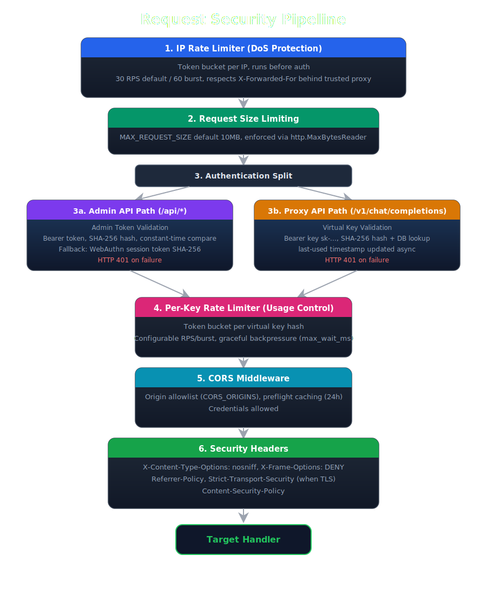

# 🛡️ Security

Model Hotel implements multiple layers of security to protect sensitive data and prevent unauthorized access. This document describes the security architecture, encryption mechanisms, authentication flows, and protective measures.

## Security Architecture Overview




---

## Encryption at Rest

### Provider API Keys (Argon2id + AES-256-GCM)

Provider API keys are encrypted using **AES-256-GCM**. The `MASTER_KEY` environment variable is **never used directly** as the encryption key. Instead, it is fed through **Argon2id** key derivation (with a per-provider random salt) to produce a 256-bit AES key. This means the `MASTER_KEY` can be any length - only the derived key is ever used in cryptographic operations.

Each provider gets a unique random 32-byte salt (generated via `crypto/rand`), stored alongside the ciphertext and nonce in the database (`key_salt` column). This ensures each provider has a unique derived key - compromising one does not compromise others.

### Key Derivation Parameters

| Parameter | Value |
|-----------|-------|
| Salt | Random 32-byte per-provider (stored in `key_salt` column) |
| Time cost | 1 |
| Memory cost | 8 MB |
| Threads | 4 |
| Output length | 32 bytes (256 bits) |

### Key Cache

Decrypted provider keys are held in an in-memory cache to avoid re-deriving the Argon2id key on every request:

- **TTL**: 10 minutes (configurable via `key_cache_ttl` setting) - cached entries expire and must be re-decrypted
- **Thread safety**: Protected by `sync.RWMutex` - multiple goroutines can read concurrently; writes are exclusive
- **Cache key**: Derived from the hex-encoded ciphertext + nonce + salt, so changing a provider's key invalidates the cache entry naturally
- **Eviction**: A background goroutine runs periodically, purging expired entries
- **Warm-up**: On startup, all enabled providers' keys are pre-loaded into the cache (`WarmKeyCache`)

This is a security trade-off: caching reduces Argon2id computation overhead on hot paths, but means decrypted keys exist in memory for up to 10 minutes. In practice, this is acceptable because:
1. The keys are short-lived in cache (10-minute TTL)
2. An attacker with memory access has already compromised the process
3. Argon2id is intentionally expensive - without caching, each request would pay the full derivation cost

---

## Hashing

### Virtual Keys

Virtual keys use the `sk-` prefix (e.g., `sk-a1b2c3d4e5f6a7b8`) and are stored as **SHA-256 hashes** only:

- The raw key is generated using `crypto/rand` (16 random bytes, hex-encoded with the `sk-` prefix)
- The raw key is shown **once** on creation, then discarded - it is never stored in plaintext
- Only the SHA-256 hash is persisted in the `virtual_keys` table
- Lookup compares SHA-256 of the provided Bearer token against the stored hash
- A key preview (`sk-...01`) is stored for display purposes in the UI

### Admin Token

The admin token is **SHA-256 hashed** before storage:

- Plaintext token is displayed once on first run (in the server logs)
- Hash stored in `<DATA_DIR>/admin-token` with `0600` permissions (owner read/write only)
- Regenerate by deleting the file and restarting
- **Constant-time comparison** via `crypto/subtle.ConstantTimeCompare` prevents timing attacks
- Legacy plaintext tokens are automatically migrated to hashed format on next validation - if the stored file is not 64 hex characters, it is assumed to be a legacy plaintext token, hashed, and the file is overwritten with the hash

The generated token is 32 hex characters (derived from a random UUID hashed with SHA-256, truncated).

### Hash Format

Stored admin token hashes use the `sha256:` prefix format:
```
sha256:<64-character-hex-hash>
```

Legacy formats (bare 64-char hex or plaintext) are automatically migrated on first access.

---

## Authentication

### Admin API Authentication

The admin API requires a Bearer token in the `Authorization` header:

```
Authorization: Bearer <admin-token>
```

**Validation flow:**
1. Extract token from `Authorization: Bearer` header
2. Compute SHA-256 hash of provided token
3. Compare against stored hash using `crypto/subtle.ConstantTimeCompare`
4. Return HTTP 401 with generic "Invalid admin token" message on failure

The constant-time comparison prevents timing attacks that could leak information about the valid token.

### WebAuthn/FIDO2 Passkey Authentication

When `WEBAUTHN_RP_ID` is set, users can log in with FIDO2/WebAuthn passkeys (Touch ID, Windows Hello, YubiKey, etc.) as an alternative to the admin token. Passkey login is disabled by default.

**Dual authentication middleware:** The `AuthMiddleware` in `internal/api/admin.go` checks both methods:
1. **Admin token** (fast, in-memory) - checked first using the SHA-256 hash
2. **WebAuthn session token** (DB-backed) - checked as fallback when `webauthnSessionMgr` is configured

The admin token always works. The WebAuthn path is nil-safe: when `WEBAUTHN_RP_ID` is not set, `webauthnSessionMgr` is nil and the fallback is skipped entirely.

**Session tokens:**
- Generated using `crypto/rand` (32 bytes, hex-encoded)
- SHA-256 hashed before database storage - the raw token is never persisted
- 30-day TTL (hardcoded in `internal/webauthn/session.go`)
- Constant-time comparison via `crypto/subtle.ConstantTimeCompare`
- Tokens are revoked on credential deletion or explicit logout

**WebAuthn routes:**

| Route | Method | Auth | Description |
|-------|--------|------|-------------|
| `/api/webauthn/available` | GET | None (public) | Check if WebAuthn is enabled |
| `/api/webauthn/login/start` | POST | IP rate-limited | Begin passkey login |
| `/api/webauthn/login/finish` | POST | IP rate-limited | Complete passkey login, receive session token |
| `/api/webauthn/register/start` | POST | Admin/session token | Begin credential registration |
| `/api/webauthn/register/finish` | POST | Admin/session token | Complete credential registration |
| `/api/webauthn/credentials` | GET | Admin/session token | List registered credentials |
| `/api/webauthn/credentials/{id}` | PATCH | Admin/session token | Rename a credential |
| `/api/webauthn/credentials/{id}` | DELETE | Admin/session token | Delete a credential |
| `/api/webauthn/logout` | POST | Admin/session token | Revoke the current session token |

Login endpoints are IP rate-limited to prevent brute-force probing of passkeys. Registration and credential management require admin or session token auth.

**SSE events:**

| Event Type | When |
|------------|------|
| `webauthn.credential_registered` | A new passkey is registered |
| `webauthn.credential_deleted` | A passkey is deleted |


*Login screen with WebAuthn passkey option visible when `WEBAUTHN_RP_ID` is configured.*


*Settings page - Passkey credential management, showing registered credentials with rename and delete options.*

### TOTP / Authenticator-App Two-Factor (2FA)

Time-based one-time passwords (RFC 6238) add a second factor to admin login, independent of passkeys. TOTP needs no environment variable: it is opt-in at runtime from the **Settings** page (scan the QR code with any authenticator app, enter the 6-digit code, and save the one-time recovery codes shown). The TOTP secret is encrypted at rest with AES-256-GCM under `MASTER_KEY`, the same as provider keys, and is never logged.


*Settings page - Authentication section: passkey registration and the registered-credential list, the authenticator-app (TOTP) enable control, and the single sign-on (OIDC) configuration, the admin-login methods managed together.*

**Enforcement (first-factor downgrade):** When TOTP is enabled, the raw admin token stops being a standalone bearer. It becomes a first factor that, combined with a valid 6-digit code, is exchanged on the login screen for a session token (the same DB-backed session infrastructure passkeys use). Only the session token then authorizes `/api/*` calls, which closes the static-token replay a bare bearer would otherwise allow. The same gate covers passkey management and backup restore.

**Single-use codes:** Each accepted 30-second step is recorded (`admin_totp.last_used_step`, migration 049), so a code cannot be replayed within the validation skew window (enforced by an atomic conditional UPDATE). Verification uses constant-time comparison.

**Recovery codes:** 10 single-use codes are shown once at enable time and stored only as SHA-256 hashes. A recovery code signs you in once so you can disable or re-enroll. Disable is gated on a current TOTP code or an unused recovery code, and the authorize-plus-delete runs in a single transaction so a recovery code is never spent without the disable completing.

**Lost authenticator and all recovery codes:** an operator can remove 2FA directly against the database with `make totp-disable` (or `DELETE FROM admin_totp_recovery; DELETE FROM admin_totp;` via psql against the stack's Postgres), then log in with the admin token alone and re-enroll. Like the in-app disable, the escape hatch clears both the config and the recovery-code hashes so no orphaned rows are left behind.

**TOTP routes:**

| Route | Method | Auth | Description |
|-------|--------|------|-------------|
| `/api/totp/status` | GET | None (public) | Report whether TOTP is enabled (login UI gating) |
| `/api/totp/login` | POST | IP rate-limited | Exchange admin token + 6-digit code (or a recovery code) for a session token |
| `/api/totp/enroll/start` | POST | Admin/session token | Begin enrollment; returns the otpauth URI + base32 secret |
| `/api/totp/enroll/verify` | POST | Admin/session token | Verify the first code, enable TOTP, return recovery codes + a session token |
| `/api/totp/disable` | POST | Admin/session token | Disable TOTP (gated on a current code or recovery code) |

The login endpoint is IP rate-limited to throttle brute-force probing of codes. Enroll and disable require admin or session token auth; once TOTP is enabled the raw admin token alone no longer satisfies that gate, so the second factor cannot be bypassed.

### Single Sign-On (OpenID Connect)

Admins can sign in through an external OpenID Connect provider (Authentik, Authelia, Keycloak, Pocket-ID, Okta, Google, Entra, and so on) as a third login path alongside the admin token, passkeys, and TOTP. SSO is configured at runtime from the **Settings** page (issuer URL, client ID, client secret, and the allowlist of verified emails, all visible in the Authentication screenshot above) and needs no environment variable. A "Sign in with SSO" button then appears on the login screen. Any standards-compliant OpenID Connect provider works (the names above are just examples): the flow relies only on standard discovery, PKCE, and ID-token verification, so the single requirement is that the provider releases the signing-in user's verified email (in the ID token, or from its UserInfo endpoint), because the allowlist is email-based and fails closed.

**Additive, never a replacement.** A successful SSO login mints the same DB-backed session token that passkey and TOTP logins produce, so nothing downstream changes. Local login is never removed: a misconfigured or unreachable provider cannot lock you out, because the admin token, passkeys, and TOTP all keep working.

**Identity and allowlist.** Logins are gated by an email allowlist that fails closed (an empty allowlist denies everyone) and matches only on the provider's `email_verified` claim. A user is anchored on the stable `(issuer, subject)` pair, which is logged on each successful login (app log, source `oidc`, with a masked email), so an allowlisted address cannot be hijacked through a second provider or a reused email. When the ID token omits the email (as Authelia does), the handler falls back to the OIDC UserInfo endpoint.

**Flow hardening.** The exchange uses PKCE plus a single-use `state` nonce, both bound to a short-lived login-state record (10-minute TTL) carried across the IdP round trip in a cookie. The client secret is AES-256-GCM encrypted at rest under `MASTER_KEY`, like provider keys. The minted session token is handed to the browser in the URL **fragment**, so it is never sent back to the server on later requests (no Referer leak, nothing in request logs). The one place it appears is the callback's `302 Location` header: if your reverse proxy logs response headers, redact `Location` on `/api/auth/oidc/callback`.

Because Model Hotel is self-hosted there is no turnkey "Google login": each operator registers their own OIDC app with the provider and points it at the redirect URI `<oidc_public_base_url>/api/auth/oidc/callback` (shown in Settings). OIDC SSO covers both the main admin dashboard and Front Desk: Front Desk reuses the same session seam and is configured independently from its own Settings page (its own issuer, client, allowlist, and public base URL, since it runs as a separate service on its own address), so the operator registers a redirect URI under Front Desk's own base URL. GitHub login is offered on the main dashboard only, by design.

| Route | Method | Auth | Description |
|-------|--------|------|-------------|
| `/api/auth/oidc/status` | GET | None (public) | Report whether SSO is enabled and the provider display name (login UI gating) |
| `/api/auth/oidc/start` | GET | None (public) | Begin login: build PKCE + state, redirect to the provider |
| `/api/auth/oidc/callback` | GET | None (public) | Provider redirect target: verify state/PKCE/ID token, enforce the allowlist, mint a session token |

Configuration lives entirely in the settings store (no migration): `oidc_enabled`, `oidc_issuer_url`, `oidc_client_id`, `oidc_client_secret` (encrypted), `oidc_public_base_url`, and `oidc_allowed_emails`.

### Proxy API Authentication (Virtual Keys)

The proxy API requires a virtual key in the `Authorization` header:

```
Authorization: Bearer <virtual-key>
```

**Validation flow:**
1. Extract key from `Authorization: Bearer` header
2. Compute SHA-256 hash of provided key
3. Look up hash in `virtual_keys` database table
4. On success: store key hash in request context for downstream middleware
5. On success: update `last_used_at` timestamp asynchronously (fire-and-forget with 5-second timeout)
6. Return HTTP 401 with generic "Invalid virtual key" message on failure

The generic error message prevents enumeration attacks (attackers cannot determine if a key format is valid vs. completely invalid).

---

## Rate Limiting

Model Hotel uses a two-layer rate limiting system:

### Layer 1: Per-IP Rate Limiting (DoS Protection)

Applied **before authentication**, before the per-key limiter:

- Independent buckets per client IP address
- Configurable via DB settings:
  - `rate_limit_ip_rps` (default: 30)
  - `rate_limit_ip_burst` (default: 60)
  - `rate_limit_ip_enabled` (default: true)
- Always active when `RATE_LIMIT_ENABLED=true` (cannot be bypassed by users)
- Mounted before auth middleware to catch unauthenticated floods (brute-force key guessing, etc.)
- Respects `X-Forwarded-For` and `X-Real-IP` headers only when request originates from trusted proxy (configured via `TRUSTED_PROXIES` CIDR list)

### Layer 2: Per-Virtual-Key Rate Limiting (Usage Control)

Applied after authentication:

- Independent buckets per key (no cross-key interference)
- Configurable via DB settings:
  - `rate_limit_rps` (default: 10)
  - `rate_limit_burst` (default: 20)
- Per-key overrides supported (set when creating virtual key)
- Unlimited mode: set `rate_limit_rps=0` to disable limiting for specific keys
- Optional per-key **token rate limit** (`rate_limit_tpm`): caps tokens/minute
  (prompt + completion + reasoning); over-budget keys get `429` until the
  minute budget refills. Null falls back to the global `rate_limit_tpm` setting
  (`0` = no cap).

### Shared Configuration

Both layers share:
- `rate_limit_max_wait_ms` (default: 200ms) - maximum time a request waits in the rate-limiter queue before being rejected with HTTP 429
- Returns standard `Retry-After` and `X-RateLimit-*` headers on 429 responses
- **Environment variable kill-switch** (`RATE_LIMIT_ENABLED=false`) completely removes the rate-limiting middleware - it is not merely "disabled", it becomes a no-op
- Runtime toggle via `rate_limit_enabled` / `rate_limit_ip_enabled` settings (only effective when the env var is `true`)
- When rate limiting is re-enabled after being disabled, all existing buckets are reset
- Unused buckets are cleaned up after 10 minutes of inactivity

### Graceful Backpressure

When a request exceeds the instantaneous rate limit but is within `max_wait_ms`:
1. Request is queued (not rejected)
2. Waits for token availability (up to `max_wait_ms`)
3. Proceeds if token becomes available within timeout
4. Returns HTTP 429 if timeout exceeded

This provides smoother handling of bursty traffic while still enforcing limits.

---

## Request Size Limiting

All requests are subject to `MAX_REQUEST_SIZE` (default: 50 MB, sized for multipart audio uploads to the `/v1/audio/*` endpoints). The middleware uses `http.MaxBytesReader` which enforces the limit at the stream level - the entire request body is never buffered beyond this limit.

Exceeded limits return HTTP 413 (Payload Too Large).

---

## CORS (Cross-Origin Resource Sharing)

Cross-Origin Resource Sharing is controlled by the `CORS_ORIGINS` environment variable (default: `http://localhost:5173,http://localhost:8081`). Only origins in this list are allowed to make browser requests.

The middleware:
- Checks the `Origin` header against the allowlist
- Sets `Access-Control-Allow-Origin` only for matching origins
- Sets `Access-Control-Allow-Methods: GET, POST, PUT, DELETE, OPTIONS`
- Sets `Access-Control-Allow-Headers: Content-Type, Authorization`
- Sets `Access-Control-Allow-Credentials: true`
- Sets `Access-Control-Max-Age: 86400` (24-hour preflight cache)
- Handles `OPTIONS` preflight requests with `204 No Content`

---

## Security Headers

All HTTP responses include standard security headers (set globally via middleware):

| Header | Value | Purpose |
|--------|-------|---------|
| `X-Content-Type-Options` | `nosniff` | Prevents MIME type sniffing |
| `X-Frame-Options` | `DENY` | Prevents clickjacking via iframes |
| `Referrer-Policy` | `strict-origin-when-cross-origin` | Controls referrer information sent with requests |
| `Strict-Transport-Security` | `max-age=63072000; includeSubDomains; preload` | Enforces HTTPS connections (when TLS is active) |
| `Content-Security-Policy` | `default-src 'self'; script-src 'self'; style-src 'self' 'unsafe-inline'; img-src 'self' data: blob:; connect-src 'self'; frame-ancestors 'none'; base-uri 'self'; form-action 'self'` | Prevents injection of unauthorized scripts and resources |

---

## Provider URL Validation (SSRF Prevention)

The `ValidateProviderURL` function enforces multiple security checks to prevent SSRF (Server-Side Request Forgery):

1. **HTTPS by default** - HTTP is only allowed if `ALLOW_HTTP_PROVIDERS=true`
2. **Loopback block** - `localhost`, `127.0.0.1`, `::1` are rejected by default (prevents SSRF)
3. **IP resolution check** - All resolved IPs are checked for loopback addresses (blocks DNS rebinding)
4. **IPv6 loopback** - `::1` and IPv6-mapped loopback addresses are blocked
5. **Allowed hosts** - Optional allowlist via `ALLOWED_PROVIDER_HOSTS`:
   - Built-in provider hosts (`api.openai.com`, `api.nano-gpt.com`, `api.z.ai`, `api.deepseek.com`, `api.anthropic.com`, `ollama.com`, `opencode.ai`, `api.x.ai`, `generativelanguage.googleapis.com`, `api.cohere.com`, `api.cohere.ai`, `openrouter.ai`, `api.neuralwatt.com`, `neuralwatt.com`) are **always allowed** regardless of the allowlist
   - Hosts explicitly listed in `ALLOWED_PROVIDER_HOSTS` bypass the loopback restriction - this is intentional to allow `localhost` for local Ollama or testing scenarios
   - When `ALLOWED_PROVIDER_HOSTS` is empty (the default), any non-loopback HTTPS URL is accepted

---

## SafeDialer (Runtime SSRF Protection)

While `ValidateProviderURL` blocks dangerous URLs at configuration time, the **SafeDialer** in `internal/proxy/safe_dialer.go` provides runtime SSRF protection when the proxy makes outbound connections to providers.

### How It Works

1. **Resolve first, dial by IP**: The dialer first resolves the hostname to a list of IP addresses, then checks all IPs against blocked ranges (private, loopback, link-local, cloud-metadata). If all are blocked, the connection is refused.
2. **DNS rebinding protection**: By resolving first and dialing by IP (not hostname), the dialer closes the TOCTOU gap where DNS could resolve to a different address between check and dial.
3. **Redirect validation**: HTTP redirect targets are also validated - the redirect host's IPs are checked against the same blocked ranges.
4. **Known bypass via `KNOWN_PROXIES`**: IPs within CIDRs listed in `KNOWN_PROXIES` bypass the private-IP block, allowing connections to internal LLM servers (e.g. self-hosted Ollama on 10.0.0.5:11434).
5. **Host bypass via `ALLOWED_PROVIDER_HOSTS`**: Hostnames in `ALLOWED_PROVIDER_HOSTS` skip the SafeDialer IP checks entirely.

### Blocked IP Ranges

| Category | CIDR/Address | Reason |
|----------|-------------|--------|
| Unspecified | `0.0.0.0/8`, `::` | Unusable addresses |
| Loopback | `127.0.0.0/8`, `::1` | Localhost |
| Private | `10.0.0.0/8`, `172.16.0.0/12`, `192.168.0.0/16`, `fc00::/7` | Internal networks |
| Link-local | `169.254.0.0/16`, `fe80::/10` | Link-local |
| Cloud metadata | `169.254.169.254` | AWS/GCP/Azure metadata endpoint |

---

## Environment Variables (Security-Related)

| Variable | Default | Description |
|----------|---------|-------------|
| `MASTER_KEY` | (required) | Base secret for Argon2id key derivation. Should be 32+ random bytes. Never log or commit. |
| `ADMIN_TOKEN` | (auto-generated) | Admin API authentication token. Generated on first boot if not provided. |
| `RATE_LIMIT_ENABLED` | `true` | Master kill-switch for all rate limiting. `false` removes middleware entirely. |
| `RATE_LIMIT_IP_RPS` | `30` | Default requests per second for IP-based limiting. |
| `RATE_LIMIT_IP_BURST` | `60` | Default burst size for IP-based limiting. |
| `MAX_REQUEST_SIZE` | `52428800` | Maximum request body size (50MB; covers multipart audio uploads). |
| `CORS_ORIGINS` | `http://localhost:5173,http://localhost:8081` | Comma-separated list of allowed origins. |
| `ALLOW_HTTP_PROVIDERS` | `false` | Allow HTTP (non-HTTPS) provider URLs. Enable only for local development. |
| `ALLOWED_PROVIDER_HOSTS` | (empty) | Comma-separated allowlist of provider hostnames. Empty = all non-loopback HTTPS allowed. |
| `TRUSTED_PROXIES` | (empty) | CIDR list of trusted proxy IPs. Required for X-Forwarded-For header validation. Controls inbound trust only. |
| `KNOWN_PROXIES` | (empty) | CIDR list of internal LLM server networks. Bypasses SafeDialer private-IP blocking for outbound connections. |
| `WEBAUTHN_RP_ID` | (empty) | Relying Party ID for WebAuthn/FIDO2 passkey login. Empty = disabled. |
| `DATA_DIR` | `./data` | Directory for admin token storage. Must have restricted permissions. |

---

## Security Best Practices

### Deployment Checklist

- [ ] Set `MASTER_KEY` to a cryptographically random value (32+ bytes)
- [ ] Store `MASTER_KEY` in environment or secrets manager - never in version control
- [ ] Restrict `DATA_DIR` permissions to owner-only (0700)
- [ ] Set `ADMIN_TOKEN` explicitly in production (don't rely on auto-generation)
- [ ] Configure `CORS_ORIGINS` to match your frontend domain(s)
- [ ] Set `TRUSTED_PROXIES` if running behind a load balancer or reverse proxy
- [ ] Set `KNOWN_PROXIES` if using self-hosted LLM servers on private networks
- [ ] Set `WEBAUTHN_RP_ID` to enable passkey authentication (leave empty to disable)
- [ ] Consider enabling TOTP 2FA from Settings for an additional admin-login factor (no environment variable required)
- [ ] Keep `RATE_LIMIT_ENABLED=true` in production
- [ ] Monitor rate limit 429 responses for potential attacks
- [ ] Use HTTPS for all provider URLs in production
- [ ] Regularly rotate virtual keys and provider API keys
- [ ] Review access logs for unusual patterns

### Key Rotation

**Provider API Keys:**
1. Update the provider's encrypted key via admin API
2. Old key is immediately invalidated (cache entry expires naturally)
3. New key is encrypted with v2 scheme (per-provider salt)

**Virtual Keys:**
1. Delete the old virtual key via admin API
2. Create a new virtual key
3. Distribute new key to clients
4. Old key hash is removed from database - immediate invalidation

**Admin Token:**
1. Stop the server
2. Delete `<DATA_DIR>/admin-token`
3. Restart server - new token generated and logged
4. Update all clients with new token

### Monitoring Recommendations

- Alert on unusual 401/403 rates (potential brute-force)
- Alert on rate limit 429 spikes (potential DoS)
- Monitor provider key decryption failures (potential `MASTER_KEY` mismatch)
- Track virtual key usage patterns for anomaly detection
- Log admin API access (with key hashes, never plaintext tokens)

---

## Known Security Trade-offs

### Decrypted Key Caching

Provider API keys are cached in decrypted form for up to 10 minutes to avoid Argon2id computation overhead on every request. This is an intentional trade-off:

- **Risk**: Decrypted keys exist in process memory
- **Mitigation**: Short TTL (10 min), process isolation, memory protection
- **Acceptable because**: Attacker with memory access has already compromised the host

### Argon2id Parameters

Argon2id parameters (t=1, m=8MB, p=4) are below RFC 9106 minimums (t=3, m=64MB):

- **Rationale**: `MASTER_KEY` is a high-entropy random value (32+ bytes), not a user-chosen password
- **Threat model**: Argon2id's primary defense is against low-entropy brute-force, which does not apply here
- **Benefit**: Lower latency on every provider key decrypt (including per-request operations)

---

## Reporting Security Issues

If you discover a security vulnerability, please report it privately before public disclosure. Include:
- Description of the vulnerability
- Steps to reproduce
- Potential impact
- Suggested fix (if any)

---

*Last updated: 2026-06-10 (v0.9.49)*

---

## Related Documentation

- [[Virtual Keys]] - Virtual key creation, hashing, and management
- [[Privacy]] - Data handling, logging, and privacy guarantees
- [[Request Logging]] - Request log structure and retention
