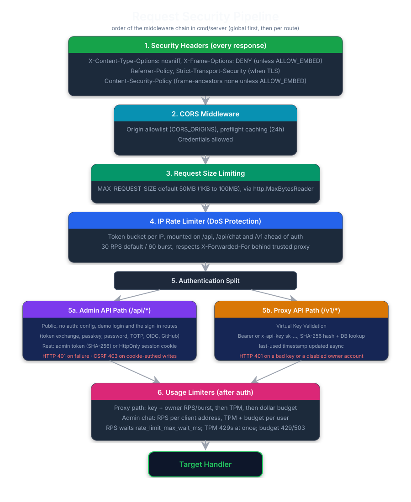

# 🛡️ Security

Model Hotel implements multiple layers of security to protect sensitive data and prevent unauthorized access. This document describes the security architecture, encryption mechanisms, authentication flows, and protective measures.

## Security Architecture Overview




---

## Encryption at Rest

### Provider API Keys (Argon2id + AES-256-GCM)

Provider API keys are encrypted using **AES-256-GCM**. The `MASTER_KEY` environment variable is **never used directly** as the encryption key. Instead, it is fed through **Argon2id** key derivation (with a per-provider random salt) to produce a 256-bit AES key. This means the `MASTER_KEY` can be any length - only the derived key is ever used in cryptographic operations.

Each provider gets a unique random 32-byte salt (generated via `crypto/rand`), stored alongside the ciphertext and nonce in the database (`key_salt` column). This ensures each provider has a unique derived key - compromising one does not compromise others.

### Key Derivation Parameters

| Parameter | Value |
|-----------|-------|
| Salt | Random 32-byte per-provider (stored in `key_salt` column) |
| Time cost | 1 |
| Memory cost | 8 MB |
| Threads | 4 |
| Output length | 32 bytes (256 bits) |

### Key Cache

Decrypted provider keys are held in an in-memory cache to avoid re-deriving the Argon2id key on every request:

- **TTL**: 10 minutes (configurable via `key_cache_ttl` setting) - cached entries expire and must be re-decrypted
- **Thread safety**: Protected by `sync.RWMutex` - multiple goroutines can read concurrently; writes are exclusive
- **Cache key**: Derived from the hex-encoded ciphertext + nonce + salt, so changing a provider's key invalidates the cache entry naturally
- **Eviction**: A background goroutine runs periodically, purging expired entries
- **Warm-up**: On startup, all enabled providers' keys are pre-loaded into the cache (`WarmKeyCache`)

This is a security trade-off: caching reduces Argon2id computation overhead on hot paths, but means decrypted keys exist in memory for up to 10 minutes. In practice, this is acceptable because:
1. The keys are short-lived in cache (10-minute TTL)
2. An attacker with memory access has already compromised the process
3. Argon2id is intentionally expensive - without caching, each request would pay the full derivation cost

---

## Hashing

### Virtual Keys

Virtual keys use the `sk-` prefix (e.g., `sk-a1b2c3d4e5f6a7b8`) and are stored as **SHA-256 hashes** only:

- The raw key is generated using `crypto/rand` (16 random bytes, hex-encoded with the `sk-` prefix)
- The raw key is shown **once** on creation, then discarded - it is never stored in plaintext
- Only the SHA-256 hash is persisted in the `virtual_keys` table
- Lookup compares SHA-256 of the provided Bearer token against the stored hash
- A key preview (`sk-...ef01`) is stored for display purposes in the UI

### Admin Token

The admin token is **SHA-256 hashed** before storage:

- Plaintext token is displayed once on first run (in the server logs)
- Hash stored in `<DATA_DIR>/admin-token` with `0600` permissions (owner read/write only)
- Regenerate by deleting the file and restarting
- **Constant-time comparison** via `crypto/subtle.ConstantTimeCompare` prevents timing attacks
- Legacy plaintext tokens are automatically migrated to hashed format on next validation - if the stored file is not 64 hex characters, it is assumed to be a legacy plaintext token, hashed, and the file is overwritten with the hash

The generated token is 32 hex characters (derived from a random UUID hashed with SHA-256, truncated).

### Hash Format

Stored admin token hashes use the `sha256:` prefix format:
```
sha256:<64-character-hex-hash>
```

Legacy formats (bare 64-char hex or plaintext) are automatically migrated on first access.

---

## Authentication

### Admin API Authentication

The admin API requires a Bearer token in the `Authorization` header:

```
Authorization: Bearer <admin-token>
```

**Validation flow:**
1. Extract token from `Authorization: Bearer` header
2. Compute SHA-256 hash of provided token
3. Compare against stored hash using `crypto/subtle.ConstantTimeCompare`
4. Return HTTP 401 with generic "Invalid admin token" message on failure

The constant-time comparison prevents timing attacks that could leak information about the valid token.

### WebAuthn/FIDO2 Passkey Authentication

When `WEBAUTHN_RP_ID` is set, users can log in with FIDO2/WebAuthn passkeys (Touch ID, Windows Hello, YubiKey, etc.) as an alternative to the admin token. Passkey login is disabled by default.

**Dual authentication middleware:** The `AuthMiddleware` in `internal/api/admin.go` checks both methods:
1. **Admin token** (fast, in-memory) - checked first using the SHA-256 hash
2. **WebAuthn session token** (DB-backed) - checked as fallback when `webauthnSessionMgr` is configured

The admin token always works. The WebAuthn path is nil-safe: when `WEBAUTHN_RP_ID` is not set, `webauthnSessionMgr` is nil and the fallback is skipped entirely.

**Session tokens:**
- Generated using `crypto/rand` (32 bytes, hex-encoded)
- SHA-256 hashed before database storage - the raw token is never persisted
- Sliding expiry: a session lives 3 days without use (`AuthTokenTTL` in `internal/webauthn/session.go`) and every use pushes that window forward, up to an absolute cap of 30 days from login (`AuthTokenMaxLifetime`); the extension rides the same 5-minute throttle as the last-seen stamp, and the cookie pair is re-issued with the new lifetime whenever the server extends. Both constants are shared by the server-side expiry and the cookie MaxAge. Nothing revokes an existing session when its owner logs in again, so the idle window bounds how long an unused stolen token stays usable and the cap bounds one in constant use; tests enforce a ceiling on both.
- Constant-time comparison via `crypto/subtle.ConstantTimeCompare`
- Tokens are revoked on credential deletion or explicit logout

**Signing other sessions out.** Because logging in does not end sessions already open elsewhere, **Settings → Authentication → Active sessions** has a "Sign out others" action (`POST /api/auth/sessions/revoke-others`). It revokes every session belonging to your identity except the one you clicked from, so you are not logged out by your own click, and it reports how many it ended.

Whose sessions end is decided by the identity the auth middleware resolved, never by a credential read back off the request. Those two can disagree, because credential resolution falls through to the bearer when the session cookie is invalid, and a handler that re-read the request could be pointed at a different identity than the one that authenticated. The presented tokens only decide which session is *spared*, and one that does not belong to your identity spares nothing.

A caller holding the raw admin token has no session of its own to keep, so every admin session is revoked, which is the shape you want when you still have the token but suspect a browser session was stolen. Note this path only exists with TOTP disabled: once TOTP is on, a bare admin-token bearer is rejected outright and you act from a session like everyone else.

This is deliberately an explicit action rather than automatic revocation on every login. The admin-token exchange and all three TOTP login paths mint sessions under one shared `"admin"` identity, so automatic revocation would evict your other devices during ordinary sign-ins and quickly train you to ignore it.

**WebAuthn routes:**

| Route | Method | Auth | Description |
|-------|--------|------|-------------|
| `/api/webauthn/available` | GET | None (public) | Check if WebAuthn is enabled |
| `/api/webauthn/login/start` | POST | IP rate-limited | Begin passkey login |
| `/api/webauthn/login/finish` | POST | IP rate-limited | Complete passkey login, receive session token |
| `/api/webauthn/register/start` | POST | Admin/session token | Begin credential registration |
| `/api/webauthn/register/finish` | POST | Admin/session token | Complete credential registration |
| `/api/webauthn/credentials` | GET | Admin/session token | List registered credentials |
| `/api/webauthn/credentials/{id}` | PATCH | Admin/session token | Rename a credential |
| `/api/webauthn/credentials/{id}` | DELETE | Admin/session token | Delete a credential |
| `/api/webauthn/logout` | POST | Admin/session token | Revoke the current session token |

Login endpoints are IP rate-limited to prevent brute-force probing of passkeys. Registration and credential management require admin or session token auth.

**SSE events:**

| Event Type | When |
|------------|------|
| `webauthn.credential_registered` | A new passkey is registered |
| `webauthn.credential_deleted` | A passkey is deleted |


*Login screen with WebAuthn passkey option visible when `WEBAUTHN_RP_ID` is configured.*


*Settings page - Passkey credential management, showing registered credentials with rename and delete options.*

### TOTP / Authenticator-App Two-Factor (2FA)

Time-based one-time passwords (RFC 6238) add a second factor to admin login, independent of passkeys. TOTP needs no environment variable: it is opt-in at runtime from the **Settings** page (scan the QR code with any authenticator app, enter the 6-digit code, and save the one-time recovery codes shown). The TOTP secret is encrypted at rest with AES-256-GCM under `MASTER_KEY`, the same as provider keys, and is never logged.


*Settings page - Authentication section: passkey registration and the registered-credential list with the active sessions beneath them, the authenticator-app (TOTP) enable control, the tab timeout and the password policy (breached-password screening, with an inline note on what the lookup sends), then the single sign-on (OIDC and GitHub) configuration, the admin-login methods managed together.*

**Enforcement (first-factor downgrade):** When TOTP is enabled, the raw admin token stops being a standalone bearer. It becomes a first factor that, combined with a valid 6-digit code, is exchanged on the login screen for a session token (the same DB-backed session infrastructure passkeys use). Only the session token then authorizes `/api/*` calls, which closes the static-token replay a bare bearer would otherwise allow. The same gate covers passkey management and backup restore.

**Single-use codes:** Each accepted 30-second step is recorded (`admin_totp.last_used_step`, migration 049), so a code cannot be replayed within the validation skew window (enforced by an atomic conditional UPDATE). Verification uses constant-time comparison.

**Recovery codes:** 10 single-use codes are shown once at enable time and stored only as SHA-256 hashes. A recovery code signs you in once so you can disable or re-enroll. Disable is gated on a current TOTP code or an unused recovery code, and the authorize-plus-delete runs in a single transaction so a recovery code is never spent without the disable completing.

**Lost authenticator and all recovery codes:** an operator can remove 2FA directly against the database with `make totp-disable` (or `DELETE FROM admin_totp_recovery; DELETE FROM admin_totp;` via psql against the stack's Postgres), then log in with the admin token alone and re-enroll. Like the in-app disable, the escape hatch clears both the config and the recovery-code hashes so no orphaned rows are left behind.

**TOTP routes:**

| Route | Method | Auth | Description |
|-------|--------|------|-------------|
| `/api/totp/status` | GET | None (public) | Report whether TOTP is enabled (login UI gating) |
| `/api/totp/login` | POST | IP rate-limited | Exchange admin token + 6-digit code (or a recovery code) for a session token |
| `/api/totp/enroll/start` | POST | Admin/session token | Begin enrollment; returns the otpauth URI + base32 secret |
| `/api/totp/enroll/verify` | POST | Admin/session token | Verify the first code, enable TOTP, return recovery codes + a session token |
| `/api/totp/disable` | POST | Admin/session token | Disable TOTP (gated on a current code or recovery code) |

The login endpoint is IP rate-limited to throttle brute-force probing of codes. Enroll and disable require admin or session token auth; once TOTP is enabled the raw admin token alone no longer satisfies that gate, so the second factor cannot be bypassed.

### Single Sign-On (OpenID Connect)

Admins can sign in through an external OpenID Connect provider (Authentik, Authelia, Keycloak, Pocket-ID, Okta, Google, Entra, and so on) as a fourth login path alongside the admin token, passkeys, and TOTP. SSO is configured at runtime from the **Settings** page (issuer URL, client ID, client secret, and the allowlist of verified emails, all visible in the Authentication screenshot above) and needs no environment variable. A "Sign in with SSO" button then appears on the login screen. Any standards-compliant OpenID Connect provider works (the names above are just examples): the flow relies only on standard discovery, PKCE, and ID-token verification, so the single requirement is that the provider releases the signing-in user's verified email (in the ID token, or from its UserInfo endpoint), because the allowlist is email-based and fails closed.

**Additive, never a replacement.** A successful SSO login mints the same DB-backed session token that passkey and TOTP logins produce, so nothing downstream changes. Local login is never removed: a misconfigured or unreachable provider cannot lock you out, because the admin token, passkeys, and TOTP all keep working.

**Identity and allowlist.** Logins are gated by an email allowlist that fails closed (an empty allowlist denies everyone) and matches only on the provider's `email_verified` claim. A user is anchored on the stable `(issuer, subject)` pair, which is logged on each successful login (app log, source `oidc`, with a masked email), so an allowlisted address cannot be hijacked through a second provider or a reused email. When the ID token omits the email (as Authelia does), the handler falls back to the OIDC UserInfo endpoint.

**Flow hardening.** The exchange uses PKCE plus a single-use `state` nonce, both bound to a short-lived login-state record (10-minute TTL) carried across the IdP round trip in a cookie. The client secret is AES-256-GCM encrypted at rest under `MASTER_KEY`, like provider keys. The minted session token is handed to the browser in the URL **fragment**, so it is never sent back to the server on later requests (no Referer leak, nothing in request logs). The one place it appears is the callback's `302 Location` header: if your reverse proxy logs response headers, redact `Location` on `/api/auth/oidc/callback`.

**Transient network failures.** All four OIDC hops (discovery, token exchange, JWKS, UserInfo), and GitHub login's equivalents, go out through the guarded client described in [netguard](#netguard-admin-configured-endpoints), which re-issues a request that failed before it ever reached the provider. A momentary DNS or dial fault at the token exchange therefore costs a 250ms retry instead of the entire login: without it the user is returned to the login screen to repeat the whole IdP round trip, consent screen included. That section covers exactly what is and is not retried, and why re-issuing a token exchange cannot burn the single-use authorization code.

Because Model Hotel is self-hosted there is no turnkey "Google login": each operator registers their own OIDC app with the provider and points it at the redirect URI `<oidc_public_base_url>/api/auth/oidc/callback` (shown in Settings). OIDC SSO covers both the main admin dashboard and Front Desk: Front Desk reuses the same session seam and is configured independently from its own Settings page (its own issuer, client, allowlist, and public base URL, since it runs as a separate service on its own address), so the operator registers a redirect URI under Front Desk's own base URL. GitHub login is offered on the main dashboard only, by design.

#### Registering the client (avoiding the two first-login pitfalls)

When you register the app with your provider, two values must match what Model Hotel sends, or login fails before it starts:

1. **Redirect URI**: exactly `<oidc_public_base_url>/api/auth/oidc/callback` (Front Desk uses its own base URL, e.g. `https://front-desk.example.com/api/auth/oidc/callback`). Any mismatch is rejected by the provider, not by Model Hotel.
2. **Allowed scopes**: the client must permit all three of `openid`, `email`, and `profile`. The login request asks for all three; a client that allows fewer is refused with `error=invalid_scope` and the log line `oidc: idp returned error error=invalid_scope`. Only the verified email is actually consumed, but `profile` is still requested, so the client must allow it.

Then, in Model Hotel's own Settings, the **allowlist** must contain the exact verified email of the account that will sign in (lowercased, comma-separated for several). A mismatch is the `oidc: login denied: email not allowlisted` log line. The placeholder you started with is not magic: put the real address the provider returns.

Your provider's own login policy (how many factors it prompts for) is independent of Model Hotel. With Authelia, for example, `authorization_policy: one_factor` gives a one-click sign-in once you have an Authelia session, while `two_factor` makes Authelia prompt for its own second factor (passkey/TOTP) before returning. Neither changes Model Hotel's behaviour; pick the friction you want at the IdP.

Authelia example client (`identity_providers.oidc.clients`):

```yaml
- client_id: model-hotel-frontdesk
  client_name: Model Hotel Front Desk
  client_secret: '$pbkdf2-sha512$...'   # the hashed digest from: authelia crypto hash generate pbkdf2 --variant sha512 --random
  public: false
  authorization_policy: one_factor       # or two_factor for an IdP-side second factor
  redirect_uris:
    - https://front-desk.example.com/api/auth/oidc/callback
  scopes:
    - openid
    - email
    - profile                            # required: omitting it causes invalid_scope
  response_types:
    - code
  grant_types:
    - authorization_code
  token_endpoint_auth_method: client_secret_basic
  pkce_challenge_method: S256
```

Paste the secret's plaintext (the "Random Password" the hash command prints, not the digest) into the client-secret field in Settings; the digest goes in the Authelia config. The issuer URL is the provider's bare origin (e.g. `https://auth.example.com`), not its `.well-known` path: discovery is appended automatically.

The provider's token-signing key (Authelia's `identity_providers.oidc.jwks`, plus the `hmac_secret`) is a one-time, provider-wide bootstrap, not per-client: you generate it once when you first enable OIDC on the IdP, and every client after that (a second app, Front Desk, etc.) reuses it. So if you set up the main dashboard first, registering Front Desk needs only the client block above, no new key. Neither Model Hotel nor Front Desk ever holds that private key; they verify tokens with the IdP's published public key fetched via discovery.

| Route | Method | Auth | Description |
|-------|--------|------|-------------|
| `/api/auth/oidc/status` | GET | None (public) | Report whether SSO is enabled and the provider display name (login UI gating) |
| `/api/auth/oidc/start` | GET | None (public) | Begin login: build PKCE + state, redirect to the provider |
| `/api/auth/oidc/callback` | GET | None (public) | Provider redirect target: verify state/PKCE/ID token, enforce the allowlist, mint a session token |

Configuration lives entirely in the settings store (no migration): `oidc_enabled`, `oidc_issuer_url`, `oidc_client_id`, `oidc_client_secret` (encrypted), `oidc_public_base_url`, and `oidc_allowed_emails`.

### Proxy API Authentication (Virtual Keys)

The proxy API requires a virtual key in the `Authorization` header:

```
Authorization: Bearer <virtual-key>
```

**Validation flow:**
1. Extract key from `Authorization: Bearer` header
2. Compute SHA-256 hash of provided key
3. Look up hash in `virtual_keys` database table
4. On success: store key hash in request context for downstream middleware
5. On success: update `last_used_at` timestamp asynchronously (fire-and-forget with 5-second timeout)
6. Return HTTP 401 with generic "Invalid virtual key" message on failure

The generic error message prevents enumeration attacks (attackers cannot determine if a key format is valid vs. completely invalid).

---

## Rate Limiting

Model Hotel uses a two-layer rate limiting system:

### Layer 1: Per-IP Rate Limiting (DoS Protection)

Applied **before authentication**, before the per-key limiter:

- Independent buckets per client IP address
- Configurable via DB settings:
  - `rate_limit_ip_rps` (default: 30)
  - `rate_limit_ip_burst` (default: 60)
  - `rate_limit_ip_enabled` (default: true)
- Always active when `RATE_LIMIT_ENABLED=true` (cannot be bypassed by users)
- Mounted before auth middleware to catch unauthenticated floods (brute-force key guessing, etc.)
- Respects `X-Forwarded-For` and `X-Real-IP` headers only when request originates from trusted proxy (configured via `TRUSTED_PROXIES` CIDR list)
- The same resolved client IP is what access log lines, auth warnings, the audit trail, the active-sessions list, and each request-log row (`request_logs.client_ip`) record, so every surface reports one consistent address per request
- List only CIDRs of proxies you control in `TRUSTED_PROXIES`: an entry there lets that peer's forwarded header dictate the address recorded in logs and the audit trail, so an over-broad list (never use `0.0.0.0/0`) turns the audit trail forgeable

### Layer 2: Per-Virtual-Key Rate Limiting (Usage Control)

Applied after authentication:

- Independent buckets per key (no cross-key interference)
- Configurable via DB settings:
  - `rate_limit_rps` (default: 10)
  - `rate_limit_burst` (default: 20)
- Per-key overrides supported (set when creating virtual key)
- Unlimited mode: set `rate_limit_rps=0` to disable limiting for specific keys
- Optional per-key **token rate limit** (`rate_limit_tpm`): caps tokens/minute
  (prompt + completion + reasoning); over-budget keys get `429` until the
  minute budget refills. Null falls back to the global `rate_limit_tpm` setting
  (`0` = no cap).

### Shared Configuration

Both layers share:
- `rate_limit_max_wait_ms` (default: 200ms) - maximum time a request waits in the rate-limiter queue before being rejected with HTTP 429
- Returns standard `Retry-After` and `X-RateLimit-*` headers on 429 responses
- **Environment variable kill-switch** (`RATE_LIMIT_ENABLED=false`) completely removes the rate-limiting middleware - it is not merely "disabled", it becomes a no-op
- Runtime toggle via `rate_limit_enabled` / `rate_limit_ip_enabled` settings (only effective when the env var is `true`)
- When rate limiting is re-enabled after being disabled, all existing buckets are reset
- Unused buckets are cleaned up after 10 minutes of inactivity

### Graceful Backpressure

When a request exceeds the instantaneous rate limit but is within `max_wait_ms`:
1. Request is queued (not rejected)
2. Waits for token availability (up to `max_wait_ms`)
3. Proceeds if token becomes available within timeout
4. Returns HTTP 429 if timeout exceeded

This provides smoother handling of bursty traffic while still enforcing limits.

---

## Request Size Limiting

Two ceilings apply, and the tighter one wins.

The gateway's router caps every request at `MAX_REQUEST_SIZE` (default: 50 MB, sized for multipart audio uploads to the `/v1/audio/*` endpoints). The middleware uses `http.MaxBytesReader` which enforces the limit at the stream level - the entire request body is never buffered beyond this limit. On `/v1` the gateway does not buffer the body until the virtual key has been verified: an unauthenticated request is answered 401 from its headers and the refusal closes the connection, so a client without a key cannot make the gateway hold an upload in memory. (Go's HTTP server still discards up to 256 KB of such a body after the refusal, under the body read deadline above, so a trickling client holds the connection no longer than that deadline.)

Control-plane JSON routes (the dashboard API, the auth ceremonies, and every Front Desk endpoint) are bounded again at 1 MB, because 50 MB is sized for an audio upload and is the wrong bound for a login body. Two routes carry their own ceiling instead: a config-sync import (8 MB) and the fleet announce heartbeat (1 KB). Front Desk runs as its own binary and mounts no global size middleware, so for its handlers the per-route ceiling is the only one.

Exceeded limits return HTTP 413 (Payload Too Large). A body that is malformed, truncated, or carries anything after its one JSON value returns HTTP 400.

## Slow-Client Protection

A size ceiling bounds how much a client may send, not how long it may take to send it, so both listeners (the gateway and Front Desk) also bound the time a connection can be held without doing work. The posture is decided once, in `internal/httpx.NewServer`, and is the same for both binaries:

- **Headers**: a request must deliver its request line and headers within 10 seconds (`ReadHeaderTimeout`).
- **Body**: a request that carries a body gets a per-request read deadline of 30 seconds plus one second per 128 KiB of its length, capped at 15 minutes. The length that earns time is the declared `Content-Length` clamped to the largest body the listener accepts (`MAX_REQUEST_SIZE` on the gateway, the 1 MB JSON ceiling on Front Desk); a body that declares no length (`Transfer-Encoding: chunked`, which a Go client streaming a file, a browser `fetch` with a stream body, or `curl -T -` uploading from a pipe sends) is budgeted as that largest body. A control-plane JSON body or an ordinary chat request has to arrive within the 30 seconds; a 20 MB vision request earns 190 seconds and the 100 MB backup restore 830 seconds, so an honest upload on a poor uplink still fits, while a client that declares a huge length and trickles bytes earns nothing past the listener's ceiling and is released after the cap at the latest. That ceiling is `MAX_REQUEST_SIZE` on the gateway, so raising it for larger uploads also lengthens the longest hold a hostile connection can buy: 430 seconds at the 50 MB default, 830 seconds at the 100 MB maximum. The clock starts when the request enters the handler chain, so the milliseconds routing and auth take count against it. The deadline covers the body only: the moment the body has been read, a streaming completion or an `/api/events` stream runs as long as it needs to, and a request without a body never gets a deadline at all. A body the handler rejects before reading (a 401 on a `POST`, say) keeps its deadline, so the client cannot hold the connection open through the server's drain of the remainder either.
- **Idle keep-alive**: a connection that has finished one request must start the next within 180 seconds (`IdleTimeout`). The server side of an idle race should be the longer one, so this sits above the pools under the project's control: Traefik's default 90-second upstream idle, Front Desk's member clients (90 seconds), and the gateway's own 120-second outbound pool when one Model Hotel is a provider for another. Bellhop's OkHttp pool keeps a connection for five minutes and is deliberately left above it: OkHttp checks a pooled socket before reuse and retries a connection failure, and the listener's idle bound has to stay bounded rather than chase every client's pool.

There is deliberately no whole-request `ReadTimeout` or `WriteTimeout` on either listener: streaming responses run for minutes to hours, and a write timeout would cut them off.

---

## CORS (Cross-Origin Resource Sharing)

Cross-Origin Resource Sharing is controlled by the `CORS_ORIGINS` environment variable (default: `http://localhost:5173,http://localhost:8081`). Only origins in this list are allowed to make browser requests.

The middleware:
- Checks the `Origin` header against the allowlist
- Sets `Access-Control-Allow-Origin` only for matching origins
- Sets `Access-Control-Allow-Methods: GET, POST, PUT, DELETE, OPTIONS`
- Sets `Access-Control-Allow-Headers: Content-Type, Authorization`
- Sets `Access-Control-Allow-Credentials: true`
- Sets `Access-Control-Max-Age: 86400` (24-hour preflight cache)
- Handles `OPTIONS` preflight requests with `204 No Content`

---

## Security Headers

All HTTP responses include standard security headers (set globally via middleware):

| Header | Value | Purpose |
|--------|-------|---------|
| `X-Content-Type-Options` | `nosniff` | Prevents MIME type sniffing |
| `X-Frame-Options` | `DENY` | Prevents clickjacking via iframes |
| `Referrer-Policy` | `strict-origin-when-cross-origin` | Controls referrer information sent with requests |
| `Strict-Transport-Security` | `max-age=63072000; includeSubDomains; preload` | Enforces HTTPS connections (when TLS is active) |
| `Content-Security-Policy` | `default-src 'self'; script-src 'self'; style-src 'self' 'unsafe-inline'; img-src 'self' data: blob:; connect-src 'self'; frame-ancestors 'none'; base-uri 'self'; form-action 'self'` | Prevents injection of unauthorized scripts and resources |

---

## Provider URL Validation (SSRF Prevention)

The `ValidateProviderURL` function enforces multiple security checks to prevent SSRF (Server-Side Request Forgery):

1. **HTTPS by default** - HTTP is only allowed if `ALLOW_HTTP_PROVIDERS=true`
2. **Loopback block** - `localhost`, `127.0.0.1`, `::1` are rejected by default (prevents SSRF)
3. **IP resolution check** - All resolved IPs are checked for loopback addresses (blocks DNS rebinding)
4. **IPv6 loopback** - `::1` and IPv6-mapped loopback addresses are blocked
5. **Allowed hosts** - Optional allowlist via `ALLOWED_PROVIDER_HOSTS`:
   - Built-in provider hosts (`api.openai.com`, `api.nano-gpt.com`, `api.z.ai`, `api.deepseek.com`, `api.anthropic.com`, `ollama.com`, `opencode.ai`, `api.x.ai`, `generativelanguage.googleapis.com`, `aiplatform.googleapis.com`, `api.cohere.com`, `api.cohere.ai`, `openrouter.ai`, `api.neuralwatt.com`, `neuralwatt.com`) are **always allowed** regardless of the allowlist
   - Hosts explicitly listed in `ALLOWED_PROVIDER_HOSTS` bypass the loopback restriction - this is intentional to allow `localhost` for local Ollama or testing scenarios
   - When `ALLOWED_PROVIDER_HOSTS` is empty (the default), any non-loopback HTTPS URL is accepted

---

## SafeDialer (Runtime SSRF Protection)

While `ValidateProviderURL` blocks dangerous URLs at configuration time, the **SafeDialer** in `internal/proxy/safe_dialer.go` provides runtime SSRF protection when the proxy makes outbound connections to providers.

### How It Works

1. **Resolve first, dial by IP**: The dialer first resolves the hostname to a list of IP addresses, then checks all IPs against blocked ranges (private, loopback, link-local, cloud-metadata). If all are blocked, the connection is refused.
2. **DNS rebinding protection**: By resolving first and dialing by IP (not hostname), the dialer closes the TOCTOU gap where DNS could resolve to a different address between check and dial.
3. **Redirect validation**: HTTP redirect targets are also validated - the redirect host's IPs are checked against the same blocked ranges.
4. **Known bypass via `KNOWN_PROXIES`**: IPs within CIDRs listed in `KNOWN_PROXIES` bypass the private-IP block, allowing connections to internal LLM servers (e.g. self-hosted Ollama on 10.0.0.5:11434).
5. **Host bypass via `ALLOWED_PROVIDER_HOSTS`**: Hostnames in `ALLOWED_PROVIDER_HOSTS` skip the SafeDialer IP checks entirely.

### Blocked IP Ranges

| Category | CIDR/Address | Reason |
|----------|-------------|--------|
| Unspecified | `0.0.0.0/8`, `::` | Unusable addresses |
| Loopback | `127.0.0.0/8`, `::1` | Localhost |
| Private | `10.0.0.0/8`, `172.16.0.0/12`, `192.168.0.0/16`, `fc00::/7` | Internal networks |
| Link-local | `169.254.0.0/16`, `fe80::/10` | Link-local |
| Cloud metadata | `169.254.169.254` | AWS/GCP/Azure metadata endpoint |

---

## netguard (Admin-Configured Endpoints)

SafeDialer guards the proxy's path to LLM providers, which are external SaaS, so
it blocks every private range. The endpoints an **admin** configures are the
opposite case: an OIDC identity provider, the apprise-api notification
container, and Front Desk members all legitimately live on the internal network.
`internal/netguard` is the guard for those, and it refuses only the addresses
that are never a legitimate destination and are the classic SSRF targets.

| Destination | netguard | Reason |
|-------------|----------|--------|
| Link-local unicast (`169.254.0.0/16`, `fe80::/10`) | **Blocked** | Contains the `169.254.169.254` cloud-metadata endpoint |
| Link-local multicast | **Blocked** | Never a legitimate HTTP endpoint |
| Unspecified (`0.0.0.0`, `::`) | **Blocked** | Unusable address |
| Private (`10.0.0.0/8`, `172.16.0.0/12`, `192.168.0.0/16`, `fc00::/7`) | Allowed | Where an internal IdP or the apprise container lives |
| Loopback (`127.0.0.0/8`, `::1`) | Allowed | Same-host deployments |

It backs the OIDC SSO handler (discovery, token exchange, JWKS, UserInfo), the
GitHub SSO handler, and the alert dispatcher. Without it, `go-oidc` and `oauth2`
would fall back to `http.DefaultClient`, letting an admin-configured issuer URL
reach the metadata endpoint. (SSO provider config is per-instance and never
fleet-synced; only the email allowlists replicate.)

Note the trust consequence of per-member SSO config in an HA fleet: the
fleet-wide email allowlist is only as strong as each member's own SSO
configuration, since any member's admin can point that member's issuer at an
IdP they control. This is not an escalation (settings writes already require
admin), but it is why the allowlists sync while the provider config does not:
revoking an address still takes effect everywhere on the next sync.

### Where the Check Runs

The refusal is a `net.Dialer` `Control` hook, so it runs **after** DNS
resolution, on the address actually being dialled. That closes the
check-then-dial (TOCTOU) window and catches DNS rebinding, where a hostname that
validated cleanly resolves to a metadata address at connect time. Every redirect
hop is dialled through the same hook, so a `3xx` toward the metadata endpoint
fails at connect time as well; a redirect to a literal blocked IP is rejected
earlier and more clearly, and the chain is capped at 10 hops.

Settings-save validation (`ValidateURL`) is the cheap first pass: it requires an
`http`/`https` scheme and a host, and rejects a literal blocked IP. It
deliberately does not resolve DNS, both to keep an operator's save off a network
lookup and because the dial-time hook is the authoritative check.

`HTTP(S)_PROXY` is honoured like `http.DefaultTransport`, so a deployment that
reaches an external IdP through an egress proxy keeps working. The dial guard
still runs on the connection to the proxy.

### Surviving a Transient Network Failure

Setting up a connection is bounded at **5 seconds** for DNS resolution plus TCP
connect, and again at 5 seconds for the TLS handshake, against a 15-second budget
for a whole SSO request. Those bounds are what make a second attempt possible: a
resolver that took the entire request budget to fail would leave nothing to retry
with. `net/http` leaves both unbounded by default, so they are set explicitly
rather than inherited.

The rescue is still best-effort at the extreme. An attempt that exhausts both
bounds (a TCP connection accepted and then stalled through the whole handshake)
spends 10 of the 15 seconds on its own, so the retry gets what is left rather
than a full connection setup of its own. The common case, a resolver that fails
in well under its 5 seconds, leaves the retry ample room.

The 5-second dial bound is shared across a host's addresses, not granted to each:
Go splits it between the candidates it tries in sequence, with a 2-second floor
per address. A hostname resolving to several addresses of the same family
therefore gets roughly 2s, 2s, then 1s rather than 5 seconds each. Dual-stack
hosts are unaffected, since IPv4 and IPv6 are raced in parallel. If an IdP of
yours is reached only after two of its addresses time out, prefer fixing the
stale address record over expecting the dial to wait.

The SSO clients wrap netguard in a retry that re-issues a request which failed
**before any byte reached the origin server**. It rescues a login from a
momentary resolver failure at the token exchange, which happens *after* the user
has already authenticated and consented at the IdP and would otherwise send them
back to the login screen to repeat the whole round trip.

The scope is deliberately narrow:

- **Retried**: DNS resolution failures other than NXDOMAIN, and failed dials,
  including the dial of an egress proxy. Nothing left the process, so re-issuing
  is safe even for the non-idempotent token `POST`.
- **Never retried**: anything at or after the origin connection. A lost response
  may mean the server already consumed the single-use authorization code, and
  replaying it would turn a transient error into a hard `invalid_grant`. Also
  never retried: a blocked address (a permanent security refusal, not a
  transient fault), NXDOMAIN (the resolver's definitive "host does not exist",
  usually a typo'd issuer), and any request whose body cannot be reproduced.
- **One shape is not purely pre-connection.** `net/http` re-issues a request
  itself when a pooled connection dies, and if the follow-up dial then fails,
  that dial error arrives here even though an earlier attempt was already
  written to a server. The stdlib only re-issues a request it deems replayable
  (`GET`, `HEAD`, `OPTIONS`, `TRACE`, or one carrying an `Idempotency-Key`), so
  those are idempotent by HTTP semantics and one more issue changes nothing. The
  token `POST` can never reach that path.
- **One retry, 250ms later.** Two attempts in total, never more.
- **Alerting keeps the plain client.** A notification is fire-and-forget, not a
  flow a user is waiting inside.

Each retry writes one WARN line to the app log under source `netguard`:

```
netguard: retrying request after pre-connection failure method=POST host=auth.example.com attempt=1 error=dial tcp: lookup auth.example.com on 127.0.0.11:53: server misbehaving
```

One line means exactly one extra attempt, so the line count is the retry count.
This is the only signal that a resolver is flaking, and worth watching: repeated
lines mean the resolver, not Model Hotel, needs attention. The text carries the
host and the resolver error, never a credential (those live in the request body,
which is never logged). See [Request Logging](Request-Logging#app-logs) for the
App Logs view and its source filter.

---

## Environment Variables (Security-Related)

| Variable | Default | Description |
|----------|---------|-------------|
| `MASTER_KEY` | (required) | Base secret for Argon2id key derivation. Should be 32+ random bytes. Never log or commit. |
| `ADMIN_TOKEN` | (auto-generated) | Admin API authentication token. Generated on first boot if not provided. |
| `RATE_LIMIT_ENABLED` | `true` | Master kill-switch for all rate limiting. `false` removes middleware entirely. |
| `RATE_LIMIT_IP_RPS` | `30` | Default requests per second for IP-based limiting. |
| `RATE_LIMIT_IP_BURST` | `60` | Default burst size for IP-based limiting. |
| `MAX_REQUEST_SIZE` | `52428800` | Maximum request body size (50MB; covers multipart audio uploads). |
| `CORS_ORIGINS` | `http://localhost:5173,http://localhost:8081` | Comma-separated list of allowed origins. |
| `ALLOW_HTTP_PROVIDERS` | `false` | Allow HTTP (non-HTTPS) provider URLs. Enable only for local development. |
| `ALLOWED_PROVIDER_HOSTS` | (empty) | Comma-separated allowlist of provider hostnames. Empty = all non-loopback HTTPS allowed. |
| `TRUSTED_PROXIES` | (empty) | CIDR list of trusted proxy IPs. Required for X-Forwarded-For header validation. Controls inbound trust only. |
| `KNOWN_PROXIES` | (empty) | CIDR list of internal LLM server networks. Bypasses SafeDialer private-IP blocking for outbound connections. |
| `WEBAUTHN_RP_ID` | (empty) | Relying Party ID for WebAuthn/FIDO2 passkey login. Empty = disabled. |
| `PWNED_PASSWORD_CHECK_ENABLED` | `true` | Hard kill-switch for breached-password screening of new dashboard passwords (Have I Been Pwned range API, k-anonymity: only a five-character SHA-1 prefix leaves the box, fail-open). `false` disables it outright; the runtime toggle under Settings > Authentication > Password policy cannot re-enable it. See [Configuration](Configuration#breached-password-screening). |
| `PWNED_PASSWORD_API_URL` | `https://api.pwnedpasswords.com` | Base URL of the range API; point at a self-hosted mirror for air-gapped deployments. |
| `DATA_DIR` | `./data` | Directory for admin token storage. Must have restricted permissions. |

---

## Security Best Practices

### Deployment Checklist

- [ ] Set `MASTER_KEY` to a cryptographically random value (32+ bytes)
- [ ] Store `MASTER_KEY` in environment or secrets manager - never in version control
- [ ] Restrict `DATA_DIR` permissions to owner-only (0700)
- [ ] Set `ADMIN_TOKEN` explicitly in production (don't rely on auto-generation)
- [ ] Configure `CORS_ORIGINS` to match your frontend domain(s)
- [ ] Set `TRUSTED_PROXIES` if running behind a load balancer or reverse proxy
- [ ] Set `KNOWN_PROXIES` if using self-hosted LLM servers on private networks
- [ ] Set `WEBAUTHN_RP_ID` to enable passkey authentication (leave empty to disable)
- [ ] Consider enabling TOTP 2FA from Settings for an additional admin-login factor (no environment variable required)
- [ ] Keep `RATE_LIMIT_ENABLED=true` in production
- [ ] Monitor rate limit 429 responses for potential attacks
- [ ] Use HTTPS for all provider URLs in production
- [ ] Regularly rotate virtual keys and provider API keys
- [ ] Review access logs for unusual patterns

### Key Rotation

**Provider API Keys:**
1. Update the provider's encrypted key via admin API
2. Old key is immediately invalidated (cache entry expires naturally)
3. New key is encrypted with v2 scheme (per-provider salt)

**Virtual Keys:**
1. Delete the old virtual key via admin API
2. Create a new virtual key
3. Distribute new key to clients
4. Old key hash is removed from database - immediate invalidation

**Admin Token:**
1. Stop the server
2. Delete `<DATA_DIR>/admin-token`
3. Restart server - new token generated and logged
4. Update all clients with new token

### Monitoring Recommendations

- Alert on unusual 401/403 rates (potential brute-force)
- Alert on rate limit 429 spikes (potential DoS)
- Monitor provider key decryption failures (potential `MASTER_KEY` mismatch)
- Track virtual key usage patterns for anomaly detection
- Log admin API access (with key hashes, never plaintext tokens)
- Watch the app-log source `netguard`: every line there is a
  [retried connection](#surviving-a-transient-network-failure), so a run of them
  means your resolver is flaking. A blocked-address refusal is not a line of its
  own; it surfaces inside the failing caller's error text (an `oidc:` line for
  SSO)

---

## Backup Integrity

Database backups are `pg_dump --format=custom` files sitting in `DATA_DIR/backups`. Anything able to write into that directory could otherwise replace a dump with a crafted one containing an injected admin account, and a later restore would activate it.

Each backup is therefore signed when it is written, manually or by the rotation scheduler. The signature is HMAC-SHA256 under a key derived from `MASTER_KEY` via HKDF with a dedicated label, so the signing key is not the key that encrypts provider credentials, and it lives in a `<backup>.dump.sig` sidecar rather than inside the dump, which keeps the dump a valid `pg_restore` input. Deleting or pruning a backup removes its sidecar with it.

**The signature covers the filename as well as the contents.** Signing contents alone would let a dump and its sidecar be renamed together and still verify, so an attacker able to write to the directory could drop an older genuine backup into today's name. It would verify clean and restore stale state, reinstating revoked virtual keys and deleted accounts without forging anything. Binding the name makes that swap fail the check.

**Where it is enforced.** Verification happens on **download**, because a restore consumes an upload and a download is how a backup leaves the server on its way to one. A dump whose contents changed after signing is not served at all: the request gets `409`, and a `backup.integrity_failed` event is raised. The check reads the same open file handle the response streams from, so swapping the file at that path after it is opened cannot slip different bytes past the check. Content is streamed lazily, so an attacker who can write **in place to the same file** (not merely replace it in the directory, which is a stronger permission) can still alter bytes mid-transfer; closing that would mean buffering the whole dump. Restore additionally verifies when the caller supplies the sidecar's contents in the `signature` form field (the dashboard's restore dialog has a field to paste it into), and rejects a mismatch outright.

**What is deliberately not blocked.** A backup with no signature (taken before signing existed, or produced by another instance) is still served and still restorable, because refusing it would make legitimate old backups unrecoverable. The backups API reports `signed` per file so unprotected backups can be identified, and a restore performed without a signature raises a `backup.restore_unverified` warning event. In the dashboard, restoring with the signature field empty is a deliberate second step: the dialog states that the dump's contents cannot be verified and asks for an explicit "restore anyway" before the upload happens, because the pre-restore inspection checks the kinds of objects in the dump, not the rows they hold, so a dump with a planted admin account or a repointed provider address would pass it. In the backup list, a signed backup carries a "Copy signature" button (backed by `GET /api/backups/{name}/signature`) that puts the sidecar's contents on the clipboard for that field, since the download hands over the dump alone; an unsigned backup has no such button, which is the only per-backup indication of `signed` the dashboard shows. Otherwise the signal an operator sees is the `409` on download and the events.

**Limits worth knowing.**

- The signing key is derived from `MASTER_KEY`, which lives in the application's environment, so this does not defend against an attacker who has already compromised the app container: they can read the master key and forge a signature. What it does defend is backups at rest wherever the directory is reachable by something that lacks that environment, such as a NAS share or a sync target.
- Because the signature binds the filename, a backup renamed after download (a browser adding a suffix to a duplicate, for instance) will not verify at restore. You can restore without the `signature` field, which proceeds and records the restore as unverified, but only do that when you can account for why the *name* changed. A mismatch you cannot explain means the *contents* changed, and restoring it unverified is exactly the outcome this feature exists to prevent. Rename the file back to the name it was downloaded under before reaching for that.
- Rotating `MASTER_KEY` invalidates every existing sidecar, so previously signed backups stop downloading with a `409` until their sidecars are removed from the backup directory. There is no in-app control for that today.
- Verification reads the whole dump before the first byte is sent, so a download of a very large backup starts slower than it used to.
- Dumps themselves are not signed against the database they came from, only against tampering after the fact.

Dumps are not encrypted. Provider keys, TOTP secrets, and fleet member tokens are already AES-256-GCM encrypted in the database, so a dump alone does not expose them; what a dump does contain is Argon2id password hashes and SHA-256 hashes of virtual keys. Store backups on encrypted volumes if that matters to your threat model.

---

## Known Security Trade-offs

### Decrypted Key Caching

Provider API keys are cached in decrypted form for up to 10 minutes to avoid Argon2id computation overhead on every request. This is an intentional trade-off:

- **Risk**: Decrypted keys exist in process memory
- **Mitigation**: Short TTL (10 min), process isolation, memory protection
- **Acceptable because**: Attacker with memory access has already compromised the host

### Argon2id Parameters

Argon2id parameters (t=1, m=8MB, p=4) are below RFC 9106 minimums (t=3, m=64MB):

- **Rationale**: `MASTER_KEY` is a high-entropy random value (32+ bytes), not a user-chosen password
- **Threat model**: Argon2id's primary defense is against low-entropy brute-force, which does not apply here
- **Benefit**: Lower latency on every provider key decrypt (including per-request operations)

---

## Reporting Security Issues

If you discover a security vulnerability, please report it privately before public disclosure. Include:
- Description of the vulnerability
- Steps to reproduce
- Potential impact
- Suggested fix (if any)

---

*Last updated: 2026-06-10 (v0.9.49)*

---

## Related Documentation

- [[Virtual Keys]] - Virtual key creation, hashing, and management
- [[Privacy]] - Data handling, logging, and privacy guarantees
- [[Request Logging]] - Request log structure and retention
