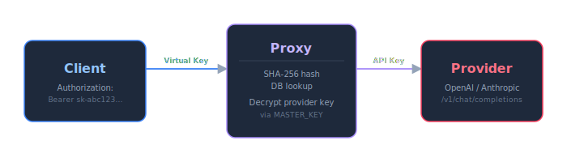

# 🔑 Virtual Keys

Virtual keys are client-facing API keys that provide authenticated access to the `/v1/*` proxy endpoints. They enable per-client rate limiting, token usage tracking, and audit logging without exposing provider API keys.

<p align="center">
<br>
<em>Virtual Keys page with name, preview, tokens used, last used timestamp, and delete button</em>
</p>

<p align="center">
<br>
<em>Key creation dialog - the plaintext key is shown only once</em>
</p>

## Overview



1. Client includes a virtual key in the `Authorization: Bearer <virtual-key>` header
2. Proxy hashes the key with SHA-256 and looks it up against the `virtual_keys` table (1 DB query)
3. If the hash matches, the proxy sets the key identity in the request context
4. Proxy looks up the requested model and provider
5. Proxy decrypts the provider's real API key using `MASTER_KEY`
6. Request is forwarded to the provider with the real API key
7. Proxy streams the response back, logging token usage against the virtual key

## Key Format and Generation

### Structure

Virtual keys follow the format: `sk-<32 hex characters>`

- **Prefix**: `sk-` (secret key identifier)
- **Payload**: 32 hexadecimal characters (16 bytes of cryptographic randomness)
- **Total length**: 35 characters
- **Example**: `sk-a1b2c3d4e5f6789012345678abcdef01`

### Generation Algorithm

Keys are generated using Go's `crypto/rand` package (CSPRNG):

```go
func Generate() (string, error) {
    key := make([]byte, 16)
    if _, err := io.ReadFull(cryptoRand.Reader, key); err != nil {
        return "", err
    }
    return "sk-" + hex.EncodeToString(key), nil
}
```

- **Source**: `crypto/rand` - cryptographically secure pseudo-random number generator
- **Entropy**: 128 bits (16 bytes × 8 bits)
- **Encoding**: Lowercase hexadecimal
- **Uniqueness**: Probability of collision is negligible (~1 in 2¹²⁸)

### Key Preview

The `key_preview` field stores a human-readable identifier for the key:

- **Format**: First 3 characters (including `sk-` prefix) + `...` + last 2 characters
- **Example**: `sk-a1b2c3d4e5f6789012345678abcdef01` → `sk-...01`
- **Purpose**: UI identification without exposing the full key
- **Storage**: Stored in plaintext alongside the hash in the `virtual_keys` table

## SHA-256 Hashing

Virtual keys are **never stored in plaintext**. Only the SHA-256 hash is persisted:

```go
func Hash(key string) string {
    hash := sha256.Sum256([]byte(key))
    return hex.EncodeToString(hash[:])
}
```

### Properties

| Property | Value |
|----------|-------|
| Algorithm | SHA-256 (FIPS 180-4) |
| Output | 256-bit (32-byte) digest |
| Encoding | Lowercase hexadecimal (64 characters) |
| Deterministic | Same input → same output |
| One-way | Cannot recover key from hash |

### Security Implications

- **Storage**: Only 64-character hex hash stored in `key_hash` column
- **Lookup**: Incoming requests hash the provided token and compare hashes
- **Deletion**: Removing a key from the database immediately invalidates it
- **Rotation**: Create a new key, update clients, delete the old key
- **Recovery**: Lost keys **cannot** be recovered - generate a new one

## Authentication Flow

### Request Processing Pipeline


### Middleware Implementation

```go
func (h *Handler) ProxyKeyMiddleware(next http.Handler) http.Handler {
    return http.HandlerFunc(func(w http.ResponseWriter, r *http.Request) {
        // 1. Extract Bearer token
        token, ok := util.ParseBearerToken(r)
        if !ok {
            writeOpenAIError(w, "Authorization header required (Bearer token)", http.StatusUnauthorized)
            return
        }

        // 2. Hash the token
        keyHash := virtualkey.Hash(token)

        // 3. Database lookup
        vk, err := h.virtualKeyRepo.FindByKeyHash(r.Context(), keyHash)
        if err != nil {
            if errors.Is(err, virtualkey.ErrNotFound) {
                writeOpenAIError(w, "Invalid virtual key", http.StatusUnauthorized)
            } else {
                writeOpenAIError(w, "Internal error", http.StatusInternalServerError)
            }
            return
        }

        // 4. Set context values for downstream handlers
        ctx := context.WithValue(r.Context(), virtualKeyNameKey, vk.Name)
        ctx = context.WithValue(ctx, virtualKeyIDKey, vk.ID)
        ctx = context.WithValue(ctx, VirtualKeyHashKey, keyHash)
        ctx = context.WithValue(ctx, ctxkeys.VirtualKeyRateLimitRPSKey, vk.RateLimitRPS)
        ctx = context.WithValue(ctx, ctxkeys.VirtualKeyRateLimitBurstKey, vk.RateLimitBurst)

        // 5. Async last-used update (non-blocking)
        go func(hash string) {
            tctx, tcancel := context.WithTimeout(context.Background(), 5*time.Second)
            defer tcancel()
            h.virtualKeyRepo.TouchLastUsed(tctx, hash)
        }(keyHash)

        next.ServeHTTP(w, r.WithContext(ctx))
    })
}
```

### Context Keys

After successful authentication, the following values are available in request context:

| Key | Type | Purpose |
|-----|------|---------|
| `virtual_key_name` | `string` | Human-readable key name (e.g., "production-app") |
| `virtual_key_id` | `uuid.UUID` | Database primary key |
| `virtual_key_hash` | `string` | SHA-256 hash (64 hex chars) |
| `virtual_key_rate_limit_rps` | `*float64` | Per-key RPS override (nil = use global) |
| `virtual_key_rate_limit_burst` | `*int` | Per-key burst override (nil = use global) |
| `virtual_key_allowed_providers` | `*[]string` | Provider access restriction (nil = all providers) |
| `virtual_key_strip_reasoning` | `bool` | Whether to strip reasoning fields from streaming output |

## Database Schema

### Table: `virtual_keys`

```sql
CREATE TABLE IF NOT EXISTS virtual_keys (
    id              UUID PRIMARY KEY DEFAULT gen_random_uuid(),
    name            TEXT NOT NULL,
    key_hash        TEXT NOT NULL UNIQUE,
    key_preview     TEXT NOT NULL DEFAULT '',
    tokens_used     BIGINT NOT NULL DEFAULT 0,
    last_used_at    TIMESTAMPTZ,
    created_at      TIMESTAMPTZ DEFAULT now(),
    rate_limit_rps  DOUBLE PRECISION DEFAULT NULL,
    rate_limit_burst INTEGER DEFAULT NULL,
    allowed_providers TEXT[] DEFAULT NULL,
    strip_reasoning BOOLEAN NOT NULL DEFAULT false
);

CREATE INDEX IF NOT EXISTS idx_virtual_keys_key_hash ON virtual_keys(key_hash);
```

### Columns

| Column | Type | Constraints | Description |
|--------|------|-------------|-------------|
| `id` | `UUID` | PRIMARY KEY, DEFAULT `gen_random_uuid()` | Unique identifier |
| `name` | `TEXT` | NOT NULL | Human-readable name (1-100 chars, printable) |
| `key_hash` | `TEXT` | NOT NULL, UNIQUE | SHA-256 hash (64 hex characters) |
| `key_preview` | `TEXT` | NOT NULL | First 3 + last 2 chars (e.g., `sk-...01`) |
| `tokens_used` | `BIGINT` | NOT NULL, DEFAULT 0 | Cumulative token count (prompt + completion) |
| `last_used_at` | `TIMESTAMPTZ` | NULLABLE | Last authentication timestamp |
| `created_at` | `TIMESTAMPTZ` | DEFAULT `now()` | Creation timestamp |
| `rate_limit_rps` | `DOUBLE PRECISION` | NULLABLE | Per-key RPS override (null = global default) |
| `rate_limit_burst` | `INTEGER` | NULLABLE | Per-key burst override (null = global default) |
| `allowed_providers` | `TEXT[]` | NULLABLE | Provider IDs this key may use (null = all providers accessible) |
| `strip_reasoning` | `BOOLEAN` | NOT NULL, DEFAULT false | Strip `reasoning`/`reasoning_content` fields from streaming output for this key |

### Migration History

| Migration | File | Changes |
|-----------|------|---------|
| `004` | `internal/db/migrations/004_virtual_keys.sql` | Initial table creation |
| `005` | `internal/db/migrations/005_virtual_key_preview.sql` | Added `key_preview` column |
| `012` | `internal/db/migrations/012_add_virtual_key_id_to_request_logs.sql` | Added `virtual_key_id` to `request_logs` |
| `029` | `internal/db/migrations/029_virtual_key_rate_limits.sql` | Added per-key rate limit columns |
| `037` | `internal/db/migrations/037_virtual_key_allowed_providers.sql` | Added `allowed_providers` (per-key provider access restriction) |
| `038` | `internal/db/migrations/038_virtual_key_strip_reasoning.sql` | Added `strip_reasoning` flag |

## API Reference

All virtual key endpoints require `Authorization: Bearer $ADMIN_TOKEN` header.

### Create Virtual Key

**Endpoint**: `POST /api/virtual-keys`

**Request Body**:
```json
{
  "name": "production-app",
  "rate_limit_rps": 5.0,
  "rate_limit_burst": 10,
  "allowed_providers": ["provider-uuid-1"],
  "strip_reasoning": false
}
```

| Field | Type | Required | Constraints |
|-------|------|----------|-------------|
| `name` | `string` | Yes | 1-100 chars, printable Unicode, not reserved |
| `rate_limit_rps` | `number` | No | Must be ≥ 0 (null = use global default) |
| `rate_limit_burst` | `integer` | No | Must be ≥ 1 (null = use global default) |
| `allowed_providers` | `array of UUID strings` | No | Restrict the key to the listed provider IDs (null/omitted = all providers; empty array rejected) |
| `strip_reasoning` | `boolean` | No | Strip `reasoning`/`reasoning_content` from streaming output (default false) |

**Reserved Names** (cannot be used):
- `chat`
- `arena`
- `completions`
- `admin`

These are reserved because they conflict with built-in URL paths.

**Response** (`201 Created`):
```json
{
  "id": "550e8400-e29b-41d4-a716-446655440000",
  "name": "production-app",
  "key": "sk-a1b2c3d4e5f6789012345678abcdef01",
  "key_preview": "sk-...01",
  "tokens_used": 0,
  "last_used_at": null,
  "created_at": "2025-01-15T10:30:00Z",
  "rate_limit_rps": 5.0,
  "rate_limit_burst": 10,
  "allowed_providers": ["provider-uuid-1"],
  "strip_reasoning": false
}
```

> **⚠️ Critical**: The `key` field is returned **only once** on creation. It is never returned in subsequent API calls. Store it securely immediately.

### List Virtual Keys

**Endpoint**: `GET /api/virtual-keys`

**Response** (`200 OK`):
```json
[
  {
    "id": "550e8400-e29b-41d4-a716-446655440000",
    "name": "production-app",
    "key": "",
    "key_preview": "sk-...01",
    "tokens_used": 125000,
    "last_used_at": "2025-01-15T14:22:00Z",
    "created_at": "2025-01-15T10:30:00Z",
    "rate_limit_rps": 5.0,
    "rate_limit_burst": 10
  },
  {
    "id": "660e8400-e29b-41d4-a716-446655440001",
    "name": "dev-testing",
    "key": "",
    "key_preview": "sk-...ab",
    "tokens_used": 4500,
    "last_used_at": null,
    "created_at": "2025-01-14T08:15:00Z",
    "rate_limit_rps": null,
    "rate_limit_burst": null
  }
]
```

Note: `key` is always empty string in list/get responses. `rate_limit_*` fields are `null` if using global defaults.

### Get Virtual Key

**Endpoint**: `GET /api/virtual-keys/{id}`

**Response** (`200 OK`):
```json
{
  "id": "550e8400-e29b-41d4-a716-446655440000",
  "name": "production-app",
  "key": "",
  "key_preview": "sk-...01",
  "tokens_used": 125000,
  "last_used_at": "2025-01-15T14:22:00Z",
  "created_at": "2025-01-15T10:30:00Z",
  "rate_limit_rps": 5.0,
  "rate_limit_burst": 10
}
```

### Update Virtual Key

**Endpoint**: `PUT /api/virtual-keys/{id}`

**Request Body**:
```json
{
  "name": "production-app-v2",
  "rate_limit_rps": 10.0,
  "rate_limit_burst": 20
}
```

**Response** (`200 OK`):
```json
{
  "id": "550e8400-e29b-41d4-a716-446655440000",
  "name": "production-app-v2",
  "key": "",
  "key_preview": "sk-...01",
  "tokens_used": 125000,
  "last_used_at": "2025-01-15T14:22:00Z",
  "created_at": "2025-01-15T10:30:00Z",
  "rate_limit_rps": 10.0,
  "rate_limit_burst": 20
}
```

### Delete Virtual Key

**Endpoint**: `DELETE /api/virtual-keys/{id}`

**Response**: `204 No Content` (empty body)

> **⚠️ Permanent Deletion**: Keys are **permanently deleted**, not disabled. There is no "revoke" or "disable" endpoint. Once deleted:
> - The key hash is removed from the database immediately
> - Any subsequent request using that key receives `401 Unauthorized`
> - Historical logs retain the `virtual_key_name` for auditing
> - **Recovery is impossible** - create a new key if needed

## Rate Limiting

Each virtual key has an independent token bucket rate limiter.

### Configuration

| Setting | Default | Description |
|---------|---------|-------------|
| `rate_limit_enabled` | `true` | Runtime toggle (DB setting) |
| `rate_limit_rps` | `10` | Requests per second (global default) |
| `rate_limit_burst` | `20` | Maximum burst size (global default) |

### Per-Key Overrides

Virtual keys can override global rate limits via `rate_limit_rps` and `rate_limit_burst` columns:

- **`null`**: Use global settings from `settings` table
- **`0` for RPS**: Unlimited requests (no rate limiting for this key)
- **`0` for burst**: Invalid - rejected on creation/update (must be ≥ 1)

### Rate Limit Response

When a key exceeds its rate limit:

```
HTTP/1.1 429 Too Many Requests
Retry-After: 2
X-RateLimit-Limit: 10
X-RateLimit-Remaining: 0
X-RateLimit-Burst: 20
Content-Type: application/json

{
  "error": {
    "message": "Rate limit exceeded",
    "type": "rate_limit_error",
    "code": 429
  }
}
```

### Bucket Cleanup

- **Stale buckets**: Automatically removed after 10 minutes of inactivity
- **Disable → Re-enable**: All buckets reset when rate limiting is re-enabled at runtime

## Provider Access Control and Reasoning Stripping

Two additional per-key controls:

- **`allowed_providers`** restricts which providers a key may route to. When set, requests resolving to a provider outside the list are rejected, and `hotel/` failover candidates from disallowed providers are skipped. `null` means all providers are accessible; an empty array is rejected on create/update (use `null` to clear the restriction).
- **`strip_reasoning`** removes `reasoning`/`reasoning_content` fields from streaming output for that key - useful for clients that mishandle reasoning deltas from thinking models. Token counting is unaffected.

Both are configurable on key creation and update (API or dashboard).

## Token Usage Tracking

### Accumulation

Token usage is tracked per virtual key:

```go
func (r *Repository) AddTokens(ctx context.Context, keyHash string, tokens int) error {
    _, err := r.pool.Exec(ctx,
        `UPDATE virtual_keys SET tokens_used = tokens_used + $1, last_used_at = now() WHERE key_hash = $2`,
        tokens, keyHash)
    return err
}
```

- **When**: After successful proxy request completion
- **What**: `prompt_tokens + completion_tokens` from provider response
- **How**: Async fire-and-forget with 5-second timeout
- **Accuracy**: Best-effort tally - may lag behind actual usage

### Last Used Timestamp

Updated on every authenticated request:

```go
func (r *Repository) TouchLastUsed(ctx context.Context, keyHash string) error {
    _, err := r.pool.Exec(ctx,
        `UPDATE virtual_keys SET last_used_at = now() WHERE key_hash = $1`,
        keyHash)
    return err
}
```

- **When**: During `ProxyKeyMiddleware` (async, non-blocking)
- **Timeout**: 5 seconds (prevents blocking proxy path)
- **Purpose**: Identify active vs. dormant keys for cleanup

## Usage Examples

### cURL

```bash
# Set virtual key
export PROXY_KEY="sk-a1b2c3d4e5f6789012345678abcdef01"

# List available models
curl http://localhost:8081/v1/models \
  -H "Authorization: Bearer $PROXY_KEY"

# Chat completion
curl -X POST http://localhost:8081/v1/chat/completions \
  -H "Authorization: Bearer $PROXY_KEY" \
  -H "Content-Type: application/json" \
  -d '{
    "model": "hotel/gpt-4o",
    "messages": [{"role": "user", "content": "Hello!"}]
  }'
```

### Python

```python
import openai

client = openai.OpenAI(
    base_url="http://localhost:8081/v1",
    api_key="sk-a1b2c3d4e5f6789012345678abcdef01"
)

response = client.chat.completions.create(
    model="hotel/gpt-4o",
    messages=[{"role": "user", "content": "Hello!"}]
)
print(response.choices[0].message.content)
```

### Node.js

```javascript
import OpenAI from 'openai';

const client = new OpenAI({
  baseURL: 'http://localhost:8081/v1',
  apiKey: 'sk-a1b2c3d4e5f6789012345678abcdef01'
});

const response = await client.chat.completions.create({
  model: 'hotel/gpt-4o',
  messages: [{ role: 'user', content: 'Hello!' }]
});
console.log(response.choices[0].message.content);
```

## Key Lifecycle

### Creation


### Authentication (Every Request)


### Rotation

1. Create new virtual key via API/dashboard
2. Update client applications with new key
3. Monitor usage of old key (via `last_used_at`)
4. Delete old key when no longer needed

### Deletion


## Security Properties

| Property | Implementation |
|----------|---------------|
| **Storage** | SHA-256 hash only - raw key never persisted |
| **Key format** | `sk-` + 32 hex chars (128 bits entropy) |
| **Key preview** | First 3 + last 2 chars stored as `key_preview` (e.g., `sk-...01`) |
| **Deletion** | Permanent - `DELETE` removes key entirely |
| **Per-key tracking** | Token usage logged per virtual key |
| **Rate limiting** | Independent token bucket per key |
| **Audit trail** | Logs retain `virtual_key_name` after deletion |

## Troubleshooting

### 401 Unauthorized

**Symptoms**: Requests rejected with `Invalid virtual key`

**Causes**:
- Key was deleted from database
- Typo in key value
- Missing `Bearer ` prefix in Authorization header
- Key was never created (check creation response)

**Resolution**:
1. Verify key exists: `GET /api/virtual-keys`
2. Check `key_preview` matches your key's last 4 chars
3. Ensure header format: `Authorization: Bearer sk-...`

### Rate Limited (429)

**Symptoms**: `Rate limit exceeded` with `Retry-After` header

**Resolution**:
1. Check per-key limits: `GET /api/virtual-keys/{id}`
2. Increase `rate_limit_rps` or set to `0` for unlimited
3. Increase `rate_limit_burst` for traffic spikes
4. Wait for `Retry-After` seconds before retrying

### Key Lost After Creation

**Symptoms**: Plaintext key not saved; only preview available

**Resolution**:
- **Impossible to recover** - this is by design
- Create a new key and update clients
- Delete the old key once migrated

## Related Documentation

- [[Security]] - How provider keys are encrypted and managed
- [[Configuration]] - Global and per-key rate limit configuration
- [[Request Logging]] - How virtual keys appear in audit logs
