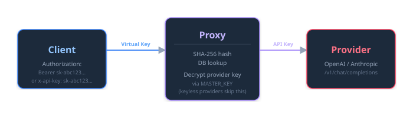

# 🔑 Virtual Keys

Virtual keys are client-facing API keys that provide authenticated access to the `/v1/*` proxy endpoints. They enable per-client rate limiting, token usage tracking, and audit logging without exposing provider API keys.

<p align="center">
<br>
<em>Virtual Keys page: name, key preview, RPS, burst, TPM, created, tokens used, and last used, with a name filter above the table. Clicking a row opens the key detail modal, which is where editing and deletion live.</em>
</p>

<p align="center">
<br>
<em>Key creation dialog - the plaintext key is shown only once</em>
</p>

## Overview



1. Client sends the virtual key as `Authorization: Bearer <virtual-key>` (OpenAI-style clients) or as `x-api-key: <virtual-key>` (Anthropic-SDK clients). Bearer wins when both headers are present
2. Proxy hashes the key with SHA-256 and looks it up in the `virtual_keys` table, joining the owning user row in the same query (1 DB query)
3. If the hash matches and the owner's account is enabled, the proxy puts the key identity, the key's limits, and the owner's aggregate limits into the request context
4. Proxy looks up the requested model and provider
5. Proxy decrypts the provider's real API key using `MASTER_KEY`
6. Request is forwarded to the provider with the real API key
7. Proxy streams the response back, logging token usage against the virtual key

## Key Format and Generation

### Structure

Virtual keys follow the format: `sk-<32 hex characters>`

- **Prefix**: `sk-` (secret key identifier)
- **Payload**: 32 hexadecimal characters (16 bytes of cryptographic randomness)
- **Total length**: 35 characters
- **Example**: `sk-a1b2c3d4e5f6789012345678abcdef01`

### Generation Algorithm

Key generation reads 16 bytes from Go's `crypto/rand`, hex-encodes them, and prefixes `sk-`.

- **Source**: `crypto/rand` - cryptographically secure pseudo-random number generator
- **Entropy**: 128 bits (16 bytes × 8 bits)
- **Encoding**: Lowercase hexadecimal
- **Uniqueness**: Probability of collision is negligible (~1 in 2¹²⁸)

### Key Preview

The `key_preview` field stores a human-readable identifier for the key:

- **Format**: First 3 characters (the `sk-` prefix) + `...` + last 4 characters
- **Example**: `sk-a1b2c3d4e5f6789012345678abcdef01` → `sk-...ef01`
- **Purpose**: UI identification without exposing the full key
- **Storage**: Stored in plaintext alongside the hash in the `virtual_keys` table

The four-character tail matches the provider card's masking. Because only the hash is stored, a key issued before the tail widened keeps its shorter two-character preview; the key itself still works.

## SHA-256 Hashing

Virtual keys are **never stored in plaintext**: the key is hashed with SHA-256 and the 64-character lowercase hex digest goes into `key_hash`. Hashing is deterministic, so an incoming key can be hashed and compared, and one-way, so a stored digest cannot be turned back into a key.

### Security Implications

- **Storage**: Only 64-character hex hash stored in `key_hash` column
- **Lookup**: Incoming requests hash the provided token and compare hashes
- **Deletion**: Removing a key from the database immediately invalidates it
- **Rotation**: Create a new key, update clients, delete the old key
- **Recovery**: Lost keys **cannot** be recovered - generate a new one

## Authentication Flow

### Request Processing Pipeline


### What the middleware does

`ProxyKeyMiddleware` runs ahead of every `/v1` handler:

1. **Extract**: read the key from `Authorization: Bearer` or, failing that, `x-api-key`. Neither present is a `401` with `missing authorization header`.
2. **Hash and look up**: SHA-256 the key and fetch the row by hash, joining the owning user. The lookup carries its own 10-second timeout so a wedged database refuses requests (`500 internal error`) instead of parking them.
3. **Refuse cleanly**: an unknown hash is `401 invalid virtual key`; a key whose owner account is disabled is `401 virtual key disabled: owner account is disabled`. Every `401` from this middleware sets `Connection: close`, so a client trickling a body with no valid key hears the refusal immediately rather than after the body deadline.
4. **Populate context**: key name, id, hash, the per-key RPS/burst/TPM overrides, `allowed_providers`, `strip_reasoning`, and, for an owned key, the owner id plus that account's aggregate limits and provider cap.
5. **Touch**: update `last_used_at` in a fire-and-forget goroutine with a 5-second timeout, so the proxy path never waits on it.

Rejections are logged at warn level with the remote address and, where known, the key name. Request and response content is never logged.

### Context Keys

After successful authentication, the following values are available in request context:

| Key | Type | Purpose |
|-----|------|---------|
| `virtual_key_name` | `string` | Human-readable key name (e.g., "production-app") |
| `virtual_key_id` | `uuid.UUID` | Database primary key |
| `virtual_key_hash` | `string` | SHA-256 hash (64 hex chars) |
| `virtual_key_rate_limit_rps` | `*float64` | Per-key RPS override (nil = use global) |
| `virtual_key_rate_limit_burst` | `*int` | Per-key burst override (nil = use global) |
| `virtual_key_rate_limit_tpm` | `*int` | Per-key tokens-per-minute cap (nil = no cap / global default) |
| `virtual_key_allowed_providers` | `*[]string` | Provider access restriction (nil = all providers) |
| `virtual_key_strip_reasoning` | `bool` | Whether to strip reasoning fields from streaming output |
| `virtual_key_owner_id` | `uuid.UUID` | Owning dashboard user (absent for an unowned key) |
| `user_rate_limit_rps` | `*float64` | Owner's aggregate RPS cap (nil = no cap) |
| `user_rate_limit_burst` | `*int` | Owner's aggregate burst (nil = no cap) |
| `user_rate_limit_tpm` | `*int` | Owner's aggregate tokens-per-minute cap (nil = no cap) |
| `user_allowed_providers` | `*[]string` | Owner's account provider cap (nil = no cap) |

The five owner values are set only when the key has an owner.

## Database Schema

### Table: `virtual_keys`

```sql
CREATE TABLE IF NOT EXISTS virtual_keys (
    id              UUID PRIMARY KEY DEFAULT gen_random_uuid(),
    name            TEXT NOT NULL,
    key_hash        TEXT NOT NULL UNIQUE,
    key_preview     TEXT NOT NULL DEFAULT '',
    tokens_used     BIGINT NOT NULL DEFAULT 0,
    last_used_at    TIMESTAMPTZ,
    created_at      TIMESTAMPTZ DEFAULT now(),
    rate_limit_rps  DOUBLE PRECISION DEFAULT NULL,
    rate_limit_burst INTEGER DEFAULT NULL,
    rate_limit_tpm  INTEGER DEFAULT NULL,
    allowed_providers TEXT[] DEFAULT NULL,
    strip_reasoning BOOLEAN NOT NULL DEFAULT false,
    owner_user_id   UUID REFERENCES users(id) ON DELETE SET NULL,

    CONSTRAINT virtual_keys_rate_limit_bounds CHECK (
        (rate_limit_rps   IS NULL OR rate_limit_rps   >= 0) AND
        (rate_limit_burst IS NULL OR rate_limit_burst >= 1) AND
        (rate_limit_tpm   IS NULL OR rate_limit_tpm   >= 1)
    )
);

CREATE INDEX IF NOT EXISTS idx_virtual_keys_key_hash ON virtual_keys(key_hash);
CREATE INDEX IF NOT EXISTS idx_virtual_keys_owner
    ON virtual_keys (owner_user_id) WHERE owner_user_id IS NOT NULL;
```

### Columns

| Column | Type | Constraints | Description |
|--------|------|-------------|-------------|
| `id` | `UUID` | PRIMARY KEY, DEFAULT `gen_random_uuid()` | Unique identifier |
| `name` | `TEXT` | NOT NULL | Human-readable name (1-100 chars, printable) |
| `key_hash` | `TEXT` | NOT NULL, UNIQUE | SHA-256 hash (64 hex characters) |
| `key_preview` | `TEXT` | NOT NULL | First 3 + last 4 chars (e.g., `sk-...ef01`) |
| `tokens_used` | `BIGINT` | NOT NULL, DEFAULT 0 | Cumulative token count (prompt + completion) |
| `last_used_at` | `TIMESTAMPTZ` | NULLABLE | Last authentication timestamp |
| `created_at` | `TIMESTAMPTZ` | DEFAULT `now()` | Creation timestamp |
| `rate_limit_rps` | `DOUBLE PRECISION` | NULLABLE | Per-key RPS override (null = global default) |
| `rate_limit_burst` | `INTEGER` | NULLABLE | Per-key burst override (null = global default) |
| `rate_limit_tpm` | `INTEGER` | NULLABLE | Per-key tokens-per-minute cap (null = no cap / global default) |
| `allowed_providers` | `TEXT[]` | NULLABLE | Provider IDs this key may use (null = all providers accessible) |
| `strip_reasoning` | `BOOLEAN` | NOT NULL, DEFAULT false | Strip `reasoning`/`reasoning_content` fields from streaming output for this key |
| `owner_user_id` | `UUID` | NULLABLE, FK `users(id)` ON DELETE SET NULL | Owning dashboard user (null = unowned) |

Deleting a user orphans their keys (`owner_user_id` becomes null) instead of deleting them, so an account cleanup cannot silently kill production traffic.

### Migration History

| Migration | File | Changes |
|-----------|------|---------|
| `004` | `internal/db/migrations/004_virtual_keys.sql` | Initial table creation |
| `005` | `internal/db/migrations/005_virtual_key_preview.sql` | Added `key_preview` column |
| `012` | `internal/db/migrations/012_add_virtual_key_id_to_request_logs.sql` | Added `virtual_key_id` to `request_logs` |
| `029` | `internal/db/migrations/029_virtual_key_rate_limits.sql` | Added per-key rate limit columns |
| `037` | `internal/db/migrations/037_virtual_key_allowed_providers.sql` | Added `allowed_providers` (per-key provider access restriction) |
| `038` | `internal/db/migrations/038_virtual_key_strip_reasoning.sql` | Added `strip_reasoning` flag |
| `046` | `internal/db/migrations/046_virtual_key_rate_limit_tpm.sql` | Added `rate_limit_tpm` (per-key tokens-per-minute cap) |
| `051` | `internal/db/migrations/051_user_limits_vk_ownership.sql` | Added `owner_user_id` plus its index, and the matching per-user limit columns |
| `064` | `internal/db/migrations/064_rate_limit_bounds.sql` | Nulled out-of-bounds limits and added the `CHECK` that keeps them in range |
| `074` | `internal/db/migrations/074_request_log_vk_index.sql` | Indexed `request_logs.virtual_key_id` for the Logs page's virtual-key filter |

## API Reference

Virtual key endpoints are dashboard API routes, not proxy routes. A caller authenticates either with the browser session cookie or with `Authorization: Bearer $ADMIN_TOKEN`, and needs the `virtual_keys` grant, which covers reads and writes alike. Admins see and edit every key; a non-admin grant holder sees and edits only the keys they own, and a key belonging to someone else answers `404` rather than `403` so the listing and the detail route tell the same story.

Two things narrow that further:

- With TOTP two-factor enabled, a bare admin token is refused: exchange it for a session token via `POST /api/totp/login` first.
- On a managed fleet member the three write routes answer `403`, because the primary owns virtual keys and replaces them on the next sync. Create, update, and delete them on the primary.

### Create Virtual Key

**Endpoint**: `POST /api/virtual-keys`

**Request Body**:
```json
{
  "name": "production-app",
  "rate_limit_rps": 5.0,
  "rate_limit_burst": 10,
  "rate_limit_tpm": 50000,
  "allowed_providers": ["provider-uuid-1"],
  "strip_reasoning": false
}
```

| Field | Type | Required | Constraints |
|-------|------|----------|-------------|
| `name` | `string` | Yes | 1-100 chars, printable Unicode, not reserved |
| `rate_limit_rps` | `number` | No | Must be ≥ 0 (null = use global default) |
| `rate_limit_burst` | `integer` | No | Must be ≥ 1 (null = use global default) |
| `rate_limit_tpm` | `integer` | No | Tokens-per-minute cap, must be ≥ 1 (null = no cap / global default) |
| `allowed_providers` | `array of UUID strings` | No | Restrict the key to the listed provider IDs (null/omitted = all providers; empty array rejected) |
| `strip_reasoning` | `boolean` | No | Strip `reasoning`/`reasoning_content` from streaming output (default false) |
| `owner_user_id` | `UUID string` | No | Dashboard user to own the key. Admin callers only: a non-admin's key is always created as their own, whatever the body says. Null or empty = unowned |

**Reserved Names** (cannot be used, compared case-insensitively):
- `chat`
- `arena`
- `completions`
- `admin`

These are reserved because they conflict with built-in URL paths.

**Response** (`201 Created`):
```json
{
  "id": "550e8400-e29b-41d4-a716-446655440000",
  "name": "production-app",
  "key": "sk-a1b2c3d4e5f6789012345678abcdef01",
  "key_preview": "sk-...ef01",
  "tokens_used": 0,
  "last_used_at": null,
  "created_at": "2025-01-15T10:30:00Z",
  "rate_limit_rps": 5.0,
  "rate_limit_burst": 10,
  "rate_limit_tpm": 50000,
  "allowed_providers": ["provider-uuid-1"],
  "strip_reasoning": false,
  "owner_user_id": "770e8400-e29b-41d4-a716-446655440002",
  "owner_username": "alice"
}
```

> **⚠️ Critical**: The `key` field is returned **only once** on creation. It is never returned in subsequent API calls. Store it securely immediately.

### List Virtual Keys

**Endpoint**: `GET /api/virtual-keys`

**Response** (`200 OK`):
```json
[
  {
    "id": "550e8400-e29b-41d4-a716-446655440000",
    "name": "production-app",
    "key_preview": "sk-...ef01",
    "tokens_used": 125000,
    "last_used_at": "2025-01-15T14:22:00Z",
    "created_at": "2025-01-15T10:30:00Z",
    "rate_limit_rps": 5.0,
    "rate_limit_burst": 10,
    "rate_limit_tpm": 50000
  },
  {
    "id": "660e8400-e29b-41d4-a716-446655440001",
    "name": "dev-testing",
    "key_preview": "sk-...9fab",
    "tokens_used": 4500,
    "last_used_at": null,
    "created_at": "2025-01-14T08:15:00Z",
    "rate_limit_rps": null,
    "rate_limit_burst": null,
    "rate_limit_tpm": null
  }
]
```

Notes on the shape: `key` is omitted entirely outside the create response. `rate_limit_*` are `null` when the key falls back to the global defaults. The examples above are trimmed; every response also carries `allowed_providers`, `strip_reasoning`, `owner_user_id`, and, for an owned key, `owner_username`. A non-admin caller's list contains only their own keys.

### Get Virtual Key

**Endpoint**: `GET /api/virtual-keys/{id}`

**Response** (`200 OK`):
```json
{
  "id": "550e8400-e29b-41d4-a716-446655440000",
  "name": "production-app",
  "key_preview": "sk-...ef01",
  "tokens_used": 125000,
  "last_used_at": "2025-01-15T14:22:00Z",
  "created_at": "2025-01-15T10:30:00Z",
  "rate_limit_rps": 5.0,
  "rate_limit_burst": 10,
  "rate_limit_tpm": 50000
}
```

### Update Virtual Key

**Endpoint**: `PUT /api/virtual-keys/{id}`

**Request Body**:
```json
{
  "name": "production-app-v2",
  "rate_limit_rps": 10.0,
  "rate_limit_burst": 20,
  "rate_limit_tpm": 30000
}
```

**Response** (`200 OK`):
```json
{
  "id": "550e8400-e29b-41d4-a716-446655440000",
  "name": "production-app-v2",
  "key_preview": "sk-...ef01",
  "tokens_used": 125000,
  "last_used_at": "2025-01-15T14:22:00Z",
  "created_at": "2025-01-15T10:30:00Z",
  "rate_limit_rps": 10.0,
  "rate_limit_burst": 20,
  "rate_limit_tpm": 30000
}
```

`PUT` is a full rewrite of the rate-limit fields: `rate_limit_rps`, `rate_limit_burst`, and `rate_limit_tpm` are written on every update, so omitting one clears it back to the global default rather than preserving the current value. Send the values you want kept.

Three fields behave the other way and are preserved when omitted: `allowed_providers`, `strip_reasoning`, and `owner_user_id` keep their stored value, so a script that only renames a key cannot accidentally drop its restrictions. For `owner_user_id` an explicit `null` from an admin unassigns the owner; a non-admin's update always keeps the key on their own account.

### Delete Virtual Key

**Endpoint**: `DELETE /api/virtual-keys/{id}`

**Response**: `204 No Content` (empty body)

> **⚠️ Permanent Deletion**: Keys are **permanently deleted**, not disabled. There is no per-key "revoke" or "disable" endpoint. Once deleted:
> - The key hash is removed from the database immediately
> - Any subsequent request using that key receives `401 Unauthorized`
> - Historical logs retain the `virtual_key_name` for auditing
> - **Recovery is impossible** - create a new key if needed

An owned key has a reversible alternative: disabling the owner's account rejects every key that account owns with `401`, and re-enabling it brings them all back. See [Ownership and per-user limits](Virtual-Keys#ownership-and-per-user-limits).

## Rate Limiting

Each virtual key has an independent token bucket rate limiter.

### Configuration

| Setting | Default | Description |
|---------|---------|-------------|
| `rate_limit_enabled` | `true` | Runtime toggle (DB setting) |
| `rate_limit_rps` | `10` | Requests per second (global default) |
| `rate_limit_burst` | `20` | Maximum burst size (global default) |
| `rate_limit_tpm` | `0` | Tokens-per-minute cap (global default; `0` = no cap; API-only, no Settings-UI control) |
| `rate_limit_max_wait_ms` | `200` | How long a request may be held before it is rejected (shared with the per-IP limiter) |
| `rate_limit_ip_enabled` | `true` | Runtime toggle for the per-IP limiter |
| `rate_limit_ip_rps` | `30` | Per-IP requests per second |
| `rate_limit_ip_burst` | `60` | Per-IP burst size |

The `RATE_LIMIT_ENABLED` environment variable is the boot-time kill switch (default `true`). It gates whether the limiters are mounted at all; `rate_limit_enabled` is the runtime toggle on top of that.

### Per-Key Overrides

Virtual keys can override global rate limits via `rate_limit_rps` and `rate_limit_burst` columns:

- **`null`**: Use global settings from `settings` table
- **`0` for RPS**: Unlimited requests (no rate limiting for this key)
- **`0` for burst**: Invalid - rejected on creation/update (must be ≥ 1)

### Token Rate Limiting (TPM)

In addition to the request-rate limiter above, each key can cap its **tokens
per minute** via `rate_limit_tpm` (a separate token-budget bucket, refilled at
`tpm / 60` per second with a full minute's budget available at once):

- **`null`**: No per-key override, so the global `rate_limit_tpm` setting applies
  (default `0` = no cap). That global default is API-only; there is no
  Settings-UI control for it (per-VK is the primary surface).
- **`≥ 1`**: Cap the key's combined prompt + completion + reasoning tokens per
  minute. `0` is rejected on create/update (use `null` for no cap).

Because a request's token cost is unknown until it finishes, enforcement is
**admit-on-past-consumption, debit-on-completion**: admission only checks
whether the budget is already drained, and the actual token total is subtracted
afterward. Consequently a key can overshoot by roughly one in-flight request's
worth of tokens, and a single response larger than the whole minute budget still
completes: it just blocks the *next* request until the budget refills. This is
a **consumer-side** control: the rejected request never reaches the upstream
provider, which is never throttled. Like the RPS limiter, the budget is
in-process and not shared across replicas (effective limit is ~N× with N
instances behind a load balancer).

### Backpressure Before Rejection

A request over its rate is not refused straight away. If the bucket will have
room within `rate_limit_max_wait_ms` (200 ms by default), the request is held
for that long and then served. Only a wait longer than the ceiling becomes a
`429`. Short spikes therefore show up as latency rather than errors, and a
client that disconnects mid-wait has its reservation handed back.

### Rate Limit Response

When a key exceeds its rate limit:

```
HTTP/1.1 429 Too Many Requests
Retry-After: 2
X-RateLimit-Limit: 10
X-RateLimit-Remaining: 0
X-RateLimit-Burst: 20
Content-Type: application/json

{
  "error": {
    "message": "rate limit exceeded",
    "type": "rate_limit_error",
    "code": 429
  }
}
```

Four messages come out of this family, and the wording says which limit was hit:

| Message | Limit |
|---------|-------|
| `rate limit exceeded` | The key's request rate |
| `user rate limit exceeded` | The owner's aggregate request rate |
| `token rate limit exceeded` | The key's TPM budget |
| `user token rate limit exceeded` | The owner's aggregate TPM budget |

Both request-rate stages are checked together, and the reported one is
whichever forced the longer wait.

### The Per-IP Limiter

A separate per-IP limiter (30 rps, burst 60, same `rate_limit_max_wait_ms`
backpressure) runs *before* key authentication and fronts the dashboard routes
as well as `/v1`. A client with no key, or an invalid one, can therefore be
throttled with a `429` before it ever gets its `401`. Unlike the auth failures
behind it, this rejection keeps the connection alive, because a throttled
dashboard client is legitimate and will retry on it.

Its message is also `rate limit exceeded`, and the `X-RateLimit-Scope: ip`
header it sets stays on the response even when a later stage is the one that
rejects, so neither tells you which limiter fired. The reliable signal is the
call itself: a request whose key is known-bad returning `429` instead of `401`
was stopped by IP, as was any `429` on a dashboard route.

### Fleet Fair-Share

On a fleet member managed by Front Desk, each configured cap is divided by the
number of active members, so the local shares add up to the configured global
limit instead of multiplying it. RPS divides exactly; burst and TPM are floored
to 1 so a small cap on a large fleet cannot round down to "block everything" or
to "no cap". An unlimited RPS (`0`) is never divided. The divisor reverts to 1
if Front Desk stops announcing for 24 hours, so a member that leaves the fleet
goes back to enforcing the full cap rather than a frozen fraction of it.

Outside a fleet the buckets are per-process and not shared between replicas, so
N instances behind a plain load balancer enforce roughly N times the cap.

### Bucket Cleanup

- **Stale buckets**: Automatically removed after 10 minutes of inactivity
- **Disable → Re-enable**: All buckets reset when rate limiting is re-enabled at runtime

## Ownership and Per-User Limits

A virtual key can belong to a dashboard user. `owner_user_id` is that link, and
setting it changes four things.

**The owner's account switch reaches the proxy.** Disabling the account rejects
every request on every key it owns with `401 virtual key disabled: owner account
is disabled`. The keys themselves are untouched, so re-enabling the account
restores them. This is the only reversible way to cut a key's traffic.

**The owner's limits apply on top of the key's.** A user row carries its own
`rate_limit_rps`, `rate_limit_burst`, and `rate_limit_tpm`, and they are
enforced in aggregate across every key that user owns. Unlike the per-key
fields, `null` here means "no cap" rather than "fall back to the global
setting", so an account without limits adds nothing. A request must clear the
key's bucket and the owner's bucket to be served, and the reply names whichever
one refused it.

**The owner's provider cap binds the key.** A key may never name a provider
outside its owner's `allowed_providers`. Creating or updating a key with a
provider the owner cannot reach is a `400`; leaving `allowed_providers` unset on
a capped owner stores the owner's cap explicitly rather than leaving the key
unrestricted. The rule binds admins too, so the dashboard can never advertise
access the proxy would deny. Raising the account's access first is always
available to an admin.

**The dashboard scopes itself to the owner.** A non-admin with the
`virtual_keys` grant lists, creates, edits, and deletes only their own keys, and
any attempt to name a different owner in the request body is ignored: their keys
are always created and kept as their own. Only an admin can assign a key to
someone else or unassign it. Deleting a user does not delete their keys; it
orphans them (`owner_user_id` becomes null), and an orphaned key is subject to
neither an account switch nor account limits.

Owned keys show the owner's username as a chip next to the key name on the
Virtual Keys page. See [[Multi-User]] for accounts, roles, and grants.

## Provider Access Control and Reasoning Stripping

Two additional per-key controls:

- **`allowed_providers`** restricts which providers a key may route to. When set, requests resolving to a provider outside the list are rejected, and `hotel/` failover candidates from disallowed providers are skipped. `GET /v1/models` is filtered by the same list, so a restricted key lists only the models it could actually call; a key restricted on neither its own list nor its owner's account cap is unaffected and still sees the whole catalog. `null` means all providers are accessible; an empty array is rejected on create/update (use `null` to clear the restriction).
- **`strip_reasoning`** removes `reasoning`/`reasoning_content` fields from streaming output for that key - useful for clients that mishandle reasoning deltas from thinking models. Token counting is unaffected.

Both are configurable on key creation and update (API or dashboard).

## Token Usage Tracking

### Accumulation

A completed request adds its token total to the key's `tokens_used` and stamps
`last_used_at` in the same statement. The same total is what the TPM budget is
debited by.

- **When**: After proxy request completion
- **What**: `prompt_tokens + completion_tokens + reasoning_tokens` from the provider response. Each figure is clamped to a sane bound before it is charged, so a nonsense count from an upstream cannot poison the tally, and a total of zero or less is not written at all
- **How**: Async fire-and-forget with 5-second timeout
- **Accuracy**: Best-effort tally - may lag behind actual usage
- **Keyless requests**: Admin chat has no virtual key, so it updates no key row. Its tokens are still debited from the owner's TPM budget

### Last Used Timestamp

`last_used_at` is also stamped at authentication time, independently of whether
the request goes on to succeed.

- **When**: During `ProxyKeyMiddleware` (async, non-blocking)
- **Timeout**: 5 seconds (prevents blocking proxy path)
- **Purpose**: Identify active vs. dormant keys for cleanup

## Usage Examples

The dashboard prints these for you. The Virtual Keys page carries a ready-made
snippet block (cURL, PowerShell, Python, JavaScript, plus client configs for
Claude Code, OpenCode, OpenClaw, LibreChat, ZED, and Hermes), and the same block
appears in the creation dialog with the new key already substituted in, so it
can be copied while the plaintext key is still on screen.

### cURL

```bash
# Set virtual key
export PROXY_KEY="sk-a1b2c3d4e5f6789012345678abcdef01"

# List available models
curl http://localhost:8081/v1/models \
  -H "Authorization: Bearer $PROXY_KEY"

# Chat completion
curl -X POST http://localhost:8081/v1/chat/completions \
  -H "Authorization: Bearer $PROXY_KEY" \
  -H "Content-Type: application/json" \
  -d '{
    "model": "hotel/glm-4.6",
    "messages": [{"role": "user", "content": "Hello!"}]
  }'
```

### Python

```python
import openai

client = openai.OpenAI(
    base_url="http://localhost:8081/v1",
    api_key="sk-a1b2c3d4e5f6789012345678abcdef01"
)

response = client.chat.completions.create(
    model="hotel/glm-4.6",
    messages=[{"role": "user", "content": "Hello!"}]
)
print(response.choices[0].message.content)
```

### Node.js

```javascript
import OpenAI from 'openai';

const client = new OpenAI({
  baseURL: 'http://localhost:8081/v1',
  apiKey: 'sk-a1b2c3d4e5f6789012345678abcdef01'
});

const response = await client.chat.completions.create({
  model: 'hotel/glm-4.6',
  messages: [{ role: 'user', content: 'Hello!' }]
});
console.log(response.choices[0].message.content);
```

## Key Lifecycle

### Creation


### Authentication (Every Request)


### Rotation

1. Create new virtual key via API/dashboard
2. Update client applications with new key
3. Monitor usage of old key (via `last_used_at`)
4. Delete old key when no longer needed

### Deletion


## Security Properties

| Property | Implementation |
|----------|---------------|
| **Storage** | SHA-256 hash only - raw key never persisted |
| **Key format** | `sk-` + 32 hex chars (128 bits entropy) |
| **Key preview** | First 3 + last 4 chars stored as `key_preview` (e.g., `sk-...ef01`) |
| **Deletion** | Permanent - `DELETE` removes key entirely |
| **Reversible cutoff** | Disabling an owner's account rejects every key it owns, without deleting them |
| **Ownership scoping** | Non-admin grant holders see and edit only their own keys |
| **Per-key tracking** | Token usage logged per virtual key |
| **Rate limiting** | Independent token bucket per key |
| **Audit trail** | Logs retain `virtual_key_name` after deletion |

## Troubleshooting

### 401 Unauthorized

**Symptoms**: Requests rejected with `Invalid virtual key`

**Causes**:
- Key was deleted from database
- Typo in key value
- Missing `Bearer ` prefix in Authorization header (or an empty `x-api-key`)
- Key was never created (check creation response)

If the message is `virtual key disabled: owner account is disabled` instead, the
key is fine: its owner's account has been disabled. Re-enable the account, or
move the key to another owner.

**Resolution**:
1. Verify key exists: `GET /api/virtual-keys`
2. Check `key_preview` matches your key's last 4 chars
3. Ensure header format: `Authorization: Bearer sk-...` or `x-api-key: sk-...`

### Rate Limited (429)

**Symptoms**: `rate limit exceeded` (request rate) or `token rate limit
exceeded` (TPM), both with a `Retry-After` header

**Resolution**:
1. Read the message first. A `user ` prefix means the owner's aggregate limit is
   the one that was hit, so raise it on the account rather than on the key. A
   plain `rate limit exceeded` on a request whose key is not even valid came
   from the per-IP limiter ahead of authentication: raise `rate_limit_ip_rps`
   for that one
2. Check per-key limits: `GET /api/virtual-keys/{id}`
3. Increase `rate_limit_rps` or set to `0` for unlimited
4. Increase `rate_limit_burst` for traffic spikes
5. For `token rate limit exceeded`, raise or clear (`null`) `rate_limit_tpm`
6. Wait for `Retry-After` seconds before retrying

On a Front Desk fleet, remember each member enforces its share of the cap: a
`429` at what looks like a fraction of the configured limit is the fair-share
divisor doing its job.

### Key Lost After Creation

**Symptoms**: Plaintext key not saved; only preview available

**Resolution**:
- **Impossible to recover** - this is by design
- Create a new key and update clients
- Delete the old key once migrated

## Related Documentation

- [[Security]] - How provider keys are encrypted and managed
- [[Configuration]] - Global and per-key rate limit configuration
- [[Multi-User]] - Accounts, roles, and the `virtual_keys` grant that gates this page
- [[Request Logging]] - How virtual keys appear in audit logs
